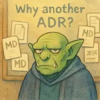

# ADR-002: Zoc for doc

| Field   | Value      |
| ------- | ---------- |
| Status  | Accepted   |
| Created | 2025-06-21 |

## Context

I want to keep beautifully organized documentation right in the repository

### What features would be nice to have

- [ ] Task tracking in the repository (tasks, features, roadmaps)
- [ ] Maintaining docs in the repository (ideas, ADR, devlogs)
- [ ] Support of cross-links between files
- [ ] Creating and updating tables of content
- [ ] Filesystem as the database, no external data storage needed
- [ ] All data in markdown
- [ ] Powerful yet simple cli
- [ ] No need for teams and projects management. Focus on solo/indie workflow

### Alternatives considered

The following tools and approaches were reviewed as possible alternatives or inspirations for solving the problems Zok aims to address.

| Tool / Approach                                                         | What it does well                                                      | Why it’s not a fit for Zok (or only partially)                                                                                                                                                                                                       |
| ----------------------------------------------------------------------- | ---------------------------------------------------------------------- | ---------------------------------------------------------------------------------------------------------------------------------------------------------------------------------------------------------------------------------------------------- |
| [doctoc](https://github.com/thlorenz/doctoc)                            | Generates a Table of Contents in Markdown documents.                   | Can only generate table of content. May be used as part of Zok                                                                                                                                                                                       |
| [typedoc](https://typedoc.org)                                          | Generates documentation from TypeScript code with links and hierarchy. | Limited to code. May be used as part of Zok                                                                                                                                                                                                          |
| [documentation.js](https://documentation.js.org)                        | Markdown documentation from JS code with comment parsing.              | Same as typedoc                                                                                                                                                                                                                                      |
| [jsdoc-to-markdown](https://github.com/jsdoc2md/jsdoc-to-markdown)      | Converts JSDoc comments to Markdown.                                   | Same as documentation.js                                                                                                                                                                                                                             |
| [readme-md-generator](https://github.com/kefranabg/readme-md-generator) | Scaffolds `README.md` from `package.json` metadata.                    | Useful only for README generation. May be used as part of Zok                                                                                                                                                                                        |
| [adr-tools](https://github.com/npryce/adr-tools)                        | Generates and links ADRs with consistent naming.                       | Focused solely on ADRs. It makes no sense to use it, because the functionality will be duplicated for other entities                                                                                                                                 |
| [taskwarrior](https://taskwarrior.org)                                  | CLI-based task tracker with custom attributes and flexible filtering.  | Task-only model and uses SQLite (which I would like to avoid). There are a lot of extensions, but none of them are completely suitable. Excellent cli-interface. It makes sense to use it as an example. Convenient work with attributes `key:value` |
| [todo.txt](https://github.com/todotxt/todo.txt)                         | Simple plaintext task tracking with tags and priorities.               | Task-only                                                                                                                                                                                                                                            |
| [plane](https://github.com/makeplane/plane)                             | Markdown-based local task/project manager with entity linking.         | Powerful but too heavy for a solo project. Has its own DB and infrastructure overhead.                                                                                                                                                               |
| [obsidian.md](https://obsidian.md)                                      | Excellent UX for Markdown note linking and visual graph view.          | Proprietary file structure. Harder to integrate into Git workflows or automate. UI-centric, not CLI-driven.                                                                                                                                          |

None of them are suitable. Most of them lack features. The rest are too complex for a solo project.

## Decision

Entrust this to [senior archivist Zok](../ideas/Idea-001_archivist-zok.md)

## Consequences

### In theory, Zok should solve the following problems:

- Maintaining document numbering
- Putting cross-references in documents (e.g. parent documents should link to children)
- Document templating
- Creating a content table in the root directories of the documentation
- Renaming documents (with correction of headings and cross-references)
- Perhaps, I will ask it to collect comments on the code for automatic generation of documentation. Although this might be a case of responsibility creep. Perhaps Zok will have an assistant
- It is possible to add a telegram bot to commit tasks to the repository directly from the chat
- It is even possible to try to learn how to give instructions to Zok via voice messages

### Trade-offs:

- This adds yet another utility that needs to be written and then supported, which takes away from creating the game itself
- This is a non-standard tool. +1 interface that needs to be kept in mind. But a quick search did not yield any tools that would do everything necessary
