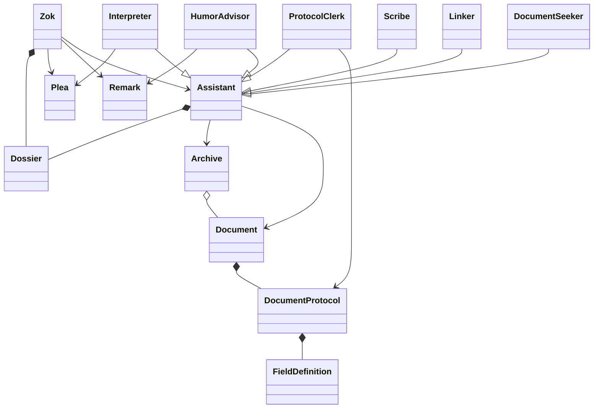
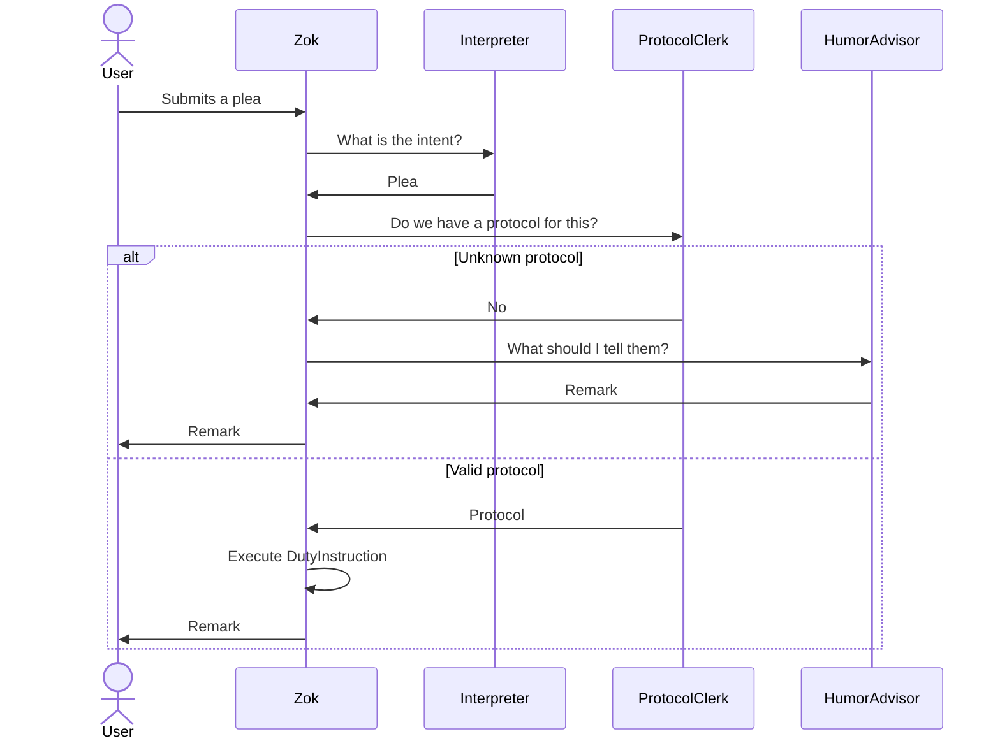
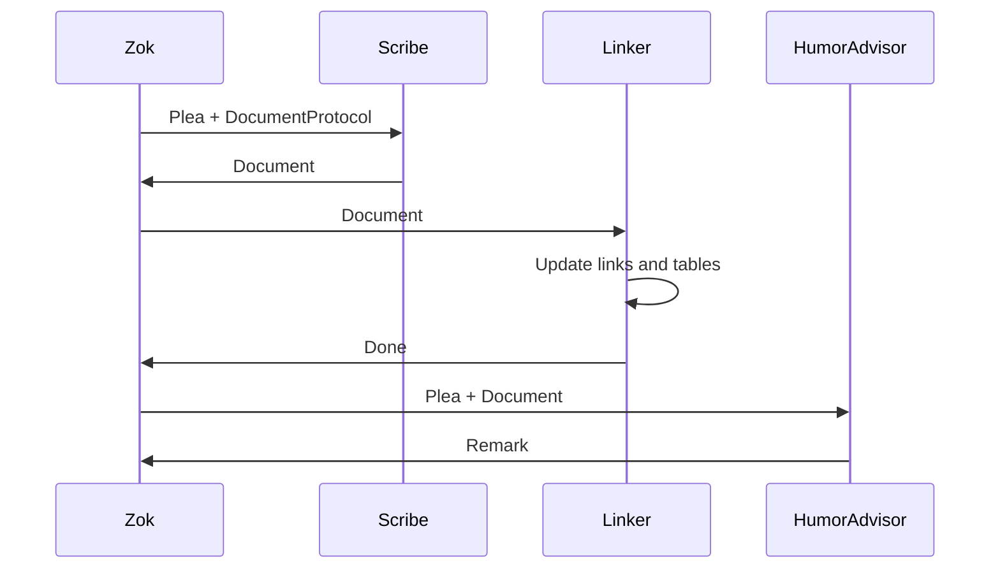
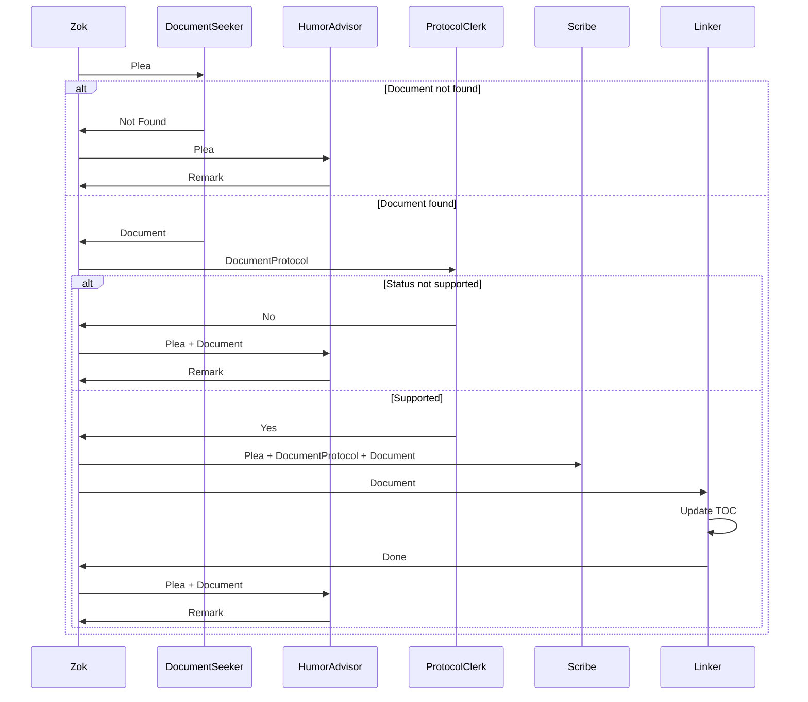
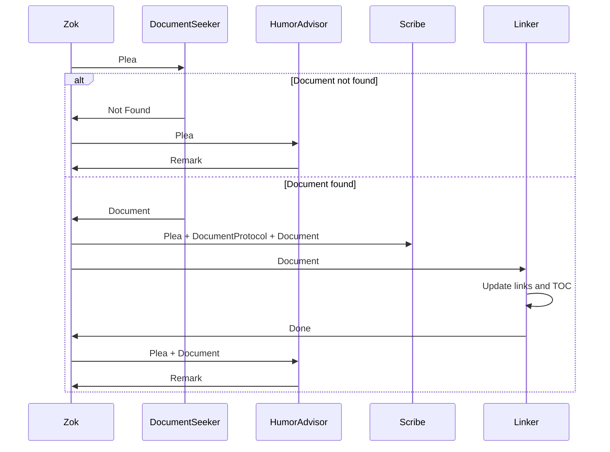
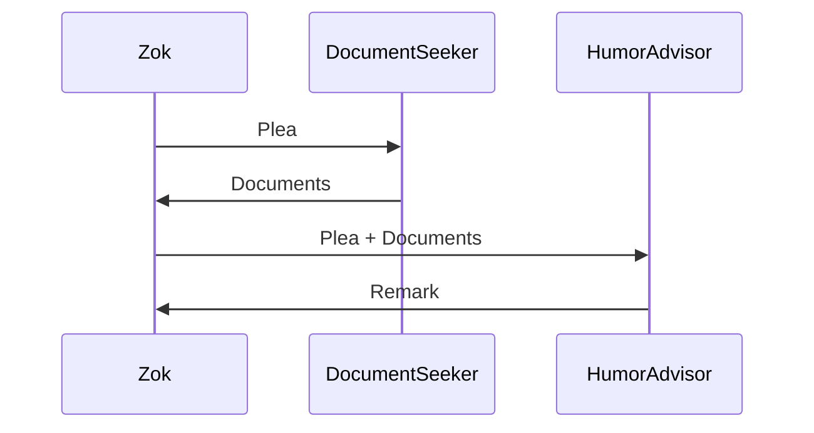

# Design-001: The Inner World of Zok

| Field   | Value      |
| ------- | ---------- |
| Created | 2025-06-21 |

## Entities

### API layer (Zok's Office)

- `Zok` — the overseer and orchestrator
- `Plea` — Zok does not accept commands, only pleas
- `Remark` — Zok's formal response to a plea

### Application layer (Zok's Assistants)

- `DutyInstruction` — a use-case; Zok's assigned responsibility
- `Assistant` — base class for all of Zok's helpers
- `Interpreter` — deciphers the intent of a plea
- `Scribe` — creates and edits documents
- `Linker` — updates cross-references and tables of contents
- `ProtocolClerk` — loads and validates document protocols
- `HumorAdvisor` — crafts Zok's witty remarks
- `DocumentSeeker` — locates documents in the archive

### Domain layer (Precious Archive Information)

- `Document` — a specific file with metadata and content
- `DocumentProtocol` — definition of a document type (task, idea, ...)
- `FieldDefinition` — structure of a single document field
- `FieldType` — field kind: `string`, `date`, `enum`, `link`, ...
- `Dossier` — a whimsical profile for each assistant (name, species, hobbies, etc.)

### Infrastructure layer (Buildings, Equipment, etc.)

- `Archive` — the physical storage of documents

## Class Diagram

## Duty Instructions

Each `DutyInstruction` begins with Zok receiving a `Plea` from the user. He consults the `Interpreter` to understand it. Then asks the `ProtocolClerk` whether a protocol exists for the requested document type.

If the protocol is unknown, he asks the `HumorAdvisor` for a sarcastic `Remark` and sends it back to the user.
If the protocol is valid, Zok performs the duty and returns a `Remark`.

### Creating a Document

- Zok forwards the `Plea` and corresponding `DocumentProtocol` to the `Scribe`
- The `Scribe` returns a new `Document`
- Zok requests the `Linker` to update references and table of contents
- Zok requests a `Remark` from the `HumorAdvisor`
- Zok responds to the user with the `Remark`

### Changing Document Status

- Zok asks `DocumentSeeker` to locate the document
- If not found, `HumorAdvisor` crafts a snarky `Remark`
- If found, Zok asks `ProtocolClerk` if the protocol supports status changes
- If not supported, `HumorAdvisor` crafts a snarky `Remark`
- If supported, Zok asks the `Scribe` to update status
- Then `Linker` updates references and TOC
- Finally, `HumorAdvisor` returns a report `Remark`

### Renaming a Document

- Zok asks `DocumentSeeker` to locate the document
- If not found, `HumorAdvisor` crafts a snarky `Remark`
- If found, `Scribe` renames it
- `Linker` updates all links and TOC
- `HumorAdvisor` composes the final `Remark`

### Searching for Documents

- Zok asks `DocumentSeeker` to gather documents
- `HumorAdvisor` creates a witty summary `Remark`

## Zok's Office

