# Design-001: The inner world of Zok

| Field   | Value      |
| ------- | ---------- |
| Status  | Draft      |
| Created | 2025-06-21 |

## Сущности

### API layer (Zok office)

- Zok — главный управляющий
- Request — Зок не принимает команд, только просьбы
- Remark — реплика Зока (ответ пользователю)

### Application layer (Zok's assistants)

- DutyInstruction — должностная инструкция Зока (по сути юз-кейс)
- Assistant — Базовый класс для всех помощников Зока
- Interpreter — Расшифровывает Зоку, что от него хотят эти неразумные существа
- Scribe — создание документов / шаблонизация
- Linker — управление ссылками и связями
- ProtocolClerk — загрузка и проверка конфигурации
- HumorAdvisor — подсказывает ремарки Зоку
- DocumentSeeker — Ищет документы в архиве. Сам Зок в хранилище архива никогда не ходит

### Domain layer (Precious archive information)

- Document — конкретный файл с содержимым и метаданными
- DocumentProtocol — описание типа документа (task, idea, ...)
- FieldDefinition — описание отдельного поля документа
- FieldType — тип поля: string, date, enum, link, ...
- Profile — досье на сотрудника архива

### Infrastructure layer (Buildings, equipment, etc.)

- Archive — хранилище файлов

### Диаграмма классов

## Должностные инструкции

Любое выполнение должностной инструкции начинается с того, что Зок получает какую-то просьбу от пользователя и просит интерпретатора объяснить нормально, чего от него хотят. Поняв это, Зок просит протоколиста проверить, что для запрашиваемого типа документов сущетсвует протокол. Если протокол существует, то Зок приступает к должностным инструкциям. Иначе Зок раздраженно просит советника по юмору составить ему язвительный ответ и передает его пользователю. Иначе Зок выполняет свою должностную инструкцию, и возвращает пользователю ремарку о проделанной работе

### Должностная инструкция по созданию документа

- Зоку передает запрос пользователя и протокол документа Писателю
- Писатель создает документ и возвращает его Зоку
- Зок просит Линкера узнать, есть ли связи с другими документами и перелинковать их, а так же обновить таблицы с содержанием
- Зок просит Советника по шуткам придумать остроумную ремарку
- Зок передает ремарку пользователю

```mermaid
sequenceDiagram
  Zok->>Scribe: Request + DocumentProtocol
  Scribe->>Zok: Document
  Zok->>Linker: Document
  Linker->>Linker: Update links and tables of content
  Linker->>Zok: Done
  Zok->>HumorAdvisor: Request + Document
  HumorAdvisor->>Zok: Remark
```

### Должностная инструкция по изменению статуса документа

- Зок просит искателя докуметов найти документ
- Если документ не найден, то просит советника по юмору составить язвительны ответ
- Если найден, то Зок просит протоколиста узнать поддерживает ли протокол статус
- Если нет, то просит советника по юмору составить язвительны ответ
- Если да, то Зок просит писаря исправить стутус документа
- Зок просит линкера обновить таблицы с содержимым
- Зок просит советника по юмору составить ироничный отчет о работе

### Должностная инструкция по переименованию документа

- Зок просит искателя докуметов найти документ
- Если документ не найден, то просит советника по юмору составить язвительны ответ
- Если найден, то Зок просит писаря переназвать документ
- Зок просит линкера перелинковать документы и обновить таблицы с содержимым
- Зок просит советника по юмору составить ироничный отчет о работе

### Должностная инструкция по поиску документов

- Зок просит искателя докуметов найти документ
- Зок просит советника по юмору составить остроумный отчет

## Zok's office

