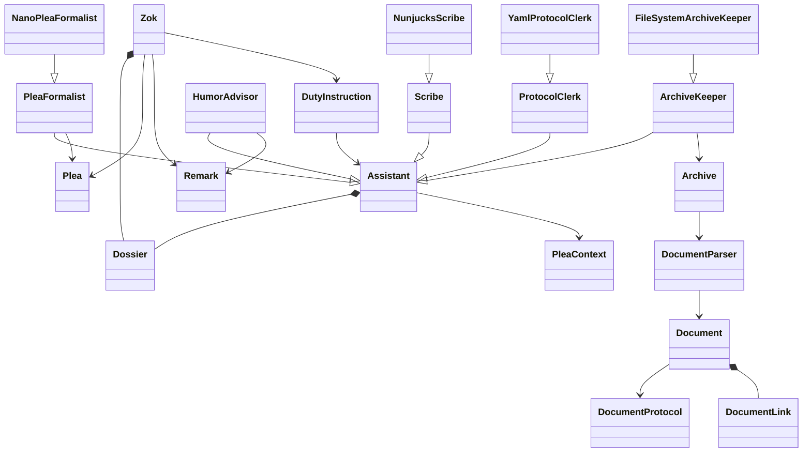
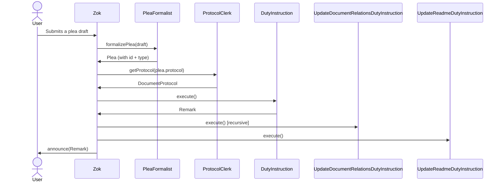
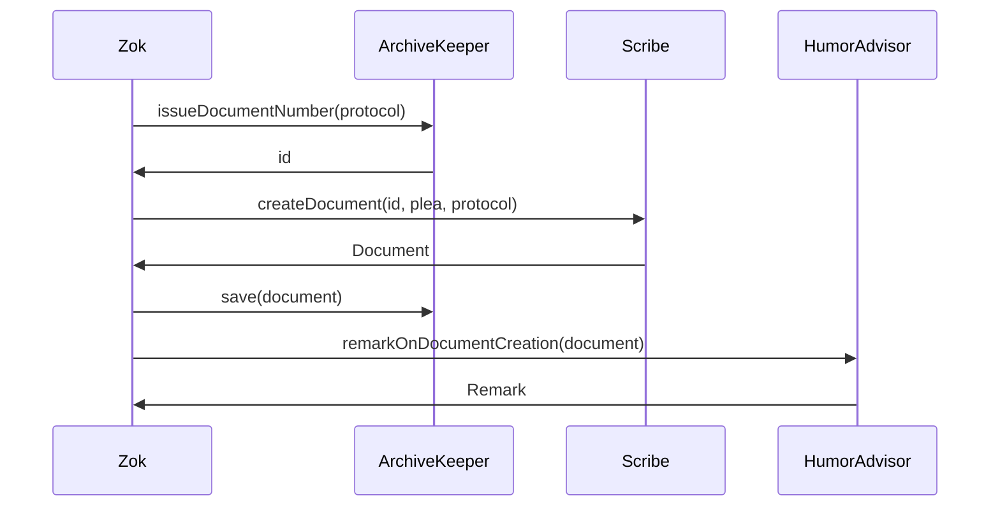
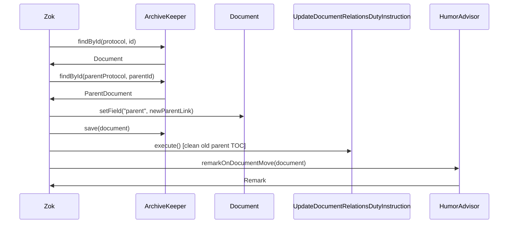

# Design-002: Real Zok

| Field   | Value      |
| ------- | ---------- |
| Created | 2026-04-05 |

Unlike [Design-001](Design-001_the-inner-world-of-zok.md), which was written before implementation as an architectural prototype, this document reflects the application as it actually exists — written after the fact, based on the real code.

## Layers

### API layer

- `Zok` — the overseer and orchestrator
- `Plea` — Zok does not accept commands, only pleas
- `Remark` — Zok's formal response to a plea

### Application layer

- `DutyInstruction` — a use-case; Zok's assigned responsibility
- `CreateDocumentDutyInstruction`
- `RenameDocumentDutyInstruction`
- `ChangeStatusDutyInstruction`
- `MoveDocumentDutyInstruction`
- `DeleteDocumentDutyInstruction`
- `ListDocumentsDutyInstruction`
- `UpdateDocumentRelationsDutyInstruction` — updates parent's table of contents; runs recursively up the hierarchy after every command
- `UpdateReadmeDutyInstruction` — updates the protocol's README index; runs after every command

### Domain layer

#### Entities

- `Document` — a specific file with metadata and content
- `DocumentProtocol` — definition of a document type (task, idea, ...)
- `FieldDefinition` — structure of a single document field
- `FieldType` — field kind: `string`, `date`, `enum`, `link`, ...
- `DocumentLink` — a typed reference from one document to another
- `DocumentToc` — a table of contents embedded in a parent document
- `Dossier` — a whimsical profile for each assistant (name, species, hobbies, etc.)

#### Assistants (Domain Services)

- `Assistant` — abstract base for all domain services; provides `report()` via `PleaContext`
- `PleaFormalist` — formalizes a raw plea draft into a `Plea` (assigns a unique id)
- `Scribe` — creates and renders documents from templates
- `ProtocolClerk` — loads and validates document protocols
- `HumorAdvisor` — crafts Zok's witty remarks
- `ArchiveKeeper` — locates, counts, saves, and deletes documents in the archive

#### Tools

- `Archive` — abstract repository interface (`find`, `save`, `delete`, `replace`)
- `DocumentParser` — factory that constructs a `Document` entity from raw markdown content
- `DocumentTocParser` — parses the TOC section embedded in a document
- `DocumentTocRender` — renders a `DocumentToc` back to markdown
- `TextExtractor` — low-level text extraction utilities

#### PleaContext

`AsyncLocalStorage` singleton that carries the active `Plea` through the entire async call stack. Every assistant can log activity reports via `report()` without being passed the `Plea` explicitly.

### Infrastructure layer

- `FileSystemArchiveKeeper` — `ArchiveKeeper` backed by the local file system
- `NanoPleaFormalist` — `PleaFormalist` that issues nanoid-based plea IDs
- `YamlProtocolClerk` — `ProtocolClerk` that reads protocols from YAML config
- `NunjucksScribe` — `Scribe` that generates documents from Nunjucks templates

### CLI layer (PLI — Plea Language Interface)

Commands: `create`, `rename`, `close`, `reopen`, `cancel`, `delete`, `move`, `list`, `office`

All commands support `-r, --record` to print the full activity record.

## Class Diagram

## Duty Instructions

Each `DutyInstruction` is executed inside `pleaContext.run()`, so every assistant
can log reports without being passed the `Plea` explicitly.

After every **command** (non-query), Zok automatically runs two maintenance instructions:

1. `UpdateDocumentRelationsDutyInstruction` — walks up the parent hierarchy and rebuilds each parent's TOC.
2. `UpdateReadmeDutyInstruction` — rebuilds the protocol's README index.

### Creating a Document

- Zok resolves the active parent document (if the protocol has a `parentProtocolId`)
- `ArchiveKeeper` issues the next document number
- `Scribe` renders the document from a template
- `ArchiveKeeper` saves it
- `HumorAdvisor` composes the creation `Remark`

### Renaming a Document

- `ArchiveKeeper` locates the document by id
- `Scribe` updates the title in content and metadata
- `ArchiveKeeper` saves the renamed file (old file is replaced)
- `Archive.replace()` updates all references to the old filename across the archive
- `HumorAdvisor` composes the `Remark`

### Changing Document Status

- `ArchiveKeeper` locates the document by id
- The status field is updated directly on the entity
- `ArchiveKeeper` saves the document
- `HumorAdvisor` composes the `Remark`

### Moving a Document

- `ArchiveKeeper` locates the document and the new parent by id
- The `parent` field is updated to point to the new parent
- `ArchiveKeeper` saves the document
- `UpdateDocumentRelationsDutyInstruction` is called with a shell document representing the **old** parent link to clean its TOC
- The normal post-command relation update then rebuilds the **new** parent's TOC

### Deleting a Document

- `ArchiveKeeper` locates the document by id and deletes it
- `HumorAdvisor` composes the `Remark`

### Listing Documents

- `ArchiveKeeper` finds all documents matching the protocol (query — no post-run maintenance)
- `HumorAdvisor` composes the summary `Remark`
