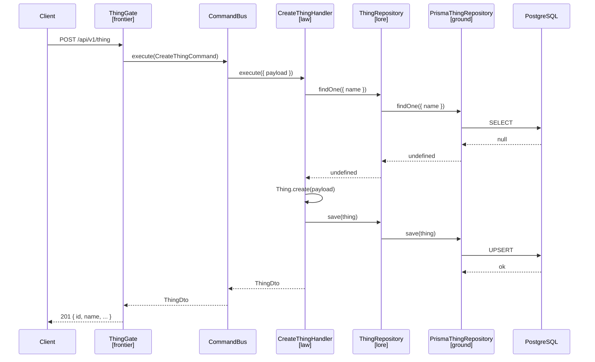

# Design-004: Realms Blueprint

| Field   | Value      |
| ------- | ---------- |
| Created | 2026-04-18 |

## Overview

A **Realm** is an independent NestJS microservice with its own database schema, API, and domain model. Each realm follows the same four-layer structure defined in [ADR-004: OOP — Ork Oriented Programming](./ADR-004_oop-ork-oriented-programming.md).

The architecture follows DDD and CQRS.

Commands operate strictly on domain entities defined in `lore`.
All state changes must go through the domain model and repository contracts.

Queries may bypass the domain layer and access infrastructure directly when no domain logic is required.
This allows simpler and more efficient read models.

## Directory structure

```
realms/my-realm/
├── prisma/
│   ├── migrations/
│   ├── schema.prisma          # Realm-specific Prisma schema
│   └── generated/             # Generated Prisma client (gitignored)
├── src/
│   ├── frontier/              # API layer — the edge of the realm
│   │   ├── gates/
│   │   │   └── thing.gate.ts
│   │   └── dto/
│   │       ├── thing.dto.ts
│   │       ├── body/
│   │       │   ├── create-thing.dto.ts
│   │       │   └── update-thing.dto.ts
│   │       └── query/
│   │           └── list-things.query.dto.ts
│   ├── law/                   # Application layer — commands and queries
│   │   ├── commands/
│   │   │   ├── create-thing.command.ts
│   │   │   └── update-thing.command.ts
│   │   └── queries/
│   │       ├── get-thing.query.ts
│   │       └── list-things.query.ts
│   ├── lore/                  # Domain layer — entities and repository contracts
│   │   ├── entities/
│   │   │   └── thing.entity.ts
│   │   └── repositories/
│   │       └── thing.repository.ts
│   ├── ground/                # Infrastructure layer — persistence
│   │   ├── prisma.service.ts
│   │   └── repositories/
│   │       └── prisma-thing.repository.ts
│   ├── app.module.ts
│   └── main.ts
└── test/
    ├── jest-e2e.json
    └── thing.e2e-spec.ts
```

## Layer responsibilities

| Layer      | Role                                                                    |
| ---------- | ----------------------------------------------------------------------- |
| `frontier` | Receives HTTP requests, validates DTOs, dispatches commands and queries |
| `law`      | Implements business logic via CQRS command and query handlers           |
| `lore`     | Defines domain entities and abstract repository contracts               |
| `ground`   | Implements repositories using Prisma, manages DB connection             |

Dependencies flow inward: `frontier → law → lore ← ground`.
`lore` has no imports from any other layer — it is the stable core everything else depends on.

## Patterns

### Entity (`lore/entities/`)

Extends `Entity` from `@dod/core`. Constructor is `protected`; creation goes through a static `create()` factory. `id` is `readonly`.

```typescript
import { Entity } from '@dod/core';

export type ThingParams = {
  id: string;
  name: string;
  description?: string;
};

export class Thing extends Entity {
  public static create(params: ThingParams): Thing {
    return new Thing(params);
  }

  public readonly id: string;
  public name: string;
  public description?: string;

  protected constructor(params: ThingParams) {
    super();
    this.id = params.id;
    this.name = params.name;
    this.description = params.description;
  }
}
```

The inherited `update(params)` method mutates only provided fields (skips `undefined`).

### Abstract repository (`lore/repositories/`)

Declares the contract. No implementation — just a typed extension of `EntityRepository`.

```typescript
import { EntityRepository } from '@dod/core';
import { Thing } from '../entities/thing.entity';

export abstract class ThingRepository extends EntityRepository<Thing> {}
```

`EntityRepository<T>` provides: `getById`, `getByIdOrFail`, `find`, `findOne`, `save`.

### Prisma repository (`ground/repositories/`)

Extends `PrismaRepository` from `@dod/core` and implements the abstract repository from `lore`. Requires three overrides: `delegate`, `toEntity`, `toModel`.

```typescript
import { Inject } from '@nestjs/common';
import { PrismaRepository } from '@dod/core';
import { Prisma, Thing as ThingModel } from '../../../prisma/generated';
import { Thing } from '@/lore/entities/thing.entity';
import { ThingRepository } from '@/lore/repositories/thing.repository';
import { PrismaService } from '../prisma.service';

export class PrismaThingRepository
  extends PrismaRepository<Thing, ThingModel>
  implements ThingRepository
{
  @Inject() private readonly prisma!: PrismaService;

  protected override get delegate(): Prisma.ThingDelegate {
    return this.prisma.thing;
  }

  protected override toEntity(model: ThingModel): Thing {
    return Thing.create({
      ...model,
      description: model.description ?? undefined,
    });
  }

  protected override toModel(entity: Thing): ThingModel {
    return {
      ...entity,
      description: entity.description ?? null,
    };
  }
}
```

Prisma nullable fields (`String?`) map to `null` in models and `undefined` in entities.

### Prisma service (`ground/`)

Identical in every realm — copy as-is.

```typescript
import { Injectable, OnModuleDestroy, OnModuleInit } from '@nestjs/common';
import { PrismaPg } from '@prisma/adapter-pg';
import { PrismaClient } from '../../prisma/generated';

@Injectable()
export class PrismaService
  extends PrismaClient
  implements OnModuleInit, OnModuleDestroy
{
  constructor() {
    super({
      adapter: new PrismaPg({ connectionString: process.env['DATABASE_URL'] }),
    });
  }

  async onModuleInit() { await this.$connect(); }
  async onModuleDestroy() { await this.$disconnect(); }
}
```

### Command handler (`law/commands/`)

Command class and its handler live in the same file. Handler injects the repository via `@Inject()`.

```typescript
import { ConflictException, Inject } from '@nestjs/common';
import { Command, CommandHandler, ICommandHandler } from '@nestjs/cqrs';
import { CreateThingDto } from '@/frontier/dto/body/create-thing.dto';
import { ThingDto } from '@/frontier/dto/thing.dto';
import { Thing } from '@/lore/entities/thing.entity';
import { ThingRepository } from '@/lore/repositories/thing.repository';

export class CreateThingCommand extends Command<ThingDto> {
  constructor(public readonly payload: CreateThingDto) {
    super();
  }
}

@CommandHandler(CreateThingCommand)
export class CreateThingHandler implements ICommandHandler<CreateThingCommand> {
  @Inject() private readonly thingRepository!: ThingRepository;

  public async execute({ payload }: CreateThingCommand): Promise<ThingDto> {
    const existing = await this.thingRepository.findOne({ name: payload.name });
    if (existing !== undefined) {
      throw new ConflictException(`Name "${payload.name}" already taken`);
    }

    const thing = Thing.create(payload);
    await this.thingRepository.save(thing);

    return ThingDto.from(thing);
  }
}
```

### Query handler (`law/queries/`)

Same file convention as commands. Use `getByIdOrFail` for single-entity lookups. For filtered lists, define a filter type in the query file — `law` never imports from `frontier`.

```typescript
import { Inject } from '@nestjs/common';
import { IQueryHandler, Query, QueryHandler } from '@nestjs/cqrs';
import { ThingDto } from '@/frontier/dto/thing.dto';
import { ThingRepository } from '@/lore/repositories/thing.repository';

// single entity
export class GetThingQuery extends Query<ThingDto> {
  constructor(public readonly id: string) {
    super();
  }
}

@QueryHandler(GetThingQuery)
export class GetThingHandler implements IQueryHandler<GetThingQuery> {
  @Inject() private readonly thingRepository!: ThingRepository;

  public async execute({ id }: GetThingQuery): Promise<ThingDto> {
    const thing = await this.thingRepository.getByIdOrFail(id);
    return ThingDto.from(thing);
  }
}

// filtered list — filter type belongs to law, not frontier
export type ListThingsFilter = {
  type?: string;
  universeId?: string;
};

export class ListThingsQuery extends Query<ThingDto[]> {
  constructor(public readonly filter: ListThingsFilter = {}) {
    super();
  }
}

@QueryHandler(ListThingsQuery)
export class ListThingsHandler implements IQueryHandler<ListThingsQuery> {
  @Inject() private readonly thingRepository!: ThingRepository;

  public async execute({ filter }: ListThingsQuery): Promise<ThingDto[]> {
    const things = await this.thingRepository.find(filter);
    return things.map((thing) => ThingDto.from(thing));
  }
}
```

The gate translates the frontier DTO into the law-level filter:

```typescript
@Get()
public async list(@Query() query: ListThingsQueryDto): Promise<ThingDto[]> {
  return this.queryBus.execute(new ListThingsQuery(query));
}
```

### Request DTOs (`frontier/dto/body/`)

Use `class-validator` decorators. Create DTO has all required fields. Update DTO marks every field `@IsOptional()`.

```typescript
// create-thing.dto.ts
import { IsString, MaxLength, MinLength } from 'class-validator';

export class CreateThingDto {
  @IsString() @MinLength(1) @MaxLength(100)
  public id!: string;

  @IsString() @MinLength(1) @MaxLength(100)
  public name!: string;
}

// update-thing.dto.ts
import { IsOptional, IsString, MaxLength, MinLength } from 'class-validator';

export class UpdateThingDto {
  @IsOptional() @IsString() @MinLength(1) @MaxLength(100)
  public name?: string;
}
```

### Query DTOs (`frontier/dto/query/`)

Used for `GET` endpoints with filter parameters (`?type=good&universeId=dod`). All fields are optional. Use `@Type()` for non-string values (numbers, booleans).

```typescript
// list-things.query.dto.ts
import { IsOptional, IsString, IsUUID } from 'class-validator';

export class ListThingsQueryDto {
  @IsOptional() @IsString()
  public type?: string;

  @IsOptional() @IsUUID()
  public universeId?: string;
}
```

### Response DTO (`frontier/dto/`)

Maps a domain entity to an API response using `plainToInstance`.

```typescript
import { plainToInstance } from 'class-transformer';
import { Thing } from '@/lore/entities/thing.entity';

export class ThingDto {
  public static from(thing: Thing): ThingDto {
    return plainToInstance(ThingDto, thing);
  }

  public id!: string;
  public name!: string;
  public description?: string;
}
```

### Gate (`frontier/gates/`)

Named `ThingGate`, not `ThingController`. Dispatches to `CommandBus` or `QueryBus` — no business logic.

```typescript
import { Body, Controller, Get, HttpCode, Param, Patch, Post, Query } from '@nestjs/common';
import { CommandBus, QueryBus } from '@nestjs/cqrs';
import { ApiCreatedResponse, ApiOkResponse, ApiTags } from '@nestjs/swagger';
import { ThingDto } from '@/frontier/dto/thing.dto';
import { CreateThingDto } from '@/frontier/dto/body/create-thing.dto';
import { UpdateThingDto } from '@/frontier/dto/body/update-thing.dto';
import { ListThingsQueryDto } from '@/frontier/dto/query/list-things.query.dto';
import { CreateThingCommand } from '@/law/commands/create-thing.command';
import { UpdateThingCommand } from '@/law/commands/update-thing.command';
import { GetThingQuery } from '@/law/queries/get-thing.query';
import { ListThingsQuery } from '@/law/queries/list-things.query';

@Controller('/v1/thing')
@ApiTags('Thing')
export class ThingGate {
  constructor(
    private readonly commandBus: CommandBus,
    private readonly queryBus: QueryBus,
  ) {}

  @Post()
  @HttpCode(201)
  public async create(@Body() dto: CreateThingDto): Promise<ThingDto> {
    return this.commandBus.execute(new CreateThingCommand(dto));
  }

  @Patch('/:id')
  public async update(@Param('id') id: string, @Body() dto: UpdateThingDto): Promise<ThingDto> {
    return this.commandBus.execute(new UpdateThingCommand(id, dto));
  }

  @Get('/:id')
  public async getById(@Param('id') id: string): Promise<ThingDto> {
    return this.queryBus.execute(new GetThingQuery(id));
  }

  @Get()
  public async list(@Query() query: ListThingsQueryDto): Promise<ThingDto[]> {
    return this.queryBus.execute(new ListThingsQuery(query));
  }
}
```

### App module (`app.module.ts`)

Groups providers into named arrays for readability. Binds abstract repository tokens to concrete implementations.

```typescript
import { Module } from '@nestjs/common';
import { CqrsModule } from '@nestjs/cqrs';
import { ThingGate } from './frontier/gates/thing.gate';
import { PrismaService } from './ground/prisma.service';
import { PrismaThingRepository } from './ground/repositories/prisma-thing.repository';
import { CreateThingHandler } from './law/commands/create-thing.command';
import { UpdateThingHandler } from './law/commands/update-thing.command';
import { GetThingHandler } from './law/queries/get-thing.query';
import { ListThingsHandler } from './law/queries/list-things.query';
import { ThingRepository } from './lore/repositories/thing.repository';

const commandHandlers = [CreateThingHandler, UpdateThingHandler];
const queryHandlers = [GetThingHandler, ListThingsHandler];
const repositories = [
  { provide: ThingRepository, useClass: PrismaThingRepository },
];
const services = [PrismaService];

@Module({
  imports: [CqrsModule],
  controllers: [ThingGate],
  providers: [...commandHandlers, ...queryHandlers, ...repositories, ...services],
})
export class AppModule {}
```

### Bootstrap (`main.ts`)

Global prefix `/api`, validation pipe with `whitelist: true`, Swagger setup.

```typescript
import { INestApplication, ValidationPipe } from '@nestjs/common';
import { NestFactory } from '@nestjs/core';
import { DocumentBuilder, SwaggerModule } from '@nestjs/swagger';
import { AppModule } from './app.module';

async function bootstrap() {
  const app = await NestFactory.create(AppModule);
  app.setGlobalPrefix('/api');
  app.useGlobalPipes(new ValidationPipe({ whitelist: true }));
  setupSwagger(app);
  await app.listen(process.env.PORT ?? 3000);
}

function setupSwagger(app: INestApplication): void {
  const config = new DocumentBuilder()
    .setTitle('Thing realm')
    .setDescription('Thing management API')
    .setVersion('1.0')
    .addTag('Thing')
    .build();
  SwaggerModule.setup('api', app, () => SwaggerModule.createDocument(app, config));
}

void bootstrap();
```

### Prisma schema (`prisma/schema.prisma`)

```prisma
generator client {
  provider      = "prisma-client-js"
  output        = "./generated"
  binaryTargets = ["native", "linux-musl-openssl-3.0.x"]
}

datasource db {
  provider = "postgresql"
}

model Thing {
  id          String  @id
  name        String  @unique
  description String?

  @@map("thing")
}
```

## Core abstractions (`@dod/core`)

| Export                | Purpose                                                                                           |
| --------------------- | ------------------------------------------------------------------------------------------------- |
| `Entity`              | Base class with `update(params)` — mutates own fields from partial                                |
| `EntityRepository<T>` | Abstract contract: `getById`, `getByIdOrFail`, `find`, `findOne`, `save`                          |
| `PrismaRepository<T>` | Prisma implementation of `EntityRepository`; subclasses provide `delegate`, `toEntity`, `toModel` |

## Data flow for a command

A request enters through the gate, gets dispatched as a command, and the handler orchestrates the domain — reading and writing via the repository contract. The gate and handler never touch Prisma directly; they only speak to `lore` abstractions.

`ThingRepository` and `PrismaThingRepository` are shown as separate participants to illustrate the layer boundary. At runtime NestJS resolves the abstract token to the concrete implementation — they are the same object.


