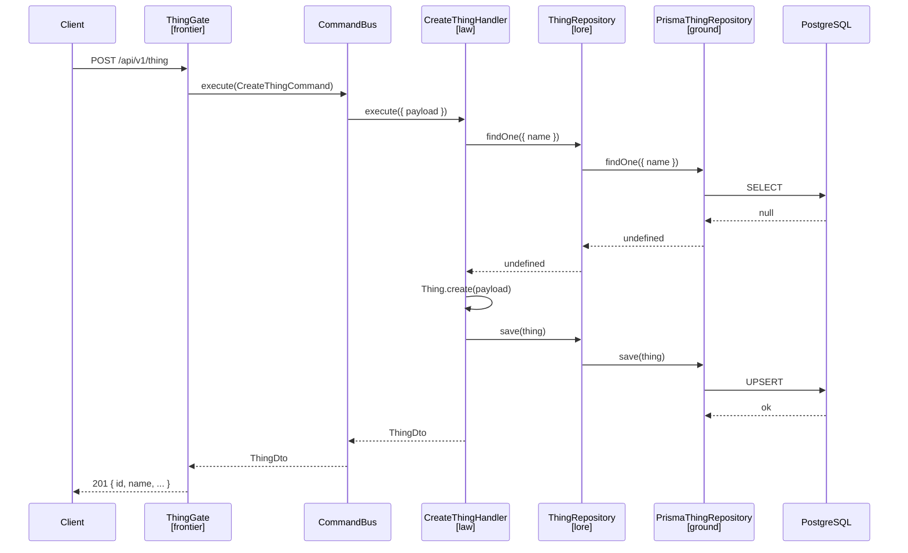

# Design-004: Realms Blueprint

| Field   | Value      |
| ------- | ---------- |
| Created | 2026-04-18 |

## Overview

A **Realm** is an independent NestJS microservice with its own database schema, API, and domain model. Each realm follows the same four-layer structure defined in [ADR-004: OOP — Ork Oriented Programming](./ADR-004_oop-ork-oriented-programming.md).

The architecture follows DDD and CQRS.

Commands operate strictly on domain entities defined in `lore`.
All state changes must go through the domain model and repository contracts.

Queries may bypass the domain layer and access infrastructure directly when no domain logic is required.
This allows simpler and more efficient read models.

## Directory structure

```
realms/my-realm/
├── prisma/
│   ├── migrations/
│   ├── schema.prisma          # Realm-specific Prisma schema
│   └── generated/             # Generated Prisma client (gitignored)
├── src/
│   ├── frontier/              # API layer — the edge of the realm
│   │   └── gates/
│   │       └── thing.gate.ts
│   ├── law/                   # Application layer — commands and queries
│   │   ├── commands/
│   │   │   ├── create-thing.command.ts
│   │   │   └── update-thing.command.ts
│   │   └── queries/
│   │       ├── get-thing.query.ts
│   │       └── list-things.query.ts
│   ├── lore/                  # Domain layer — entities and repository contracts
│   │   ├── entities/
│   │   │   └── thing.entity.ts
│   │   └── repositories/
│   │       └── thing.repository.ts
│   ├── ground/                # Infrastructure layer — persistence
│   │   ├── prisma.service.ts
│   │   └── repositories/
│   │       └── prisma-thing.repository.ts
│   ├── app.module.ts
│   └── main.ts
└── test/
    ├── jest-api.json
    └── thing.api-spec.ts
```

## Layer responsibilities

| Layer      | Role                                                                    |
| ---------- | ----------------------------------------------------------------------- |
| `frontier` | Receives HTTP requests, validates DTOs, dispatches commands and queries |
| `law`      | Implements business logic via CQRS command and query handlers           |
| `lore`     | Defines domain entities and abstract repository contracts               |
| `ground`   | Implements repositories using Prisma, manages DB connection             |

Dependencies flow inward: `frontier → law → lore ← ground`.
`lore` has no imports from any other layer — it is the stable core everything else depends on.

## Patterns

### Entity (`lore/entities/`)

Extends `Entity` from `@dod/core`. Constructor is `protected`; creation goes through a static `create()` factory. `id` is `readonly`.

```typescript
import { Entity } from '@dod/core';

export type ThingParams = {
  id: string;
  name: string;
  description?: string;
};

export class Thing extends Entity {
  public static create(params: ThingParams): Thing {
    return new Thing(params);
  }

  public readonly id: string;
  public name: string;
  public description?: string;

  protected constructor(params: ThingParams) {
    super();
    this.id = params.id;
    this.name = params.name;
    this.description = params.description;
  }
}
```

The inherited `update(params)` method mutates only provided fields (skips `undefined`).

### Abstract repository (`lore/repositories/`)

Declares the contract. No implementation — just a typed extension of `EntityRepository`.

```typescript
import { EntityRepository } from '@dod/core';
import { Thing } from '../entities/thing.entity';

export abstract class ThingRepository extends EntityRepository<Thing> {}
```

`EntityRepository<T>` provides: `getById`, `getByIdOrFail`, `find`, `findOne`, `save`.

### Prisma repository (`ground/repositories/`)

Extends `PrismaRepository` from `@dod/core` and implements the abstract repository from `lore`. Requires three overrides: `delegate`, `toEntity`, `toModel`.

```typescript
import { Inject } from '@nestjs/common';
import { PrismaRepository } from '@dod/core';
import { Prisma, Thing as ThingModel } from '../../../prisma/generated';
import { Thing } from '@/lore/entities/thing.entity';
import { ThingRepository } from '@/lore/repositories/thing.repository';
import { PrismaService } from '../prisma.service';

export class PrismaThingRepository
  extends PrismaRepository<Thing, ThingModel>
  implements ThingRepository
{
  @Inject() private readonly prisma!: PrismaService;

  protected override get delegate(): Prisma.ThingDelegate {
    return this.prisma.thing;
  }

  protected override toEntity(model: ThingModel): Thing {
    return Thing.create({
      ...model,
      description: model.description ?? undefined,
    });
  }

  protected override toModel(entity: Thing): ThingModel {
    return {
      ...entity,
      description: entity.description ?? null,
    };
  }
}
```

Prisma nullable fields (`String?`) map to `null` in models and `undefined` in entities.

### Prisma service (`ground/`)

Identical in every realm — copy as-is.

```typescript
import { Injectable, OnModuleDestroy, OnModuleInit } from '@nestjs/common';
import { PrismaPg } from '@prisma/adapter-pg';
import { PrismaClient } from '../../prisma/generated';

@Injectable()
export class PrismaService
  extends PrismaClient
  implements OnModuleInit, OnModuleDestroy
{
  constructor() {
    super({
      adapter: new PrismaPg({ connectionString: process.env['DATABASE_URL'] }),
    });
  }

  async onModuleInit() { await this.$connect(); }
  async onModuleDestroy() { await this.$disconnect(); }
}
```

### Command handler (`law/commands/`)

Command class and its handler live in the same file. Handler injects the repository via `@Inject()`. The outgoing DTO is produced by `ThingSchema.parse(entity)` — this enforces the wire contract at runtime and strips any non-contract fields the entity might carry.

```typescript
import { CreateThingDto, ThingDto, ThingSchema } from '@dod/api-contract';
import { ConflictError } from '@dod/core';
import { Inject } from '@nestjs/common';
import { Command, CommandHandler, ICommandHandler } from '@nestjs/cqrs';

import { Thing } from '@/lore/entities/thing.entity';
import { ThingRepository } from '@/lore/repositories/thing.repository';

export class CreateThingCommand extends Command<ThingDto> {
  constructor(public readonly payload: CreateThingDto) {
    super();
  }
}

@CommandHandler(CreateThingCommand)
export class CreateThingHandler implements ICommandHandler<CreateThingCommand> {
  @Inject() private readonly thingRepository!: ThingRepository;

  public async execute({ payload }: CreateThingCommand): Promise<ThingDto> {
    const existing = await this.thingRepository.findOne({ name: payload.name });
    if (existing !== undefined) {
      throw new ConflictError(`Name "${payload.name}" already taken`);
    }

    const thing = Thing.create(payload);
    await this.thingRepository.save(thing);

    return ThingSchema.parse(thing);
  }
}
```

`law` throws framework-agnostic domain errors from `@dod/core` (`ConflictError`, `NotFoundError`, `UnauthenticatedError`, etc.) — never `NestJS` exceptions. The `ErrorFilter` at the `frontier` layer maps them to the HTTP envelope defined in [Design-005](./Design-005_api-guidelines.md).

### Query handler (`law/queries/`)

Same file convention as commands. Use `getByIdOrFail` for single-entity lookups. Outgoing DTOs pass through `XxxSchema.parse()`.

```typescript
import { ThingDto, ThingSchema } from '@dod/api-contract';
import { Inject } from '@nestjs/common';
import { IQueryHandler, Query, QueryHandler } from '@nestjs/cqrs';

import { ThingRepository } from '@/lore/repositories/thing.repository';

export class GetThingQuery extends Query<ThingDto> {
  constructor(public readonly id: string) {
    super();
  }
}

@QueryHandler(GetThingQuery)
export class GetThingHandler implements IQueryHandler<GetThingQuery> {
  @Inject() private readonly thingRepository!: ThingRepository;

  public async execute({ id }: GetThingQuery): Promise<ThingDto> {
    const thing = await this.thingRepository.getByIdOrFail(id);
    return ThingSchema.parse(thing);
  }
}

export class ListThingsQuery extends Query<ThingDto[]> {}

@QueryHandler(ListThingsQuery)
export class ListThingsHandler implements IQueryHandler<ListThingsQuery> {
  @Inject() private readonly thingRepository!: ThingRepository;

  public async execute(): Promise<ThingDto[]> {
    const things = await this.thingRepository.find();
    return things.map((thing) => ThingSchema.parse(thing));
  }
}
```

For filtered lists, declare the filter type inside the query file and have the gate pass it through — `law` still never imports from `frontier`.

### Wire shapes (`@dod/api-contract`)

All request/response shapes — schemas **and** inferred types — live in the zero-dep `@dod/api-contract` package. Realms do **not** keep a local `frontier/dto/` directory; the wire contract has one home.

```typescript
// @dod/api-contract/src/contracts/thing.ts
import { z } from 'zod';

export const ThingSchema = z.object({
  id: z.uuid(),
  name: z.string(),
  description: z.string().optional(),
});
export type ThingDto = z.infer<typeof ThingSchema>;

export const CreateThingSchema = z.object({
  id: z.uuid(),
  name: z.string().min(1).max(100),
});
export type CreateThingDto = z.infer<typeof CreateThingSchema>;

export const UpdateThingSchema = z.object({
  name: z.string().min(1).max(100).optional(),
});
export type UpdateThingDto = z.infer<typeof UpdateThingSchema>;
```

Convention: the schema (const) is `XxxSchema`, the inferred type is `XxxDto`. Both are imported directly by gates, handlers, and the web client.

### Gate (`frontier/gates/`)

Named `ThingGate`, not `ThingController`. Dispatches to `CommandBus` or `QueryBus` — no business logic. Incoming bodies are validated by `@ZodBody(Schema)` from `@dod/core`, which throws `ValidationFailedError` with field-level details on failure.

```typescript
import {
  CreateThingDto,
  CreateThingSchema,
  ThingDto,
  UpdateThingDto,
  UpdateThingSchema,
} from '@dod/api-contract';
import { ZodBody } from '@dod/core';
import { Controller, Get, HttpCode, Param, Patch, Post } from '@nestjs/common';
import { CommandBus, QueryBus } from '@nestjs/cqrs';

import { CreateThingCommand } from '@/law/commands/create-thing.command';
import { UpdateThingCommand } from '@/law/commands/update-thing.command';
import { GetThingQuery } from '@/law/queries/get-thing.query';
import { ListThingsQuery } from '@/law/queries/list-things.query';

@Controller('/v1/thing')
export class ThingGate {
  constructor(
    private readonly commandBus: CommandBus,
    private readonly queryBus: QueryBus,
  ) {}

  @Post()
  @HttpCode(201)
  public async create(
    @ZodBody(CreateThingSchema) dto: CreateThingDto,
  ): Promise<ThingDto> {
    return this.commandBus.execute(new CreateThingCommand(dto));
  }

  @Patch('/:id')
  public async update(
    @Param('id') id: string,
    @ZodBody(UpdateThingSchema) dto: UpdateThingDto,
  ): Promise<ThingDto> {
    return this.commandBus.execute(new UpdateThingCommand(id, dto));
  }

  @Get('/:id')
  public async getById(@Param('id') id: string): Promise<ThingDto> {
    return this.queryBus.execute(new GetThingQuery(id));
  }

  @Get()
  public async list(): Promise<ThingDto[]> {
    return this.queryBus.execute(new ListThingsQuery());
  }
}
```

### App module (`app.module.ts`)

Groups providers into named arrays for readability. Binds abstract repository tokens to concrete implementations.

```typescript
import { Module } from '@nestjs/common';
import { CqrsModule } from '@nestjs/cqrs';
import { ThingGate } from './frontier/gates/thing.gate';
import { PrismaService } from './ground/prisma.service';
import { PrismaThingRepository } from './ground/repositories/prisma-thing.repository';
import { CreateThingHandler } from './law/commands/create-thing.command';
import { UpdateThingHandler } from './law/commands/update-thing.command';
import { GetThingHandler } from './law/queries/get-thing.query';
import { ListThingsHandler } from './law/queries/list-things.query';
import { ThingRepository } from './lore/repositories/thing.repository';

const commandHandlers = [CreateThingHandler, UpdateThingHandler];
const queryHandlers = [GetThingHandler, ListThingsHandler];
const repositories = [
  { provide: ThingRepository, useClass: PrismaThingRepository },
];
const services = [PrismaService];

@Module({
  imports: [CqrsModule],
  controllers: [ThingGate],
  providers: [...commandHandlers, ...queryHandlers, ...repositories, ...services],
})
export class AppModule {}
```

### Bootstrap (`main.ts`)

Global prefix `/api`, plus two platform hooks from `@dod/core` that implement [Design-005](./Design-005_api-guidelines.md): envelope interceptor (wraps 2xx payloads as `{ data }`), error filter (maps domain errors + unknown exceptions to the error envelope). Body/query validation happens per-endpoint via `@ZodBody(Schema)` — no global pipe is needed.

```typescript
import { EnvelopeInterceptor, ErrorFilter } from '@dod/core';
import { NestFactory, Reflector } from '@nestjs/core';

import { AppModule } from './app.module';

async function bootstrap() {
  const app = await NestFactory.create(AppModule);
  app.setGlobalPrefix('/api');
  app.useGlobalInterceptors(new EnvelopeInterceptor(app.get(Reflector)));
  app.useGlobalFilters(new ErrorFilter());
  await app.listen(process.env.PORT ?? 3000);
}

void bootstrap();
```

Endpoints whose response must bypass the envelope (health probes, metrics, webhooks) apply `@NoEnvelope()` to the handler method. Swagger is not wired — the OpenAPI surface of a realm is defined by the Zod schemas in `@dod/api-contract`.

### Prisma schema (`prisma/schema.prisma`)

```prisma
generator client {
  provider      = "prisma-client-js"
  output        = "./generated"
  binaryTargets = ["native", "linux-musl-openssl-3.0.x"]
}

datasource db {
  provider = "postgresql"
}

model Thing {
  id          String  @id
  name        String  @unique
  description String?

  @@map("thing")
}
```

## Core abstractions (`@dod/core`)

**Domain primitives**

| Export                | Purpose                                                                                           |
| --------------------- | ------------------------------------------------------------------------------------------------- |
| `Entity`              | Base class with `update(params)` — mutates own fields from partial                                |
| `EntityRepository<T>` | Abstract contract: `getById`, `getByIdOrFail`, `find`, `findOne`, `save`                          |
| `PrismaRepository<T>` | Prisma implementation of `EntityRepository`; subclasses provide `delegate`, `toEntity`, `toModel`. `getByIdOrFail` throws `NotFoundError` |

**Domain errors** — thrown by `law` and `lore`, caught by the HTTP filter at the `frontier`:

| Export                  | HTTP status | Use                                                           |
| ----------------------- | ----------- | ------------------------------------------------------------- |
| `DomainError`           | —           | Abstract base — subclass when a new error code is introduced  |
| `BadRequestError`       | 400         | Request shape unparseable or semantically nonsense            |
| `ValidationFailedError` | 400         | Field-level validation failure (raised by `createValidationPipe`) |
| `UnauthenticatedError`  | 401         | No or invalid credentials                                     |
| `ForbiddenError`        | 403         | Authenticated but not authorized                              |
| `NotFoundError`         | 404         | Resource does not exist                                       |
| `ConflictError`         | 409         | Uniqueness or state invariant violated                        |
| `UnprocessableError`    | 422         | Request valid in shape but rejected by domain rules           |

**HTTP glue** — wired once in `main.ts` (`EnvelopeInterceptor` + `ErrorFilter`), plus decorators used per endpoint. Keeps the realm aligned with [Design-005](./Design-005_api-guidelines.md):

| Export                   | Purpose                                                                             |
| ------------------------ | ----------------------------------------------------------------------------------- |
| `EnvelopeInterceptor`    | Wraps 2xx responses as `{ data }`                                                   |
| `ErrorFilter`            | Maps `DomainError` (and fallback exceptions) to `{ error: { code, message, details? } }` |
| `ZodBody(schema)`        | Parameter decorator: parses the request body with a Zod schema, raises `ValidationFailedError` on failure |
| `ZodQuery(schema)`       | Same, for query parameters                                                          |
| `ZodParam(name, schema)` | Same, for path parameters                                                           |
| `NoEnvelope()`           | Method decorator that bypasses the envelope for fixed-shape endpoints (health, metrics, webhooks) |

The wire-level type definitions (`SuccessEnvelope<T>`, `ErrorEnvelope`, `ErrorCode`) and every realm's Zod schemas + inferred DTOs live in the `@dod/api-contract` package.

## Data flow for a command

A request enters through the gate, gets dispatched as a command, and the handler orchestrates the domain — reading and writing via the repository contract. The gate and handler never touch Prisma directly; they only speak to `lore` abstractions.

`ThingRepository` and `PrismaThingRepository` are shown as separate participants to illustrate the layer boundary. At runtime NestJS resolves the abstract token to the concrete implementation — they are the same object.


