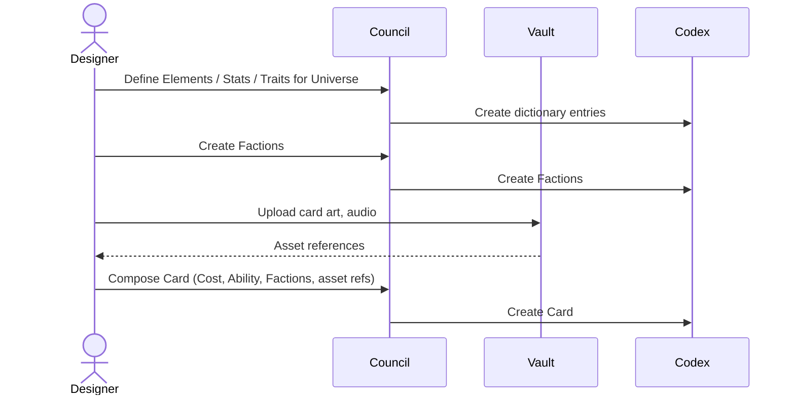
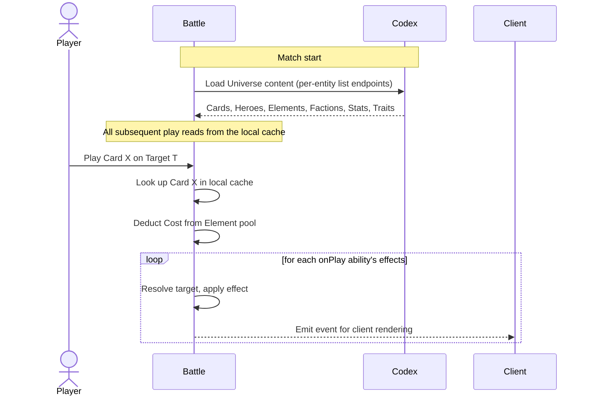
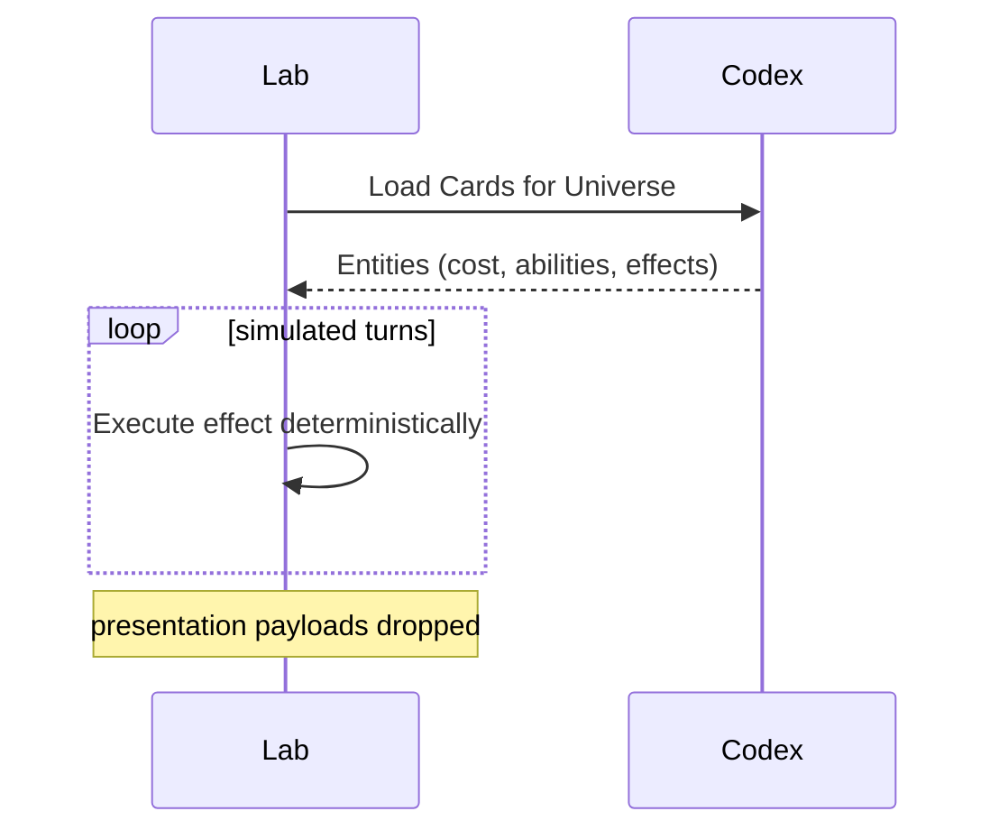
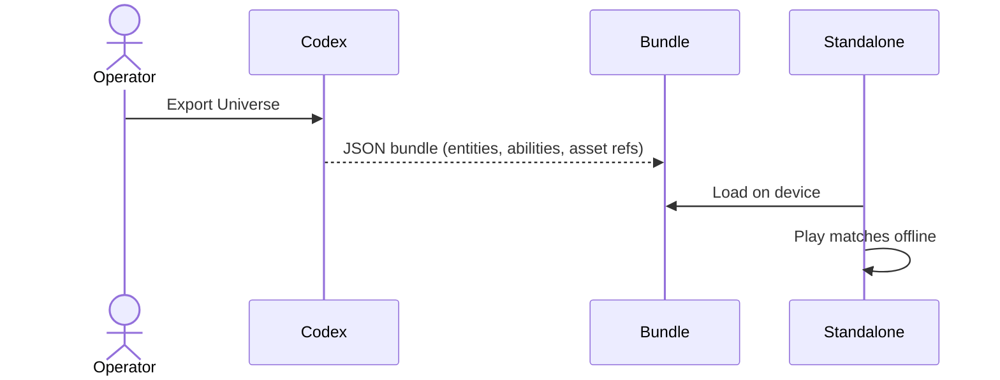
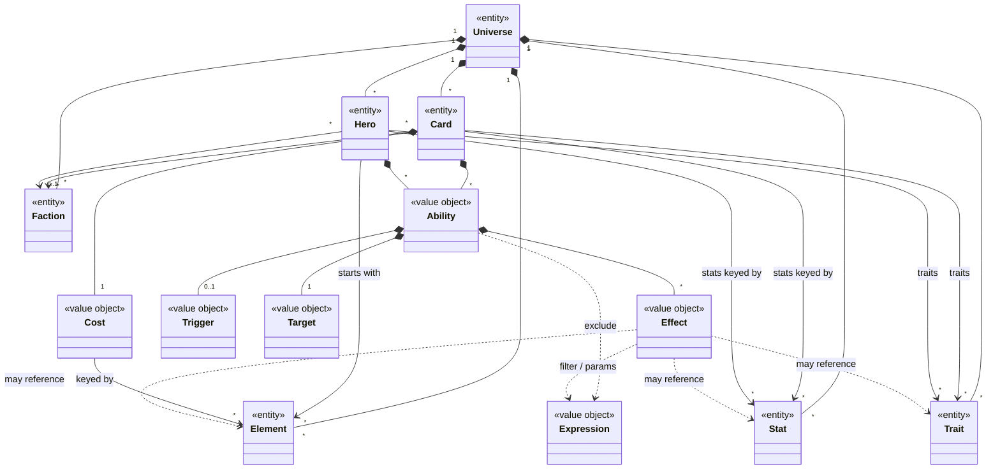

# Design-007: Codex Realm

| Field   | Value      |
| ------- | ---------- |
| Created | 2026-04-19 |

## Purpose

Codex is the repository of game content.

It stores the canonical templates of everything that *can exist* in a game — cards, heroes, factions, and the mechanics that drive them. It does not contain player data, match state, or anything that changes during play.

Codex is a single platform-wide realm. It is multi-tenant by **Universe**: every Codex record belongs to exactly one Universe, and no query ever crosses tenants. One deployment of the platform can host Decay of Magic, Cyber Deal, and Dolphins vs Persimmons side by side without their content bleeding into each other.

This document covers everything needed to understand and implement the Codex realm — its entities, value objects, dictionaries, and the runtime contract with Battle. The detailed grammar of the authored shape (the exact YAML / JSON form authors write for cards, abilities, effects, and expressions) is specified in [Design-008: Card DSL](./Design-008_card-dsl.md), which sits under this design and refines what the value objects look like at the wire level.

## Example universes

The vocabulary below is deliberately universe-neutral. Three reference universes, used throughout this document:

| Universe                  | Setting                                                                 |
| ------------------------- | ----------------------------------------------------------------------- |
| Decay of Magic            | Magic is dying; surviving mages duel with the last remnants of power.   |
| Cyber Deal                | Underground card fights between workers trying to escape digital debt.  |
| Dolphins vs Persimmons    | Two clans — Dolphins and Persimmons — wage tactical card warfare.       |

## Use cases

### Authoring (via Council)

- A designer defines the Elements of a Universe (Fire / Credits / Tide).
- A designer groups Heroes and Cards into Factions.
- A designer curates the Universe's Stats and Traits dictionaries.
- A designer creates a Hero, declaring its Elements and identity.
- A designer creates a Card, setting its Cost in Elements and composing its abilities and effects. Cards that summon a minion carry the minion's stats and traits inline on the card prototype.

### Runtime (read by Battle)

- At match start, Battle loads the Codex content the match needs (Card pool, Heroes, Elements, Factions, Stats, Traits) via the per-entity list endpoints. All runtime lookups resolve against the local cache; Battle never calls Codex mid-match.
- Battle resolves a played Card by interpreting its abilities: checks triggers, resolves targets, executes effects against match state.
- Presentation payloads (when present) flow through to the client unchanged.

### Runtime (read by Lab)

- Lab pulls Codex content to run simulations. It executes effects deterministically; any presentation payloads on those effects are ignored entirely.

### Distribution (offline / standalone)

- A Universe's Codex can be exported as a self-contained DSL bundle (JSON + asset references) so a standalone app can play that Universe without a server connection.

## Entities

Each entity has an identity, lives in CRUD, and is scoped to exactly one Universe. Entities split into two groups: **content** (Hero, Card) — what designers compose — and **dictionaries** (Element, Faction, Stat, Trait) — the universe-scoped vocabularies that content references.

### Element

A fundamental kind of currency, affinity, or school in a Universe.

Used as Cost on Cards, as starting pool on Heroes, and as a mechanical axis on abilities.

| Universe           | Elements                         |
| ------------------ | -------------------------------- |
| Decay of Magic     | Fire, Water, Air, Earth, Death   |
| Cyber Deal         | Credits, Energy, Heat            |
| Dolphins vs Persimmons | Tide, Instinct               |

### Faction

A grouping of Heroes and Cards inside a Universe. Expresses identity and mechanical synergy.

| Universe           | Factions                            |
| ------------------ | ----------------------------------- |
| Decay of Magic     | Order of Ash, Circle of Decay       |
| Cyber Deal         | Neon Syndicate, Rust Collective     |
| Dolphins vs Persimmons | Dolphins, Persimmons            |

A Card may belong to zero, one, or many Factions (neutral, faction-bound, or cross-faction). A Hero may belong to a Faction.

### Stat

A numeric attribute slug that a Universe permits on its entities. Examples: `attack`, `health`, `defence`, `spellDamage`, `fireGrowth`.

A Stat declares:

- **`appliesTo`** — which entity types the stat may attach to (any combination of `minion`, `hero`, `card`). A Hero's stats and a minion's stats are typically different sets.

How a stat actually behaves at runtime — whether it ticks into another stat (as a `fireGrowth` would feed `fire`), participates in damage math, etc. — is the engine's concern, not the dictionary's.

### Trait

A named tag slug a Universe permits on its entities. Examples: `wall`, `charge`, `immuneToSpells`, `spell`. Traits drive keyword abilities, targeting filters, and damage-source classification.

A Trait declares:

- **`appliesTo`** — which entity types the trait may attach to (any combination of `minion`, `hero`, `card`).

The engine carries built-in semantics for each trait it recognizes (e.g. `charge` skips summoning sickness, `wall` blocks attacks past it). For MVP the recognized set is fixed at the platform level; pushing trait semantics into the DSL is future work. Universes may still add dictionary entries beyond the recognized set — those traits work as descriptive tags that abilities and filters reference, with no implicit engine behavior.

### Hero

A playable character. Defines the player's identity and starting state.

A Hero has:

- a name and description (rules text and flavor combined),
- optional Faction,
- an Element pool (a map of Element id to amount),
- optional Stats (each slug must be a Stat in this Universe whose `appliesTo` includes `hero`),
- optional Traits (each slug must be a Trait in this Universe whose `appliesTo` includes `hero`),
- optional Abilities (typically `passive: true` for a signature effect, or a recurring trigger like `onTurnStart`).

### Card

The primary playable object. Cards live in decks, get drawn into hands, and are played by spending their Cost. Some cards are spells that resolve immediately; others summon a persistent unit (a "minion") onto the battlefield.

A Card has:

- a name and description,
- a Cost (a map of Element id to positive amount),
- zero or more Factions,
- an **Activation** — the play-time pick requirement (`emptySlot` summons a minion onto a chosen empty board slot; `enemyMinion` / `ownerMinion` pick a creature on the board; `immediate` resolves with no pick),
- optional Stats (required when `activation: emptySlot`, forbidden otherwise; each slug's `appliesTo` must include `minion`),
- optional Traits (each slug's `appliesTo` must include `minion` for summon cards or `card` for spells),
- zero or more Abilities.

Minions are not a separate aggregate in Codex. A summon-style card carries the minion's Stats and Traits inline on the card prototype itself; the unit placed on the battlefield is a runtime object owned by Battle that references the originating Card.

Cards are what the player sees and touches. Everything else in Codex exists to describe what Cards do.

## Dictionaries

Codex content references universe-scoped vocabulary slugs throughout — every Element id in a Cost, every Stat slug in a stats block, every Trait slug in a traits list. The engine treats Elements and Stats as opaque slugs and never hardcodes them. Traits are split: the platform ships a fixed recognized set with built-in semantics, while additional traits live in content as descriptive tags driven by abilities and filters. This is what keeps the engine portable across Universes: the same engine runs Decay of Magic, Cyber Deal, and Dolphins vs Persimmons because every universe-specific element or stat lives in content, not in code.

The four content-side dictionaries:

- **Elements** — resource types (`fire`, `water`, `credits`, `tide`). Heroes hold element pools, Cards have Costs in elements, abilities gain or lose elements.
- **Stats** — numeric attributes on an entity (`attack`, `health`, `defence`, `fireGrowth`). Each declares `appliesTo`. Runtime behaviour (e.g. `fireGrowth` feeding `fire`) is the engine's concern, not the dictionary's.
- **Traits** — named tags on an entity (`wall`, `charge`, `spell`). Each declares `appliesTo`.
- **Damage source tags** — not a separate dictionary. A damage event carries a reference to its source, and the source's Traits classify the damage. What makes damage `spell` or `kinetic` is just which Traits the source carries. The trait dictionary owns it.

### Validation rules

Codex enforces dictionary integrity on write:

- Every trait or stat slug used on a Card or Hero (in `traits`, `stats`, or any effect parameter that names a slug — `giveTraits`, `removeTraits`, `increaseStat`/`decreaseStat`/`multiplyStat`/`setStat`) must resolve to an existing Trait/Stat in the same Universe.
- That dictionary entry's `appliesTo` must include the entity type the slug is attached to (`hero` for hero stats/traits, `minion` for summon-card stats/traits, `card` for spell-card traits).

## Value objects

Value objects have no identity. They live embedded in entities, are immutable after creation, and are compared by value. The conceptual roles below are the realm-level contract; the wire-level grammar is specified in [Design-008: Card DSL](./Design-008_card-dsl.md).

### Cost

A map from Element id to a positive amount. Paid when a Card is played.

### Ability

What a Card or Hero *does*. Composed of:

- exactly one of a **Trigger** or a `passive: true` flag,
- a **Target** — the candidate set the ability sees,
- an optional **Exclude** Expression — drops candidates from the target set at the ability level,
- an ordered list of **Effects** — what actually happens.

A passive ability is in force while the card is on the board (the engine activates it on enter-board and deactivates it on leave-board). A triggered ability fires when its named engine event happens.

### Trigger

Names the engine event that fires an ability. Triggers are camelCase and drawn from a small engine-published vocabulary that all Universes share. Examples: `onPlay`, `onTurnStart`, `onTurnEnd`, `onDeath`, `onDamaged`, `onBeforeDamage`, `onAttack`, `onSummon`.

Universe-specific concepts (e.g., "before spell damage") are expressed by combining a generic trigger (`onBeforeDamage`) with a per-effect filter on source Traits — never by adding new trigger names to the vocabulary.

### Target

Names the candidate set the ability sees. A Target is always a bare slug. Examples: `self`, `ownerHero`, `enemyHero`, `chosen`, `neighbors`, `ownerMinions`, `enemyMinions`, `allMinions`.

`chosen` resolves to the entity the player picked at play-time (governed by the Card's Activation). It is unresolvable on cards with `activation: immediate`.

### Effect

The smallest deterministic gameplay primitive — a function call against the engine's effect registry.

An Effect carries:

- a **`kind`** discriminator naming a function in the registry,
- **`params`** — kind-specific arguments (each registry entry declares its own param schema),
- an optional **`filter`** Expression — narrows the ability's target set further for this specific effect.

The reference set of registry kinds (universe-agnostic): `damage`, `heal`, `fullHeal`, `gainElement`, `increaseStat`, `decreaseStat`, `multiplyStat`, `setStat`, `giveTraits`, `removeTraits`, `summon`, `destroy`, `attackNow`, `preventDamage`, `reflectDamage`. Universes don't add new effect functions — they add Stats, Traits, and Elements that effect functions reference.

### Expression

A small typed-data language for stat values, exclude predicates, per-effect filters, and effect params. Two forms:

- **Dotted-path reads** for property access — `ownerHero.elements.fire`, `target.traits`, `event.source`.
- **Structured operator nodes** for predicates, arithmetic, logic, and membership — `{ eq: [target, chosen] }`, `{ contains: [target.traits, 'wall'] }`, `{ add: [ownerHero.elements.fire, 2] }`.

There is no infix operator syntax (`a == b`) and no method-call syntax (`x.contains(y)`); the structured form is canonical.

## Domain model

Composition arrows (`*--`) mark ownership: a Universe owns its Elements, Factions, Stats, Traits, Heroes, and Cards; a Card owns its Cost and Abilities; an Ability owns its Trigger, Target, and Effects. Association arrows (`-->`) mark references without ownership: a Card belongs to Factions and references Stats / Traits as keys; a Hero starts with a pool of Elements. Dashed arrows (`..>`) mark loose references that depend on the Effect's `kind` — `gainElement` references an Element, `giveTraits` references Traits, `increaseStat` references a Stat, and so on.

## Battle integration

Codex is read-only at runtime. Battle never writes to it, and never reads from it mid-match — all Codex content the match needs is loaded into a local cache at match start.

Flow when a Card is played:

1. Battle receives "player plays Card X on target T".
2. Battle looks up Card X in the local cache.
3. Battle checks the Cost against the player's element pools; deducts.
4. Battle walks each `onPlay` ability's Effects in order. For each Effect:
   - resolves the Target (and any Exclude or per-Effect filter) against current match state,
   - executes the Effect's `kind` + `params` against match state (damage, heal, summon, …),
   - emits a client event for the UI to render.
5. A summon-style Card produces a minion runtime object in Battle's match state from the inline minion fields on the Card prototype; the minion's abilities fire on their own triggers during subsequent turns.

Battle's engine implements the interpreter for the effect registry. Codex defines *what the shapes are*; Battle defines *what they mean at runtime*.

Lab uses the same interpreter; any presentation payloads attached to effects are dropped, which is why presentation must never influence deterministic state.

## Design principles

### Small core, big compositions

The entity roster (Element, Faction, Stat, Trait, Hero, Card) is intentionally minimal. New mechanics are expressed by adding registry effect kinds or by composing existing ones — not by adding new entity types.

### Universe-neutral vocabulary

Every term is chosen to work across fantasy, sci-fi, and abstract settings. "Element" rather than "Force"; "Faction" rather than "Alliance"; "minion" rather than "creature". A new Universe should not need new entity types — only new dictionary entries and new Cards.

### Engine-oriented structure

The effect registry is universe-agnostic. The engine depends on the registry, not on any Universe's content. Adding a Universe adds data; it does not add interpreter branches.

### Logic / presentation separation

Effects are deterministic and engine-interpreted; presentation payloads (when attached) are opaque and flow through to the client. Lab can run a full match without ever reading them. (Visual and audio effects themselves are deferred for MVP.)

## Out of scope (MVP)

The following are intentionally excluded from this design. They may return in later iterations.

- **Visual / audio effects** — Cards will eventually attach VFX and SFX payloads to specific effects. For MVP, content runs without presentation; battles can be simulated, logged, and played end-to-end without visuals.
- **Versioning** — all Codex records are live. A match in progress is not guaranteed a frozen snapshot.
- **Keywords** — shared named abilities (e.g. Haste, Shield) usable across many Cards. For MVP, abilities are inlined per Card. Promote to a first-class entity once duplication hurts.
- **Deckbuilding / starter decks** — which Cards a Hero may include in a deck is a Battle / rules concern, not a Codex concern.
- **Hero-to-Card restrictions** — whether a Hero is gated to Cards of matching Faction or Element is a rules concern.
- **Cross-Universe references** — Codex is strictly per-Universe. Cross-Universe battles are a far-future idea.
- **Localization** — names and descriptions are single-locale for MVP.
- **Authoring permissions** — who can edit Codex content within Council is a Citizen / authorization concern.
