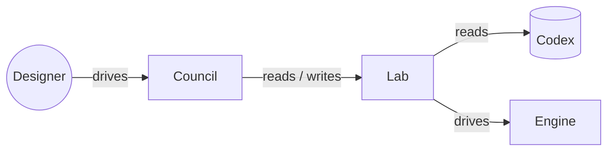
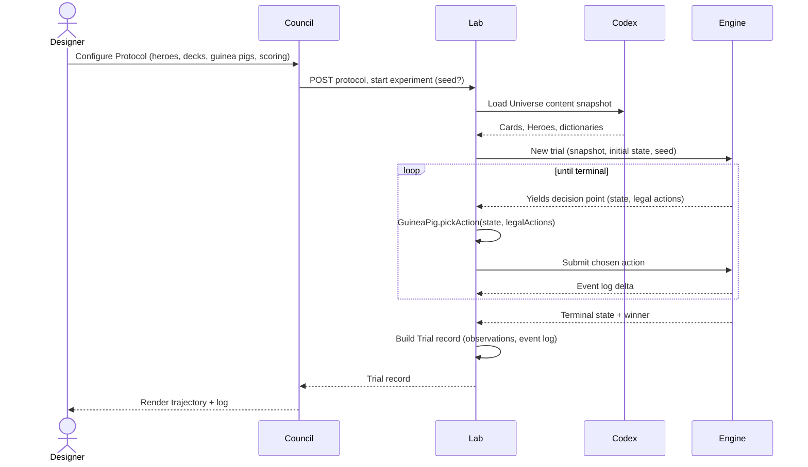
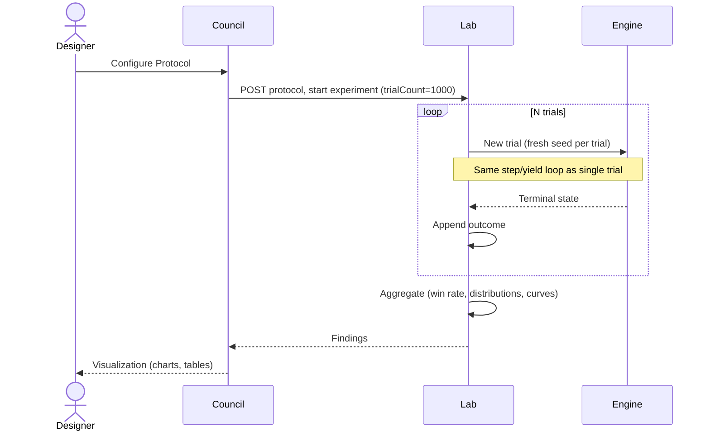
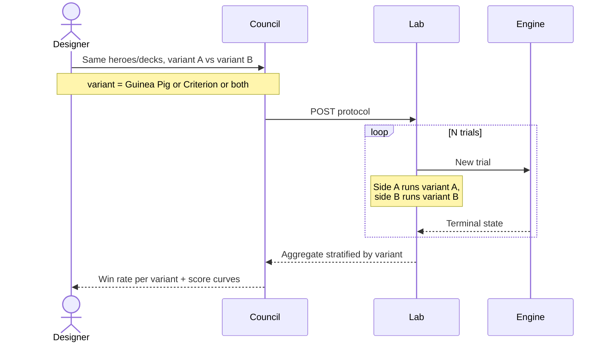
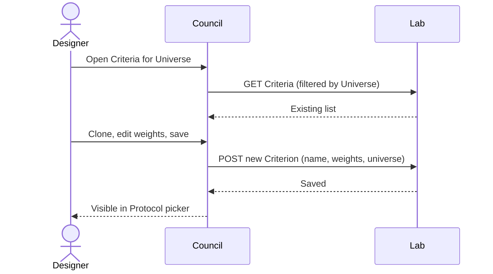
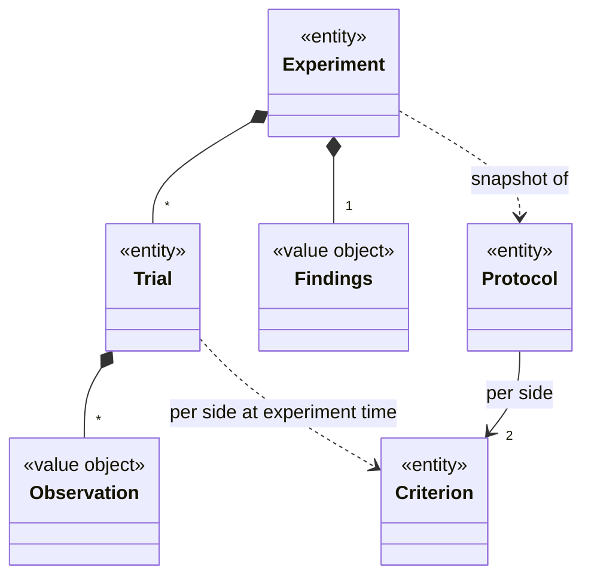

# Design-009: Lab Realm

| Field   | Value      |
| ------- | ---------- |
| Created | 2026-05-13 |

## Description

Lab is the platform's simulation realm. It emulates matches against a deterministic engine to produce balance signal — win rates, score trajectories, per-Card frequency, Guinea Pig comparisons.

Lab is the first real consumer of the engine API. It drives the same step/yield loop a human player would, with an AI policy supplying actions instead of a human. The engine is policy-free; Battle (future) and Lab (now) share one API.

Lab consumes Codex (Universe content snapshotted at experiment start) and the engine (one session per Trial; engine resolved per Universe). Council renders Lab's read API. Human play is Battle's concern, not Lab's.

## Glossary

| Term | What it is |
|---|---|
| **Protocol** | Reusable specification of what to test (entity) |
| **Experiment** | One conducted batch of Trials (entity) |
| **Trial** | One simulated game within an Experiment (entity) |
| **Criterion** | Named weighted feature set for scoring states (entity) |
| **Findings** | Aggregated conclusions of an Experiment (value object) |
| **Observation** | Per-yield-point record within a Trial (value object) |
| **Guinea Pig** | Action-selection policy used inside Trials (code module, not entity) |

## Functionality

Lab's MVP capabilities. Each maps to one or more use cases.

- **Run one trial.** Emulate a complete trial end-to-end from a Protocol (Heroes, decks, Guinea Pig per side). Produces a Trial record — full observation log plus engine event log.
- **Run a batch.** Repeat single-trial emulation N times with fresh seeds against the same Protocol. Produces an Experiment containing N Trials and aggregated Findings.
- **Compare.** A batch variant: hold most of a Protocol constant, vary one axis per side — Guinea Pig, Criterion, or both. Used to compare AI policies and to research which Criterion best models a Universe. Produces Findings stratified by the axis that varied.
- **Inspect a Trial.** Read a Trial's full observation log — every yield point, the action chosen, the alternatives considered with their scores, the engine event delta, the resulting score delta. Surfaces *critical moments* (largest score swings) so a designer can find a trial's turning point without scrolling the whole log.
- **Inspect an Experiment.** Read an Experiment's aggregated Findings — win rate per side (and per Guinea Pig if applicable), trial-length distribution, per-turn score trajectories with confidence bands, per-Card frequency, per-Card win-when-played correlation, termination-reason breakdown.
- **Define scoring.** Create, edit, clone Criteria per Universe. Each is a named weighted feature set that Guinea Pigs consult when evaluating candidate states. The other half of emulation configuration — rules — is inherited from the Universe in MVP (not per-Protocol tunable; see [Out of scope](#out-of-scope)).

## Use cases

### Single-trial emulation

A designer wants to inspect one trial end-to-end — see every decision the AI made, the alternatives it considered, and the state transitions that followed.

### Batch experiment (balance sweep)

A designer wants aggregate signal over many trials — "is this pairing balanced?", "does Card X dominate?".

### Comparison

A designer wants to compare two variants of one axis — two Guinea Pigs (which AI policy plays better?), two Criteria (which scoring better models the Universe?), or a (Guinea Pig, Criterion) pair on each side. Everything else in the Protocol is held constant.

### Define scoring

A designer creates or refines a Criterion. Used to research how a Universe should be scored, and as preparation for comparison experiments.

## Entities

Lab's domain is small: four entities and two value objects. Codex provides the per-Universe content the engine consumes; Lab references it by id but does not redefine it.

### Protocol

The input to an experiment. A reusable specification of what to test. Carries:

- a **Universe** reference — resolves Codex content and the engine that drives the trial,
- an **initial setup** — the per-side starting data the engine consumes. The shape is engine-defined and varies by Universe. For the MVP universes this is a Hero plus a deck of Cards per side, validated against Codex; other Universes may have no Heroes, no Cards, asymmetric setups, or pools instead of decks. Lab treats it as engine-validated payload rather than a fixed schema.
- a **Guinea Pig name** per side — names a Lab-resident code module (`random`, `greedy`, `lookahead`, …),
- a **Criterion** reference per side — the weighted feature set the Guinea Pig consults,
- **turnLimit** — operational guard that caps runaway trials.

The (Guinea Pig, Criterion) pair is independent per side: identical across sides for normal experiments, divergent for Comparison experiments.

Sample-size (`trialCount`) and the random instance (`seed`) live on the **Experiment**, not the Protocol — a Protocol describes *what to test*, not *how thoroughly* or *which random instance*. Running the same Protocol with `trialCount=100` then `trialCount=10000` produces two Experiments, not two Protocols.

### Experiment

One execution of a Protocol. The historical record of a batch of simulations (a single trial is just a batch of size 1). Carries:

- a **resolved Protocol snapshot** — the Protocol's contents captured at experiment start, so later Protocol edits don't retroactively change history,
- a **Codex content snapshot** — Cards, Heroes, dictionaries as they existed when the Experiment started (Codex is live; this snapshot is what makes an Experiment reproducible),
- **trialCount** — how many Trials this Experiment runs (1 for a single-trial Experiment, N for a batch),
- a **seed** — the base seed for this Experiment; supplied by the designer or generated by Lab. Per-Trial seeds derive from it deterministically, so re-running with the same base seed reproduces the same Trial sequence.
- a list of **Trial** results,
- the **Findings** value object,
- timestamps and the user that started it.

### Trial

One simulated game inside an Experiment. Carries:

- the **per-trial seed**,
- the **initial state** — deck order, starting hands, board layout (engine-determined from the seed),
- the **observation log** — an ordered list of **Observation** entries, one per yield point,
- the engine's **event log** for the trial,
- the **terminal state** — winner, turns played, and termination reason.

### Criterion

A named weighted feature set used by Guinea Pigs to evaluate trial states. Universe-scoped: each Universe has its own feature catalog (since "what's worth tracking" differs by game), and a Criterion picks weights over that catalog. Carries:

- a **Universe** reference,
- a **name**,
- a list of **(feature, weight)** pairs — each feature must exist in Lab's catalog for that Universe.

Multiple Criteria can coexist for the same Universe. Criteria are mutable — an Experiment captures the resolved weights in its snapshot, so later edits don't change past Experiment results. Designers preserve historical weights by **cloning** a Criterion before editing it.

### Findings

Value object owned by an Experiment. Computed from the Experiment's Trials; not edited directly. Carries:

- win rate per side (and per Guinea Pig / Criterion in a Comparison),
- trial-length distribution,
- per-turn score trajectories with confidence bands,
- per-Card play frequency and per-Card win-when-played correlation,
- termination-reason breakdown.

### Observation

Value object owned by a Trial — one entry per yield point. Carries:

- the **yield point** — engine-yielded state and the legal actions presented,
- the **chosen action**,
- the **alternatives considered** with the score each would have produced,
- the **engine event delta** that followed submitting the chosen action,
- the **score delta** between the prior and resulting states.

### Domain model

## Engine contract

What Lab requires from the engine. The authoritative contract lives in the forthcoming Engine design doc; this section captures Lab's view.

### Operations

One engine instance = one Trial. Lab constructs N instances for a batch, each fully isolated; no explicit session handle is passed because the instance *is* the session.

| Operation | Purpose |
|---|---|
| `Engine.start(snapshot, initialSetup, seed)` | Construct an engine and advance to the first yield point. Returns the engine plus that yield point (or a terminal state if the trial ends immediately). |
| `engine.submit(action)` | Submit the chosen action; advance to the next yield point or terminal state. |
| `engine.peek(action)` | Return the state that would result from `action`, without committing. `greedy` and `lookahead` rely on this. |
| `engine.getEvents()` | Return the engine's event log since `start`. |

### What a yield point exposes

At each yield point the engine returns:

- the **current state** — hero stats, minion array, element pools, hand contents (shape is universe-specific),
- the **playable cards**, each carrying its target requirement (per Design-008's `activation`),
- the **available targets** by category (own minions, enemy minions, heroes, empty slots),
- any **other actionable entities** — e.g., own minions ready to attack and their valid attack targets.

Lab-side helpers enumerate legal (action, target) pairs from these ingredients (see [Guinea Pigs](#guinea-pigs)). The engine itself doesn't enumerate combinations.

### Determinism

Same `snapshot` + same `seed` + same submitted action sequence → identical event stream. No wall-clock reads, no global state, no environment-dependent inputs inside the engine. This is what makes Experiment reproducibility work.

### Resolution

Lab picks which engine to run from the Protocol's Universe — the binding lives in Codex (a field on the Universe entity; mechanism specified in the Engine design doc). Lab rejects Protocols targeting Universes with no engine bound.

## Guinea Pigs

A Guinea Pig is an action-selection policy. At each engine yield point the Guinea Pig receives the current state and the legal actions, and returns one action to submit. Guinea Pigs are **code modules**, not entities; each is universe-agnostic in MVP and operates on the engine's yield shape without knowing which Universe is loaded.

Action combination is not the engine's concern. At each yield point the engine exposes actionable entities — playable cards with their target requirements, own minions ready to attack with their valid attack targets — plus the available target categories (own minions, enemy minions, heroes, empty slots). A Lab-side helper enumerates valid (action, target) pairs by matching requirements to categories; Guinea Pigs consume the enumerated list. For `greedy` and `lookahead`, each candidate is peeked and scored.

### Reference set

| Name        | Description |
|-------------|-------------|
| `random`    | Uniform random over legal actions. Baseline / control. |
| `greedy`    | For each legal action, peek the resulting state, score via the Criterion, pick max. |
| `lookahead` | Search k plies forward (k is a parameter), assuming the opponent uses a symmetric Guinea Pig; pick the action with the best leaf score. Phase 3. |

Future: Monte Carlo Tree Search and ML / RL policies; per-Universe Guinea Pig variants will likely emerge as Universes diverge in shape, since MVP only gets away with universal Guinea Pigs because all MVP Universes share the engine's yield shape. The interface accommodates these; MVP doesn't ship them.

## Scoring

Scoring turns a match state into a single number — used by `greedy` Guinea Pigs to compare candidate actions, by `lookahead` to evaluate leaf states, and by Lab's analytics to produce per-turn score trajectories. A Criterion combines two things: a **feature set** Lab defines per Universe and **weights** chosen by the designer.

### Features

A feature is a named, deterministic read or aggregation over match state that returns a number (booleans coerced to 0/1). Features are **Lab-defined per Universe**: the engine exposes state primitives (hero stats, the minion array, element pools, hand contents), and Lab combines them into features that Criteria can reference.

Example feature set for a DoM-style Universe (illustrative, not normative):

| Feature | Computes |
|---|---|
| `ownerHero.stats.health` / `enemyHero.stats.health` | Hero `health` per side — direct engine read |
| `ownerMinions.totalHealth` / `enemyMinions.totalHealth` | sum over `ownerMinions[].stats.health` |
| `ownerMinions.totalAttack` / `enemyMinions.totalAttack` | sum over `ownerMinions[].stats.attack` |
| `ownerHero.elements.total` / `enemyHero.elements.total` | sum over `ownerHero.elements.*` |
| `ownerHero.handSize` | count of cards in own hand |

Feature names mirror Codex DSL path conventions for readability (`ownerHero.stats.health` parallels how the DSL reads a hero's health in [Design-008](./Design-008_card-dsl.md)). The engine doesn't compute aggregations — it returns the minion array, the element map, the hand list; the summing and counting is Lab's job. Adding a feature is a Lab-side change as long as it can be derived from existing engine primitives; only fundamentally new state (a new kind of pool, a new entity type) requires an engine extension.

### Weights

A Criterion picks weights over the features it cares about. Each weight is a real number — positive (more is better) or negative (less is better). Features the Criterion doesn't reference get weight 0 implicitly.

The score of a state is the dot product `score = Σ weight[i] × feature[i](state)`. A single number per state, comparable across actions, across turns, and across Trials.

### Score curve

A Trial's *score curve* is the sequence of scores across its Observations — one per yield point. The same Criterion is applied to both sides, so a Trial yields two curves (owner and enemy). Aggregated across an Experiment's Trials, these become the per-turn score trajectory shown in Findings.

## Analysis & representation

Lab supports analysis at two scales: **per-Trial** (one game, full inspection) and **per-Experiment** (aggregate over a batch). Per-Experiment is the primary surface — that's where balance signal lives.

### Per-Trial

Beyond the raw Observation log:

- **Critical moments** — Observations where the score delta exceeds a threshold. The turning point, without scrolling.
- **Termination reason** — HP zero, deck-out, turn limit.

A deep-dive view for "why did the AI lose this specific game?", not the primary research surface.

### Research questions Lab answers

Lab ships a **fixed taxonomy** of platform-level research questions. Each has a canonical Council view; universe specificity comes from the feature catalog, not the UI.

| Question | Findings surface | Council view |
|---|---|---|
| Is this matchup balanced? | Win rate with confidence band | Bar with 50% target line |
| Is this Card overpowered? | Win-when-played per Card, delta vs baseline | Ranked scatter: frequency × win-when-played |
| Is this Card underused? | Frequency-when-available per Card | Sorted bar list |
| How long do matches last? | Length distribution | Histogram with mean / median markers |
| Which Guinea Pig plays this better? | Win rate stratified by Guinea Pig | Side-by-side bars |
| Which Criterion better models the Universe? | Win rate stratified by Criterion | Side-by-side bars |
| Did this change matter? | Two Findings overlaid | Overlaid trajectories + delta panel |

One row = one screen in Council. No chart-editor knobs, no arbitrary metric composition. Adding a question is a platform change (new Findings field + new Council view); MVP ships this set.

### Research validity

A Findings always carries:

- **Confidence bands** on every aggregate, derived from `trialCount`.
- **Sample-size hints** — when a win-rate confidence interval crosses 50%, mark inconclusive and suggest a larger N.
- **N always shown** with every metric.

Without confidence reporting, Lab is a roulette wheel — designers would chase noise.

### Flexibility through feature catalogs, not through UI

The fixed taxonomy works across Universes because each question's **shape** is universe-agnostic; only its **content** is universe-specific.

- **Shape** — chart type, axes, statistical treatment — is the same in every Universe. Council renders the same screens.
- **Content** — what's being aggregated — comes from primitives shared by every game (`winner`, `turnsPlayed`, `cardsPlayed`) or from the Universe's Criterion feature catalog (score trajectories take their meaning from DoM's elements vs Cyber Deal's debt-clock vs whatever else).

Designers don't author charts; they pick a question, configure inputs (Heroes, decks, Criterion, Guinea Pig), and read the canonical view. Adding analytic depth within an existing question = feature-catalog change in Lab. Adding a fundamentally new question = platform change. The wall is deliberate: flexibility through catalogs keeps the UI explicit and finite.

## Worked example: balance check

A designer wants to test whether Fire Drake outperforms Wall of Fire in mid-game.

**Setup.** In Council the designer picks two Heroes from the DoM Universe and builds two decks — Side A heavy on Fire Drake, Side B heavy on Wall of Fire. Both sides use the `greedy` Guinea Pig and Lab's default DoM Criterion. The designer creates a Protocol.

**Execution.** The designer starts an Experiment with `trialCount=1000`. Lab loads the Codex content snapshot once, then runs 1000 Trials. Each Trial:

1. `Engine.start(snapshot, initialSetup, seed)` yields the first decision point.
2. The Lab helper enumerates legal (action, target) pairs from the yield ingredients.
3. The `greedy` Guinea Pig peeks each candidate, scores it via the Criterion, picks the max.
4. `engine.submit(chosenAction)` advances to the next yield, until a terminal state.
5. Lab records the Trial — Observations, engine event log, terminal state.

**Reading the result.** Lab aggregates the 1000 terminals into Findings. Council renders the *Is this matchup balanced?* view: Side A wins 38% ±2%; confidence crosses 50% → "results inconclusive, consider larger N". The *Is this Card overpowered?* view shows Fire Drake at +12 win-when-played vs baseline, Wall of Fire at +5 — suggestive but within noise.

**Iteration.** Designer clones the default Criterion, raises the weight on `ownerMinions.totalAttack`, and runs a Comparison Experiment with both Criteria. After 1000 Trials, the new Criterion wins 57% of side-by-side games — kept as the next-revision baseline.

## Out of scope (MVP)

The following are intentionally excluded from this design. They may return in later iterations.

- **Real-time human play.** A networked match flow with human input belongs to the future Battle realm; Lab only drives the engine via Guinea Pigs.
- **Comparison against real-match data.** Recording real human matches and replaying them through Lab to measure prediction accuracy is a future-milestone goal. The Match log shape leaves room for it; the consumer side is not built here.
- **Per-Protocol rule overrides.** Rules are inherited from the Universe in MVP. A richer rules design (trait-enable flags, turn-phase composition, draft-pool rules) lands later, when concrete needs emerge.
- **ML / RL Guinea Pigs.** The Guinea Pig interface accommodates them; MVP ships only `random`, `greedy`, `lookahead`.
- **Cross-Universe Experiments.** A Protocol is scoped to exactly one Universe.
- **Deck-construction search.** Cross-match strategy search (which deck wins more often? which Hero counters which?) is in [Milestone-007](../milestones/Milestone-007_lab-engine.md) Phase 3 scope; specified separately when it lands.
- **Exhaustive log retention.** Lab samples full per-Trial Observation logs for inspection rather than archiving every Trial's log. Aggregates in Findings are always retained.
- **Custom chart authoring / power-user metric composition.** The research-question taxonomy is fixed; new questions are platform changes, not designer-authored compositions. The wall is deliberate — see [Analysis & representation](#analysis--representation).
- **Authoring permissions.** Who may submit Protocols or edit Criteria is a Citizen / authorization concern, not specified here.
