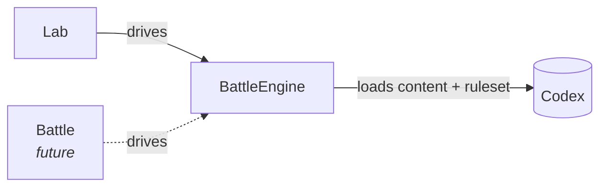
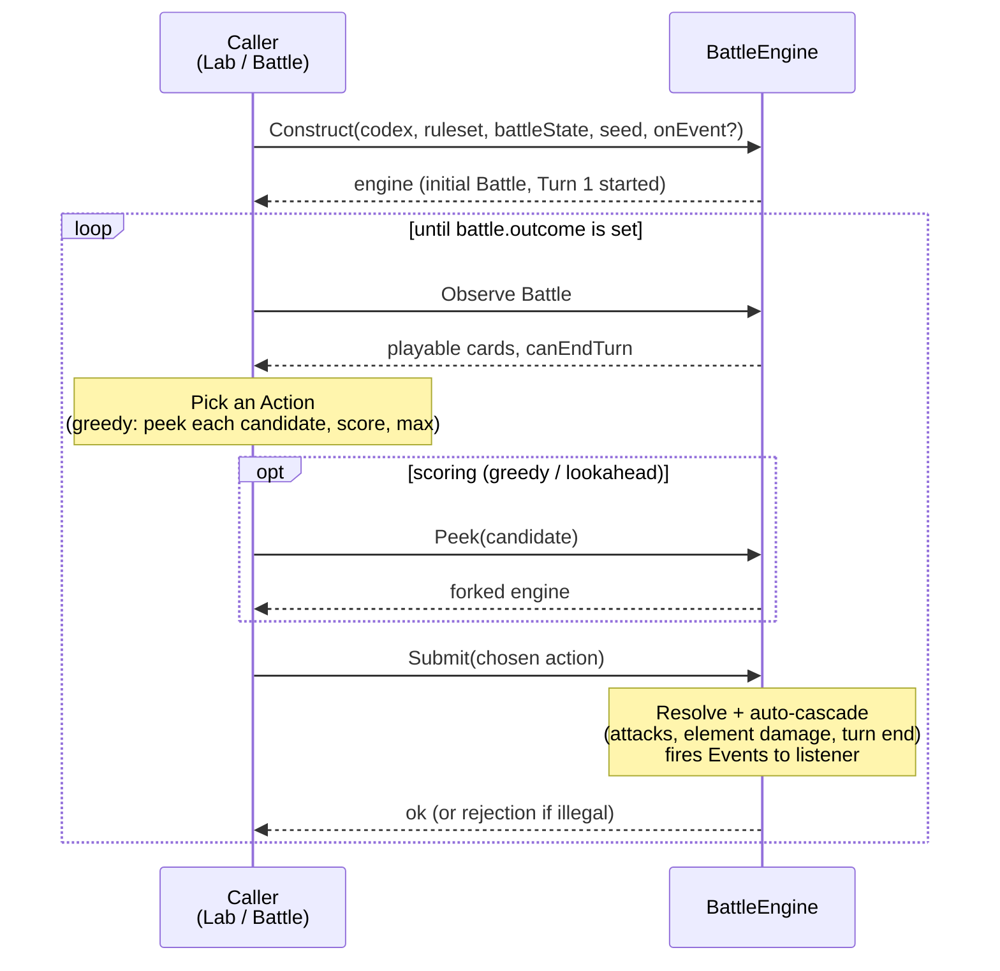
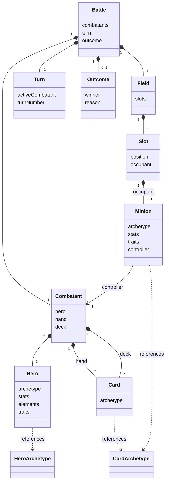
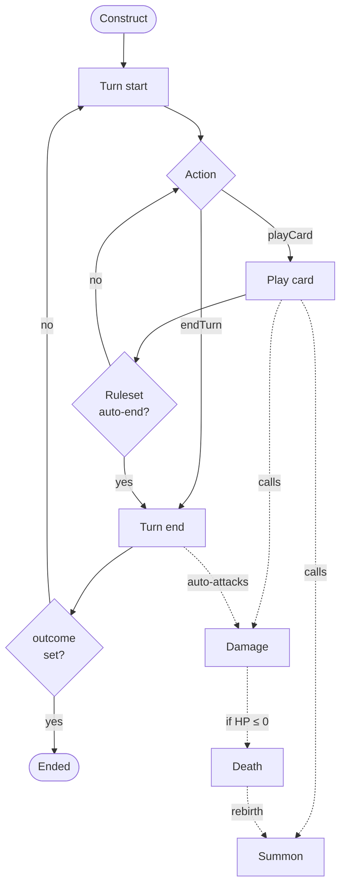

# Design-010: Engine Prototype

| Field   | Value      |
| ------- | ---------- |
| Created | 2026-05-13 |

## Description

The **BattleEngine** is the deterministic runtime that drives a single match to completion. It loads three inputs at start — immutable **Codex content** (Cards, Heroes, dictionaries), a **Ruleset** (per-Universe gameplay parameters), and an engine-validated **BattleState** (per-combatant hero + deck in MVP) — and produces a mutable **Battle**: the runtime model of the active match. Players take Turns; on each Turn, the active player submits Actions, and the engine resolves them.

Callers are policy-free. Lab supplies a Guinea Pig (an AI policy); a future Battle realm supplies a human via the network. The BattleEngine never knows or cares which is on the other end — same contract, same Battle model, same Action vocabulary.

This document specifies the **prototype** — the first concrete runtime that interprets [Design-008: Card DSL](./Design-008_card-dsl.md). Scope is what the milestone needs (one TypeScript engine driving every MVP Universe that uses the DoM DSL); the future portable contract that lets other Universes ship their own engines is acknowledged but not specified here.



## Design stance

**Engine is code; content and rules are data.** Cards (Codex content) and gameplay parameters (Ruleset) are authorable. The damage pipeline, trigger semantics, and Event vocabulary are engine algorithm — not authorable. Crossing this line turns the engine into a programming language with the implementation pain that implies.

Stay simple where the prototype can. Prefer concrete entity types (Hero, Minion, Card) over a unified BattleObject. Keep the **Field** a flat set of fixed slots rather than a movement/pathfinding graph. Prefer a fixed pair of Combatants over an open N-player roster until a real multi-player game forces the hand. Future-proofing happens through *replaceable* layers — Ruleset, Codex content, Action vocabulary, Effect registry — not through preemptive generalization. The one deliberate exception is board ownership: the Field is shared (not split into per-combatant rows) and each Minion carries its controlling Combatant explicitly, so movement, neutral-zone, and grid Universes reuse the engine without rethinking whose minion is whose. See [Field](#notes-on-contents).

## Glossary

Terms specific to the BattleEngine layer. Card-DSL terms (Card, Ability, Trigger, Target, Effect, Expression) live in [Design-008](./Design-008_card-dsl.md); Lab-side terms (Trial, Protocol, Experiment, Findings) live in [Design-009](./Design-009_lab-realm.md).

| Term | What it is |
|---|---|
| **BattleEngine** | The runtime layer that advances a Battle: validates Actions, resolves them against the Ruleset and Codex content, emits Events, and mutates the Battle. One BattleEngine instance drives one Battle. |
| **Battle** | Mutable runtime model of an active match: per-combatant Heroes, hands, decks, and element pools; a single shared Field of positioned Minions (each carrying its controlling Combatant); the current Turn; the Outcome (when ended). The engine derives the initial Battle from a BattleState and the Seed. Battle is purely runtime — history of submitted Actions lives outside the engine, on the caller (Lab's Trial). |
| **BattleState** | Engine-validated input shape that populates a Battle. For a fresh match: per-combatant `{hero, deck}` plus Ruleset-derived starting values. For a future resume operation: a previously serialized mid-Battle snapshot. |
| **Ruleset** | Per-Universe gameplay parameters that frame the game — board, draws, growth, victory, timers. Full treatment in [Ruleset](#ruleset). Separates *how the game flows* from *what exists in it* (Codex content) and *what's happening now* (Battle). |
| **Codex content** | Immutable content (Cards, Heroes, dictionaries) loaded at battle start. The engine never re-reads Codex mid-battle. |
| **Combatant** | One side of the match — a Hero, a hand, a deck. The prototype has two; the model permits more. |
| **Hero** | Runtime entity representing a Combatant's avatar — element pools, base stats, traits, optional Hero abilities. HP ≤ 0 ends the match. |
| **Minion** | Runtime entity occupying one Slot on the Field. Spawned from a CardArchetype at summon time; carries its own stats, traits, and controller. |
| **Field** | The shared board owned by the Battle: a fixed set of Slots, each empty or holding one Minion. Side-relative targets resolve through a Minion's controller, not its slot. |
| **Turn** | One player's active phase. Starts (firing `onTurnStart`), awaits that player's Actions, ends (emitting `TurnEndEvent`). After end, the engine starts the other player's Turn or transitions to terminal. |
| **Action** | What the active player submits during their Turn: play a card (with target if required) or end the Turn. The atomic unit of player intent. Minion attacks and element damage are not Actions — they happen automatically during resolution. The ordered list of Actions (plus initial BattleState + Seed) is the canonical replay history. |
| **Event** | Transient signal fired during Action resolution (`TurnStartEvent`, `PlayEvent`, `SummonEvent`, `DamageEvent`, `DeathEvent`, …). Triggers and passives consume Events internally. The engine does not retain them; a caller that wants telemetry registers an event listener at Construct. Not the canonical history — replaying the Action list reproduces the Event stream. |
| **Seed** | Input to the engine's deterministic RNG. Same Codex content + same Ruleset + same BattleState + same Seed + same Action list → identical Battle resolution. |

## API surface

The BattleEngine exposes four operations: construct, observe, submit, peek. Lab (now) and a future Battle realm consume the same surface. One BattleEngine instance drives one Battle — the instance is the session.

### Operations

| Operation | Purpose |
|---|---|
| **Construct** | Given Codex content, Ruleset, BattleState, Seed, and an optional event listener, validate the BattleState, hydrate it into a Battle, fire `TurnStartEvent` for the first Turn. |
| **Observe Battle** | Read the current Battle — heroes, minions, hands, decks, pools, current Turn, the active player's playable cards, and the Outcome (set once the Battle has ended). |
| **Submit** | Validate an Action against the active player's options; resolve it (including any automatic cascade — minion attacks, element damage, turn end); fire Events to the listener; mutate the Battle. Rejects illegal Actions. |
| **Peek** | Return a forked BattleEngine as it would look after applying the Action. The original instance is untouched. Used by Lab's `greedy` / `lookahead` Guinea Pigs. |

### Playable cards

The Battle exposes the active player's options at the current Turn:

- **Playable cards** in hand — each with its target requirement (per [Design-008 — Activation](./Design-008_card-dsl.md#activation)) and the available target categories (own minions, enemy minions, heroes, empty slots),
- **Can end Turn** — whether ending the Turn is a valid Action right now (Ruleset-dependent: explicit in multi-action rulesets, skip-only in one-card-per-turn rulesets).

The engine surfaces ingredients, not enumerated combinations. Combining a card with its targets into concrete (card, target) pairs is the caller's responsibility — see [Design-009 — Guinea Pigs](./Design-009_lab-realm.md#guinea-pigs).

Minion attacks and element damage are *not* exposed as playable Actions — they happen automatically inside Submit during turn resolution.

### Outcome

When the Battle ends, the engine sets `battle.outcome` to `{ winner, reason }`. While the Battle is in progress, `outcome` is null. Callers loop until `outcome` is set; further Submits after that point are rejected.

| Reason | Trigger |
|---|---|
| `heroDefeated` | A Hero's HP ≤ 0. Winner = surviving Combatant. |
| `deckOut` | A Combatant could not draw a required card. Winner per Ruleset. |
| `turnLimit` | Operational cap reached. Winner per Ruleset. |
| `custom` | Ruleset-defined condition. |
| `draw` | Simultaneous terminals; Ruleset tie-break resolved to draw. |

A single cascade can drop both Heroes simultaneously (e.g., Armageddon when both Heroes' HP ≤ `8 + ownerHero.elements.fire`). The Ruleset chooses the tie-break — acting Combatant wins, defending Combatant wins, or `draw`. The prototype defaults to **draw**.

### Telemetry

Events are not stored. A caller that wants a play-by-play registers an event listener at Construct; the engine fires the listener once for each Event it emits during Submit:

```
TurnStartEvent     — Player Hist's Turn 4 started
PlayEvent          — Hist plays Griffin to slot 5
SummonEvent        — Griffin #4 enters play
DamageEvent        — Griffin #4 deals 5 to enemy Hero           (Griffin onSummon)
DamageEvent        — Goblin Berserker #1 attacks, 4 to Sea Sprite #1 (auto-attack)
TurnEndEvent       — Hist's Turn ended
TurnStartEvent     — Player Dio's Turn 4 started
```

Bookkeeping that carries no trigger — element growth, card draws, cost payment — emits no Event; it changes Battle state, and a caller that wants to narrate it reads the Battle before and after via Observe. Triggers and passives consume Events internally during resolution; they do not require a listener. Lab subscribes to drive its Observation log; the engine itself holds no event history.

The listener is invoked synchronously during Submit, once per Event, in the order the engine emits them.

### Visibility

The BattleEngine surfaces the full Battle, both Combatants included. Per-player filtering (hiding the opponent's hand, for instance) is the caller's concern: a networked Battle realm filters before transmission; Lab controls both Combatants and doesn't filter.

### Typical loop



## Battle model

Battle is the mutable runtime model the engine derives at Construct from `{Codex content, Ruleset, BattleState, Seed}` and mutates on every Submit. Battle holds everything needed to continue resolution — and nothing more (no event log, no telemetry, no internal scratch).

### Archetype vs runtime

Codex defines **Archetypes** — the immutable templates for Cards and Heroes. Battle holds **runtime objects** spawned from those Archetypes. A runtime object references its Archetype for static data and carries its own mutable state (base stats, traits, board position). Two summoned Griffins from the same CardArchetype are two distinct Minions with independent runtime state.

Names used in this document:

| Codex side (Archetype) | Battle side (runtime) |
|---|---|
| HeroArchetype | Hero |
| CardArchetype | Card (in hand / deck) → Minion (in play, for summon cards) |

[Design-008](./Design-008_card-dsl.md) currently calls the Codex side "Hero prototype" / "Card prototype" — same concept; a follow-up will align terminology across the two docs.

### Contents



### Notes on contents

- **Combatants** — two players for MVP, indexed by combatant. The model does not lock to two: N-player or team modes plug in via Ruleset without restructure, with `ownerHero` / `enemyHero` generalizing to active-combatant / opposing-combatant. Design-008's `ownerHero` / `enemyHero` resolve relative to the Combatant being acted on.
- **Field** — a single shared board owned by the Battle, not by either Combatant. It is a fixed set of positioned slots (count and layout from Ruleset; DoM lays them out as two rows facing off by `oppositeSlot`), each empty or holding one Minion. A Minion carries its **controller** — the Combatant it fights for — explicitly, independent of the slot it occupies. Combatant-relative targeting (`ownerMinions` / `enemyMinions`, `ownerHero` / `enemyHero`) resolves through `controller`; spatial targeting (`oppositeSlot`, `neighbors`) resolves through slot position. In DoM a minion never moves and never changes Combatant, so its controller always matches its home row — but the engine doesn't assume that, leaving movement, neutral zones, and grid control to future Rulesets without restructuring.
- **Hand / deck** — Cards are thin: an Archetype reference plus a stable instance id (so telemetry can say "Griffin #5" and replay can refer to the same card across Actions). No stat mutation on a Card while it sits in hand or deck.
- **Minion** — once a Card is played onto a slot, the engine spawns a Minion in that slot, its controller set to the Combatant that played it, with starting stats / traits from the CardArchetype's `stats` and `traits` (per [Design-008](./Design-008_card-dsl.md#card-prototype)). From that point on, the Minion's state drifts independently as it takes damage, gains traits, dies.
- **Hero** — same idea for heroes; element pools live here, mutated by Ruleset-driven growth and by card effects.
- **Effective stats** — a Minion or Hero stores its `stats` as *base* values (mutated in place by permanent triggered effects). Continuous passives are not stored as records: the engine derives an entity's effective stats on read as the base plus the contributions of every currently-active passive that targets it, in a fixed fold order (additive, then multiplicative, then set). When a passive's source leaves the board its contribution simply stops appearing — there is nothing to revert. See [Passives](#passives).
- **Turn** — which Combatant is active and what Turn number it is. Phases (if any) belong here too, but the prototype keeps Turn structure simple — see [Event flow](#event-flow).
- **Outcome** — null while in progress; set to `{ winner, reason }` once a terminal condition (HP zero, deck-out, turn limit, Ruleset-defined victory) is reached. After Outcome is set, Submit rejects further Actions.

Battle is runtime; the **history of submitted Actions is not part of Battle**. Callers that need replay (Lab's Trial) record the Actions they submit. `{ initial BattleState, Seed, caller-recorded Action list }` plus identical Codex content + Ruleset replays byte-identical.

Battle also carries an internal **deterministic random source** — advanced by draws and shuffles; copied when Peek forks the engine so the fork's randomness doesn't disturb the real Battle. The caller never reads it directly. Full treatment in [Determinism + Canonical replay](#determinism--canonical-replay).

Inside a single Submit the engine carries the scratch state its resolution cascade needs; none of it survives Submit or is observable to callers.

## Ruleset

A Ruleset is the bundle of per-Universe gameplay parameters the engine consumes alongside Codex content. It separates *how the game flows* from *what exists in it* (Codex content) and *what's happening now* (Battle). One engine, one DSL — different Rulesets describe different games (Decay of Magic, Cyber Deal, …).

The Ruleset is data, not code: it can configure the engine but cannot teach the engine new behavior.

### What a Ruleset specifies

- **Board topology** — `topology` (MVP: `linear`; future: `hex`, `grid`); slot count per combatant; the engine's `neighbors` target keyword resolves against the chosen topology.
- **Starting hand** — initial hand size; mulligan policy (none / single redraw / selective).
- **Draw rule** — when and how many cards a player draws (start of Turn, end of Turn, never, on cue).
- **Starting resources** — initial element pools per combatant.
- **Resource growth** — how element pools change per Turn (Decay of Magic: at each Turn start, the active hero's element X gains the hero's X-growth stat).
- **Victory conditions** — terminal triggers (HP ≤ 0, deck-out, Ruleset-defined custom).
- **Turn phases** — what fires automatically at Turn start / Turn end (draws, element growth, auto-attacks, hand-limit checks). See [Event flow](#event-flow).
- **Operational guards** — turn-count cap (so runaway matches terminate); per-Action wall-clock timer (real-time play only; Lab ignores).

### What a Ruleset does NOT specify

- **Cards / Heroes** — those are Codex content. Ruleset describes the frame; Codex fills it.
- **Effect / trigger / target / expression vocabulary** — engine-level. Adding a new effect kind is an engine change, not a Ruleset change.
- **AI policies** — Lab's concern, not the engine's.

### Where it lives

Each Universe in Codex carries its Ruleset (Codex-side authoring mechanism is a follow-up). At Construct, the caller resolves the Universe to `{ Codex content, Ruleset }` and hands both to the engine. The engine reads the Ruleset once at Construct and never re-reads it during the Battle.

## Actions

The atomic unit of player intent. The caller submits one Action per Submit; the engine resolves it (with any automatic cascade), mutates the Battle, and returns. Minion attacks, element damage, draws, element growth, and victory checks are *not* Actions — they happen inside Submit during turn resolution.

### Vocabulary

| Kind | Carries | Effect |
|---|---|---|
| `playCard` | a Card in the active Combatant's hand, plus a target if the Card's activation requires one | Pay cost, run the activation branch, fire onPlay / onAfterPlay; auto-cascade if Ruleset says auto-end. |
| `endTurn` | nothing | Run Turn end (the "pass" Action in one-card-per-turn rulesets; the explicit close in multi-action rulesets). |

Two kinds is the whole prototype vocabulary. Mulligans, surrenders, concedes, and mid-resolution choices are not part of the Action contract today; mulligan is handled by the caller before Construct (BattleState arrives with hands already populated). See [Out of scope](#out-of-scope).

### Shape

```
PlayCardAction := { kind: 'playCard', card: <hand card instance id>, target?: TargetRef }
EndTurnAction  := { kind: 'endTurn' }

TargetRef := { slot: <int> }      // empty-slot picks
           | { minion: <id> }     // minion picks
```

`card` is the runtime instance id of a Card in the active Combatant's hand, not a CardArchetype slug. Two copies of the same Archetype in hand have distinct instance ids and submit as distinct Actions.

`target` discriminates by what was picked — a slot coordinate (empty-slot summon) or a minion identity (replacement summons and spell-target picks). The shape per [Activation](./Design-008_card-dsl.md#activation):

| Activation | `target` | What the engine does with it |
|---|---|---|
| `emptySlot` | `{ slot: N }` | Empty slot in the active Combatant's home row. Summon destination. |
| `replaceOwnerMinion` | `{ minion: id }` | Active Combatant's Minion to destroy. Replacement summons into its slot. |
| `enemyMinion` | `{ minion: id }` | Opposing Combatant's Minion. Becomes `chosen` for the Card's effects. |
| `ownerMinion` | `{ minion: id }` | Active Combatant's Minion. Becomes `chosen` for the Card's effects. |
| `immediate` | absent | No target; the Card resolves on its own scope. |

Cards with `immediate` activation must omit `target`; any other activation must supply it. There is no default-target inference — the caller picks explicitly.

### Validation

Submit rejects an Action and leaves the Battle untouched when:

- The Battle has an Outcome (terminal).
- For `playCard`:
  - The `card` instance id doesn't resolve to a Card in the active Combatant's hand.
  - Any element in the Card's `cost` exceeds the active hero's pool for that element.
  - `target` is present on an `immediate` Card, or absent on any other activation.
  - The target shape doesn't match the activation (slot vs. minion), the slot isn't empty (`emptySlot`), the minion isn't controlled by the required Combatant, or the instance id doesn't resolve.
- For `endTurn`: the Ruleset's turn-phase configuration disallows it (the prototype's rulesets always allow ending the Turn, but the contract leaves room).

Rejection is informational: the engine returns a structured error naming the rule that failed. The contract is "reject, don't repair" — callers either send valid Actions or learn what's wrong. The engine never silently changes targets, auto-discards, or rounds a cost down.

### Submit is atomic

A Submit either fully resolves — cost paid, ability cascade complete, victory check run, Turn switched if auto-end fired — or fully rejects. The engine never leaves Battle in a half-applied state visible to the caller.

### Canonical replay

`{ initial BattleState, Seed, ordered Action list }` plus identical Codex content + Ruleset replays byte-identical. The Action list is the only history the caller needs to record; Battle state, Event stream, and RNG cursor all recompute from those five inputs. Full treatment in [Determinism + Canonical replay](#determinism--canonical-replay).

## Events

An **Event** is a signal the engine emits at a definite moment during Action resolution. Events are transient: the engine fires one, triggers and passives react, and it is gone — there is no stored event log (a caller that wants a play-by-play registers a listener; see [Telemetry](#telemetry)).

Authoring exposes many named **triggers** (`onSummon`, `onEnemyMinionDied`, `onDealDamage`, …), but the engine emits only a handful of events. Most triggers are **facets** — views onto one event, selected by *participant role* or *relationship*. `onDeath`, `onOwnerMinionDied`, and `onEnemyMinionDied` are three relationships watching the **same** `DeathEvent`; `onDamaged` and `onDealDamage` are the two roles of one `DamageEvent`. The engine dispatches each event once and routes it to whichever facets match.

What a facet *cannot* vary is **payload**: every facet of an event reads the same fields. That is why `onPlay` and `onAfterPlay` are not two facets of one event but two separate events — `onAfterPlay` reads how many Minions the play killed, and that count does not exist when `onPlay` fires. Different payload, different event. [Event flow](#event-flow) shows how these sequence within a Turn.

### Event catalog

Six events carry triggers. Each fires at one moment and hands its facets one fixed payload (`event.*`, detailed in [Payloads](#payloads)).

| Event | Fires when | Triggers | Payload |
|---|---|---|---|
| `TurnStartEvent` | the active player's Turn begins | `onTurnStart` | — |
| `PlayEvent` | a Card resolves from hand | `onPlay` | — |
| `AfterPlayEvent` | a Card's `onPlay` effects have all resolved | `onAfterPlay` | `killedCount` |
| `SummonEvent` | a Minion enters play | `onSummon`, `onOwnerMinionSummoned`, `onEnemyMinionSummoned` | `subject` |
| `DamageEvent` | the damage pipeline yields a non-zero result | `onDamaged`, `onDealDamage` | `source`, `target`, `damage`, `lifeLost` |
| `DeathEvent` | a Minion leaves play (HP ≤ 0 or destroyed) | `onDeath`, `onOwnerMinionDied`, `onEnemyMinionDied` | `subject`, `source` |

A summon Card played from hand emits **both** `PlayEvent` (→ `onPlay`) and `SummonEvent` (→ `onSummon`); a Minion that reaches the board another way — a token, a rebirth, a replacement — emits only `SummonEvent`. So `onPlay` means "this Card was cast from hand" and `onSummon` means "this Minion entered play"; they diverge for every Minion summoned without being played.

Everything else the engine emits — element growth, card draws, cost payment, auto-attacks, the `TurnEndEvent` boundary — carries **no trigger**; it exists for telemetry and sequencing. Anything that produces damage (an attack, an element tick) routes through `DamageEvent`, so `onDamaged` / `onDealDamage` already cover it — there is no separate attack event.

### Triggers as facets

A trigger fires on an entity standing in a given relationship to the event's **participant**. `DamageEvent` has two participants (source, target); `SummonEvent` and `DeathEvent` have one (the subject); `PlayEvent`, `AfterPlayEvent`, and `TurnStartEvent` have none beyond `self`.

| Trigger | Event | Fires on |
|---|---|---|
| `onPlay` | `PlayEvent` | the played Card, once its activation has resolved |
| `onAfterPlay` | `AfterPlayEvent` | the played Card, after its `onPlay` effects |
| `onTurnStart` | `TurnStartEvent` | each entity the active Combatant controls — Hero, then Minions in slot order |
| `onSummon` | `SummonEvent` | the summoned Minion itself |
| `onOwnerMinionSummoned` | `SummonEvent` | the summoned Minion's allies (same controller, itself excluded) |
| `onEnemyMinionSummoned` | `SummonEvent` | Minions of the opposing Combatant |
| `onDeath` | `DeathEvent` | the dying Minion itself |
| `onOwnerMinionDied` | `DeathEvent` | the dead Minion's allies (same controller) |
| `onEnemyMinionDied` | `DeathEvent` | Minions of the opposing Combatant |
| `onDamaged` | `DamageEvent` | the entity that took the damage (target) |
| `onDealDamage` | `DamageEvent` | the entity that dealt it (source) |

**Self vs observer.** `onPlay` / `onAfterPlay` / `onSummon` / `onDeath` / `onDamaged` / `onDealDamage` fire on a *participant* of the event (self-scoped). The `onOwner…` / `onEnemy…` facets fire on *observers* — Minions reacting to another Minion's summon or death — and reach the participant through `event.subject`. Observers fire allies before opposing, each in slot order; a Minion never observes its own lifecycle (it receives `onSummon` / `onDeath` instead).

### Payloads

A firing trigger — and any Expression inside its ability — reads the event's payload through the `event.*` namespace. Entity-valued members expose the entity's fields (`event.source.traits`, `event.target.stats.health`); scalar members are read directly. Each event carries one fixed shape.

#### TurnStartEvent

No payload — the ticking entity is reachable as `self`.

#### PlayEvent

No payload — the Card being played is `self`.

#### AfterPlayEvent

| Path | Kind | Meaning |
|---|---|---|
| `event.killedCount` | scalar | How many Minions died during this Card's play — a snapshot taken when the after-play beat fires, not a live tally. |

#### SummonEvent

| Path | Kind | Meaning |
|---|---|---|
| `event.subject` | entity | The Minion that entered play. For `onSummon` this is `self`; the observer facets reach it here. |

#### DamageEvent

| Path | Kind | Meaning |
|---|---|---|
| `event.source` | entity | The entity that dealt the damage. |
| `event.target` | entity | The entity that took it. |
| `event.damage` | scalar | The amount the damage pipeline produced. |
| `event.lifeLost` | scalar | HP actually removed — `min(event.damage, target HP)`; below `event.damage` on overkill. |

#### DeathEvent

| Path | Kind | Meaning |
|---|---|---|
| `event.subject` | entity | The Minion that died. For `onDeath` this is `self`; the observer facets reach it here. |
| `event.source` | entity | What caused the death — the Minion or Card that struck the killing blow or destroyed it. |

The summon/death subject is also reachable as the `eventSubject` **target** keyword — the same entity in two spellings: the dotted payload path `event.subject` inside an Expression, the flat keyword `eventSubject` in a Target. The split is deliberate: Targets are a closed keyword set, payload paths walk into the event.

A payload path read under the wrong event resolves to empty — `event.damage` inside an `onSummon` ability is meaningless and should be flagged in authoring.

### In content

- `onDeath` + `event.source.traits` — Phoenix rebirths on death unless the killing blow came from a `destruction` Card (Tornado).
- `onDamaged` + `event.lifeLost` — Wall of Reflection returns to `event.source` exactly the HP it just lost.
- `onDealDamage` + `event.target` — Master Lich gains Death power only when its blow lands on the enemy Hero.
- `onAfterPlay` + `event.killedCount` — Drain Souls and Rage of Souls heal twice the Minions the cast killed.
- `onEnemyMinionSummoned` + `eventSubject` — Dwarven Rifleman strikes the Minion that just arrived.

Fuller worked cards live in [Design-008](./Design-008_card-dsl.md).

## Abilities

An **Ability** has one body — `{ target, exclude?, effects }` — and differs only in what wakes it: a `trigger` (an event facet, [Events](#events)) or `passive: true` (a standing contribution, [Passives](#passives)). When an Ability runs the engine resolves it the same way regardless of which: pick the targets, drop the excluded, and apply each effect to the targets that pass its filter. The Card-DSL *vocabulary* — which target keywords, effect kinds, and operators exist — is catalogued in [Design-008](./Design-008_card-dsl.md); this section is how the engine turns that vocabulary into Battle mutations, deterministically.

### Resolution pipeline

One fixed sequence, every Ability, every time it runs:

1. Resolve `target` to an ordered set of entities (slot order for collections; see [Targeting](#targeting)).
2. Drop every entity for which `exclude` evaluates true.
3. For each effect in `effects`, in array order:
   1. keep the surviving entities that pass the effect's `filter` (no filter = all of them);
   2. evaluate the effect's `params` Expressions and apply the effect to each kept entity, in slot order.

Order is total and content-defined — targets in slot order, effects in array order, Abilities in their Archetype's array order — and nothing is concurrent: a later effect sees the Battle the earlier one left behind. That is why Drain Souls can destroy in its first effect and read the resulting `event.killedCount` in its second. The determinism is the point; see [Determinism + Canonical replay](#determinism--canonical-replay).

### Targeting

`target` is one keyword or an array of them (a union). Each resolves against the Ability's host (`self`) and the host's controller — never its position, unless the keyword is spatial.

| Keyword | Resolves to | Via |
|---|---|---|
| `self` | the entity that owns the Ability | identity |
| `ownerHero` | the controller's Hero | controller |
| `enemyHero` | the opposing Hero | controller |
| `ownerMinions` | every Minion the controller controls | controller |
| `enemyMinions` | every Minion the opposing Combatant controls | controller |
| `allMinions` | every Minion on the Field | — |
| `neighbors` | the Minions in the slots adjacent to `self` | slot position |
| `oppositeSlot` | the Minion (if any) in the facing slot | slot position |
| `chosen` | the entity the player picked at play (`enemyMinion` / `ownerMinion` activation) | Action target |
| `eventSubject` | the summon/death subject of the triggering event | event payload |

- The four **collections** (`ownerMinions`, `enemyMinions`, `allMinions`, `neighbors`) resolve to sets iterated in **slot order**; the rest resolve to a single entity — or, for `oppositeSlot` and `eventSubject`, possibly none, in which case the Ability has nothing to act on and no-ops.
- An **array** target unions its members in listed order, deduplicated. Armageddon's `["allMinions", "ownerHero", "enemyHero"]` reaches every Minion and both Heroes from one Ability.
- Side-relative keywords (`owner…` / `enemy…`) resolve through the host's **controller**, so they behave identically wherever the Minion sits; spatial keywords (`neighbors`, `oppositeSlot`) resolve through slot position. That split — [Field](#notes-on-contents) — is what lets the same content survive a future Universe where Minions move.

### exclude vs filter

Both are Expressions evaluated to a boolean **per candidate**, with `target` bound to that candidate — but they sit at different levels and point opposite ways.

- **`exclude`** is the Ability-level *negative* gate: a candidate for which it is true is removed before any effect runs. Bargul's `exclude: "self"` keeps its summon blast off itself; Orc Chieftain's `exclude: {contains: ["target.traits", "wall"]}` spares walls.
- **`filter`** is the per-effect *positive* selector: among the survivors, only those for which an effect's `filter` is true receive *that* effect. Inferno targets `enemyMinions` once and splits it with two effects — `{eq: ["target", "chosen"]}` deals 18 to the picked Minion, `{ne: ["target", "chosen"]}` deals 10 to the rest.

They do not collapse into one: `exclude` gates the whole Ability's target set, `filter` routes individual effects within it (Divine Justice excludes `chosen` from its board-wide damage, then a separate effect heals `chosen`). When an `exclude` ignores `target` entirely — Phoenix's `{lt: ["ownerHero.elements.fire", 10]}`, Master Lich's `{ne: ["event.target", "enemyHero"]}` — it evaluates the same for every candidate, so it reads as an all-or-nothing gate on whether the Ability fires at all.

A bare entity keyword where a boolean is expected (`"self"`, `"chosen"` inside an `exclude` or `or`) means "the candidate **is** this entity" — identity, not truthiness.

### Effects

An effect is `{ kind, params, filter? }`. Fifteen kinds, grouped by what they touch:

| Group | Kinds | `params` | Mutates |
|---|---|---|---|
| Life | `damage`, `heal` | `{ amount }` | target HP — `damage` runs the [damage pipeline](#damage-pipeline) first |
| Life | `fullHeal` | `{}` | target HP back to its max |
| Stats | `increaseStat`, `decreaseStat`, `multiplyStat`, `setStat` | `{ <statSlug>: amount, … }` | one or more of the target's stats |
| Elements | `gainElement`, `decreaseElement` | `{ <elementSlug>: amount, … }` | the target Hero's element pools |
| Traits | `giveTraits` | `{ traits, duration? }` | adds traits — for `duration` turns, else permanently |
| Traits | `removeTraits` | `{ traits }` | removes traits |
| Board | `summon` | `{ minion }` | puts a Minion (by Archetype slug) into the relevant slot |
| Board | `destroy` | `{}` | removes the target Minion — a kill that is *not* damage, so it skips the pipeline |
| Board | `replaceWith` | `{ card }` | swaps the host Card for another Archetype (Drain Souls → Rage of Souls) |
| Combat | `attackNow` | `{ target? }` | makes the target Minion attack at once, against `target` or its default opposing slot (Hypnosis) |

- Stat and element params are **records** — one effect bumps several at once: Divine Intervention raises four growth stats in one effect, heals in another. Every value is an [Expression](#expressions), so amounts compute (Armageddon's `{add: [8, "ownerHero.elements.fire"]}`).
- The **same kind persists differently by Ability type**: an `increaseStat` in a *triggered* Ability is a one-time permanent change to the target's stored base; the same `increaseStat` in a *passive* Ability is a standing contribution recomputed on read and gone when its source leaves. The kind is identical — the Ability type decides. See [Passives](#passives).
- `setStat` and `removeTraits` are in the contract but unused by current content.

### Damage pipeline

A `damage` effect does not assign HP directly — the engine routes the raw amount through this deterministic transform first, applying source-side amplifiers and target-side mitigators before the result lands as a `DamageEvent`:

1. **Source-side** — `additionalSpellDamage`, `multiplyStat spellDamage` (when the source has the `spell` trait).
2. **Target-side** — `armor` (subtract), `damageMultiplier` (multiply), `maxIncomingDamage` (cap), `spellImmunity` (nullify spell-source damage entirely).

There is no content-side hook between the two stages. The result becomes `event.damage` and `event.lifeLost` carried by the `DamageEvent`.

### Expressions

The value language. Every `params` value, every `filter`, every `exclude`, and every entry in a Card's `stats` block is an Expression that evaluates — purely, against the current Battle — to a **number**, a **boolean**, an **entity**, or a **list** (of traits / factions).

Atoms are a number or boolean literal, or a string that is either a **path** (dotted, walks into Battle state) or a **literal** name (`"wall"`, `"destruction"`). Single tokens disambiguate by context — `"self"` reads as the host entity, `"wall"` as a trait literal. Paths root at one of `self`, `ownerHero`, `enemyHero`, `target`, `chosen`, `event`, then walk: `self.stats.health`, `ownerHero.elements.fire`, `target.traits`, `target.totalCost`, `event.source.traits`. `target` is the candidate currently under test; `event.*` is the triggering event's [payload](#payloads).

Operators are an object with one key (full catalogue in [Design-008](./Design-008_card-dsl.md)):

- **Arithmetic** — `add`, `sub`, `mul`, `div`, `min`, `max`, and `ceil`, the rounding primitive: Banshee's half-health-rounded-up is `{ceil: {div: ["target.stats.health", 2]}}`.
- **Comparison / boolean** — `eq`, `ne`, `lt`, `lte`, `gt`, `gte`; `and`, `or`, `not`.
- **List** — `contains(list, item)`, e.g. `{contains: ["target.traits", "wall"]}`.
- **Collection** — read over a [collection](#targeting) keyword: `count` (how many), `maxBy(coll, stat)` (top value of a stat), `rankBy(coll, stat)` (the candidate's 1-based rank within the collection by that stat), `sumTopBy(coll, N, stat)` (sum of the top N). Cannon strikes the highest-HP Minion with `filter: {eq: ["target.stats.health", {maxBy: ["enemyMinions", "health"]}]}`; Hypnosis keeps the top two attackers with `exclude: {gt: [{rankBy: ["enemyMinions", "attack"]}, 2]}`; Nature's Fury reads `{sumTopBy: ["ownerMinions", 2, "attack"]}`.

Evaluation is deterministic: a pure read of Battle state, no clock and no RNG (randomness lives only in draws and shuffles, [Determinism + Canonical replay](#determinism--canonical-replay)); collections iterate in **slot order**, so counts, `maxBy`, and rankings are stable; arithmetic is integer with explicit `ceil` wherever content rounds — the engine never rounds on its own.

A Card's `stats` are Expressions too, evaluated **once at summon** with `ownerHero` bound to the controller: Water Elemental enters with `attack = ownerHero.elements.water`. From then the value is a stored base that effects mutate ([Battle model — Effective stats](#notes-on-contents)).

## Passives

A **passive** Ability has the same body as a triggered one — `{ target, exclude?, effects }` — but flips a single bit: `passive: true` in place of `trigger`. It never fires on an Event. While its source is in play, it describes a **standing contribution** the source makes to its targets — Orc Chieftain contributes `+2 attack` to its neighbors; Dragon contributes `×1.5` to its hero's spell damage; Holy Guard contributes `+2 armor` to each adjacent Minion. The contribution exists for exactly as long as the source does, and not a moment longer.

### Recompute on read

The engine **does not** materialize contributions as records on the affected entities. Nothing hangs off a Minion's stats saying "Orc Chieftain's +2 lives here." Instead, every stat consumer — the damage pipeline, action validation, any Expression that reads `.stats.<stat>` — asks the engine for the **effective** value, and the engine computes it on demand:

```
effective(stat, entity) =
    fold( base(stat, entity), [ every passive currently in play that targets entity with this stat ] )
```

The contribution list is derived, never stored. A source dies → its contributions stop appearing in the next read. There is nothing to revert, nothing to garbage-collect, no risk of a stale buff lingering. The same property handles every "edge" case for free:

- **Source leaves the board** (HP ≤ 0, `destroy`, replaced by `replaceOwnerMinion`). Its contributions vanish on the next read.
- **Source enters the board** (summon, rebirth, replacement). Its contributions begin appearing from the same read.
- **Targets shift** (a neighbor dies; a Minion is summoned into an empty slot). The passive's `target`, `exclude`, and `filter` re-resolve on the next read — Orc Chieftain's buff lands on whichever Minions are now adjacent, automatically. There is no edge-trigger for "neighbors changed"; the recompute is the trigger.

Base stats live on Hero / Minion ([Battle model — Effective stats](#notes-on-contents)) and are mutated **only** by triggered effects. Passives never touch the base. A Hero's own passives are active for the full match — Heroes are always in play until the Battle ends.

### Fold order

When more than one passive contributes to the same stat on the same entity, the engine folds them in a fixed order:

1. **Additive** — `increaseStat` and `decreaseStat` contributions sum into a single delta on top of the base.
2. **Multiplicative** — `multiplyStat` factors multiply against the post-additive value.
3. **Set** — `setStat` replaces the post-multiplicative value; when more than one passive sets the same stat, sources resolve in slot order and the last write wins.

The fold itself produces a possibly-fractional intermediate; rounding is each consumer's job, done with explicit `ceil` per [Expressions](#expressions). Dragon's "+50%, rounded up" is `multiplyStat spellDamage: 1.5` and the damage pipeline's `ceil` together — never a hidden rule inside the fold.

`setStat` is unused by current content; its slot in the order is reserved rather than empirical, so a future override-layer Universe can drop in without restructuring.

### What can be passive

The schema does not distinguish — every effect kind is syntactically valid in a passive Ability — but only kinds with a meaningful while-true reading take part in the recompute. In current content that is exclusively the stat family: `increaseStat`, `decreaseStat`, `multiplyStat`, `setStat`. The prototype does not define runtime semantics for the remaining kinds (`damage`, `heal`, `fullHeal`, `gainElement`, `decreaseElement`, `giveTraits`, `removeTraits`, `summon`, `destroy`, `attackNow`, `replaceWith`) in passive form; an Ability authored that way is a content error and the engine treats it as a no-op.

### In content

Every passive in current content is a stat contribution.

- **Hero growth buffs** — Fire Priest, Merfolk Elder, Mind Master, Hypnotist, Dwarven Craftsman, and the four elementals contribute `+1` to their owner's element-growth stats; Elf Hermit contributes `+2 earthGrowth`. Astral Guard contributes `-1` to every opposing growth — the only `decreaseStat` passive in play.
- **Spell amplification** — Dragon contributes `×1.5` to `spellDamage`; Faerie Apprentice contributes `+1` to `additionalSpellDamage`. Both read into the source side of the [damage pipeline](#damage-pipeline).
- **Damage reduction** — Ice Guard contributes `×0.5` to its owner's `damageMultiplier`; Holy Guard contributes `+2` to each neighbor's `armor`. Both read into the target side of the pipeline.
- **Local board buffs** — Orc Chieftain contributes `+2 attack` to non-wall neighbors; Minotaur Commander contributes `+1 attack` to its owner's non-wall, non-self Minions.

In every case, removing the source stops its contribution on the next stat read — because there is no record to remove.

## Event flow

> **Scope.** This flow is Spectromancer-shaped — turn-based, one Action per Turn, end-of-Turn auto-attacks against the opposing slot, Spectromancer's stat-and-trait vocabulary. Movement-driven, range-aware, or retaliation-based games (Heroes of Might and Magic-style combat, hex-grid TRPGs) will need additional or replacement sub-sequences when those Universes arrive. The API surface, Battle model, and Ruleset layer accommodate that growth; the event flow below does not.

How the sub-sequences interconnect:



Event order per sub-sequence. **Bold** marks an engine Event; plain lowercase marks a sequencing step (no trigger); `onX` marks ability triggers firing on the listed scope. `→` is "then".

| Sub-sequence | Fires in order | Calls |
|---|---|---|
| **Turn start** | **`TurnStartEvent`** → element growth ×elements → card draw ×Ruleset → `onTurnStart` (Hero, then Minions slot 1..N) | — |
| **Play card** | cost paid → **`PlayEvent`** → activation branch → `onPlay` effects → **`AfterPlayEvent`** → `onAfterPlay` effects | Summon / Damage / Heal / Death (via effects) |
| **Summon** | **`SummonEvent`** → `onSummon` (self) → `onOwnerMinionSummoned` (allies, slot order) → `onEnemyMinionSummoned` (opposing, slot order) → passive re-evaluation | — |
| **Damage** | pipeline mitigation → **`DamageEvent`** → `onDamaged` (target) → `onDealDamage` (source) | Death (if HP ≤ 0) |
| **Death** | `onDeath` (dying) → `onOwnerMinionDied` (allies) → `onEnemyMinionDied` (opposing) → **`DeathEvent`** → passive re-evaluation | Summon (rebirth) |
| **Turn end** | auto-attacks → **`TurnEndEvent`** → victory check → switch Combatant → Turn start | Damage (per attack) |
| **Auto-attack** (per active Minion, slot order) | attack → Damage (source = attacker, target = `oppositeSlot`'s Minion, or `enemyHero` if that slot is empty) | Damage |

### Activation branch (Play card)

| `activation` | Behavior |
|---|---|
| `emptySlot` | Summon in picked slot |
| `replaceOwnerMinion` | Death on picked Minion, then Summon in its slot |
| `enemyMinion` / `ownerMinion` | spell mode; picked entity becomes `chosen` |
| `immediate` | spell mode; no target |

### Worked example: Hist plays Griffin

A snapshot to anchor the sub-sequences end to end. Hist's Hero has `elements.air = 7`; Hist controls Goblin Berserker #1 in slot 1; Dio's side is empty and Dio's Hero sits at 30 HP. Hist submits `playCard(Griffin, slot: 3)`.

```
Submit(playCard Griffin → slot 3)
  validate                          slot 3 empty ✓, cost air:2 ≤ 7 ✓
  cost paid                         Hist.elements.air: 7 → 5
  PlayEvent                         subject = Griffin (the Card)
    Griffin onPlay handlers         none
  activation = emptySlot
    Summon
      spawn Griffin #4 at slot 3    controller = Hist, base attack 3, base health 15
      SummonEvent                   subject = Griffin #4
        onSummon (self = Griffin #4)
          target   enemyHero        →  Dio's Hero
          filter   air ≥ 5          →  5 ≥ 5  →  true
          effect   damage 5
            damage pipeline         source = Griffin #4 (no `spell` trait), target = Dio's Hero
                                    no source amplifiers, no target mitigators
            DamageEvent             source = Griffin #4, target = Dio, damage = 5, lifeLost = 5
              onDamaged (Dio)       no handler
              onDealDamage (Griffin) no handler
            Dio.stats.health        30 → 25
        onOwnerMinionSummoned       Goblin Berserker #1 — no handler
        onEnemyMinionSummoned       Dio has no Minions
      passive re-evaluation         no passive's target set changed
  AfterPlayEvent                    killedCount = 0
    Griffin onAfterPlay             none
Submit returns                      Hist.elements.air = 5, Griffin #4 at slot 3, Dio.stats.health = 25
```

Every line of the trace is reachable from `{ Codex, Ruleset, BattleState, Seed, Action list }` and nothing else; replaying this Submit on the same inputs produces it identically.

## Determinism + Canonical replay

Determinism is the load-bearing contract underneath the rest of the engine. Lab's lookahead Guinea Pigs Peek a candidate and trust the result; a bug reproduces from a stored history; a regression test pins a sequence and re-runs it a year later. None of that works if the engine pulls entropy from outside its inputs or iterates in an order content cannot reason about. The whole engine is written so it doesn't.

### Inputs that pin a resolution

Five inputs, together, determine a Battle's entire arc:

| Input | What it is | When it enters |
|---|---|---|
| **Codex content** | Universe content — Cards, Heroes, dictionaries | loaded once at Construct, immutable for the match |
| **Ruleset** | Universe parameters — board, draws, victory, growth | loaded once at Construct, immutable for the match |
| **Initial BattleState** | per-combatant hero + deck (and starting hand if pre-mulligan) | input to Construct |
| **Seed** | seed for the deterministic RNG | input to Construct |
| **Action list** | ordered submitted Actions | accumulated across Submits |

The first four pin the starting conditions; the fifth is the play history. Together they pin one resolution exactly — the same five in any environment yield the same end Battle, the same Event stream, and the same RNG state.

### What's deterministic

Everything except an RNG draw:

- **Expression evaluation** is a pure read of Battle state ([Expressions](#expressions)). No clock, no host randomness, no host environment is reachable from inside an Expression.
- **Iteration order** is total and content-defined wherever a set is enumerated:
  - **Slot order** for target collections (`ownerMinions`, `enemyMinions`, `allMinions`, `neighbors`), observer facets (`onOwnerMinion*` allies-then-opposing), passive contributions, and the `setStat` last-write tiebreak.
  - **Array order** for effects within an Ability, Abilities within an Archetype, Cards in a deck.
  - **Listed order** for target arrays — Armageddon's `["allMinions", "ownerHero", "enemyHero"]` sweeps in that order, each internal collection in slot order.
- **Resolution is sequential.** Submit resolves one Action to completion before returning; nothing inside it runs concurrently or yields control mid-cascade. A later effect always sees the Battle the earlier one left behind ([Resolution pipeline](#resolution-pipeline)).

Nothing inside Submit reads `Date.now`, host randomness, the filesystem, or any IO. The only entropy the engine sees is the seeded RNG, and the only way the RNG state changes is through engine-controlled draws.

### The RNG

Battle holds one **deterministic RNG state**, seeded from the input `Seed` at Construct. The engine advances it for two purposes today and reserves one for the future:

- **Shuffles** — deck shuffle at Construct, per Ruleset.
- **Draws** — Ruleset draws every Turn.
- *(future)* **Randomized effects** — current Decay of Magic content is fully deterministic given Battle state, so no effect kind advances the RNG today. A future random-damage or random-target effect would advance the same shared RNG; the contract reserves that slot.

The caller never reads the RNG state directly; it is engine-internal and surfaces only through the resulting Battle.

**Peek forks the RNG.** Peek returns a fork that has applied the candidate Action; the fork carries a copy of the RNG state, so any draws or randomized effects in the previewed Action advance the *fork's* counter, not the live Battle's. Lab can Peek dozens of candidates and the real RNG cursor is exactly where it would have been if it had Peeked none.

### Canonical replay

A caller that wants replay records exactly one thing across the match: the ordered **Action list**. Nothing else.

Replay: Construct against the same `{ Codex content, Ruleset, initial BattleState, Seed }`, then `Submit` each Action in order. The result is byte-identical — same Battle at every step, same Event stream firing in the same order to any attached listener, same RNG state. The Event stream is *not* recorded; it is recomputable from the Action list, and storing it would only let it drift from truth.

That buys three things directly:

- **Debugging** — a real match reproduces from its inputs, breakpoint-style.
- **Regression testing** — a stored sequence pins resolution behavior; an engine change that perturbs it is detected.
- **Reproducible training** — Lab evaluates Guinea Pig policies against fixed scenarios.

### Boundaries

What "deterministic" does *not* mean here:

- **Across engine versions.** A code change — fixing a resolution bug, adding an effect kind, tightening the damage pipeline — can legitimately shift the resolution. Replays bind to the engine build that produced them. The prototype does not specify a versioning scheme; a caller that needs long-lived replay should record the engine build hash alongside the inputs.
- **Across implementations.** The future portable runtime contract is acknowledged in the [Description](#description); the prototype itself is one TypeScript engine and only guarantees self-consistency.

## Out of scope

What the prototype deliberately does **not** specify. Each item names what's missing, why it's deferred, and where it lands when a future milestone picks it up. Some are placeholders the contract already reserves (`setStat`, `onOwnerMinion*`); others are whole future expansions the API can grow into without restructuring.

### Player vocabulary

The Action contract is two kinds — `playCard` and `endTurn` ([Actions — Vocabulary](#vocabulary)). The prototype does not handle:

- **Mulligans** — the caller resolves them before Construct; BattleState arrives with hands already populated.
- **Surrenders, concedes, draws-by-agreement** — terminal Outcomes today come only from HP / deck-out / turn-limit / Ruleset-defined conditions.
- **Mid-resolution player choices** — "pick one of two effects," "pay X to gain Y." No current card needs them, and the Action contract has no shape for a player to choose during a cascade.

Each is an Action-vocabulary addition: a new `Action` kind and the engine path that consumes it.

### Game shape

- **N-player and teams.** Battle holds a fixed pair of Combatants for the prototype ([Battle model — Notes on contents](#notes-on-contents)). N-player or team modes plug in via Ruleset later; the keywords `ownerHero` / `enemyHero` generalize to active-combatant / opposing-combatant when that happens, but the combatant-iteration logic the engine would need doesn't exist yet.
- **Movement, range, retaliation.** The Event-flow assumes Minions don't move and attacks resolve against the opposing slot. Heroes-of-Might-and-Magic-style movement, hex range, or retaliation combat need additional sub-sequences — flagged at [Event flow](#event-flow).
- **Mid-battle resume.** BattleState's shape reserves "a previously serialized mid-Battle snapshot," but the prototype does not define the serialization format or the Construct path that consumes it. Fresh matches only.

### Engine boundary

- **Per-player visibility.** The engine surfaces the full Battle ([API surface — Visibility](#visibility)); filtering opponent hands and decks is the caller's job (a future networked Battle realm filters before transmission).
- **Networking, transport, rendering.** Not engine concerns; the engine offers an in-process Construct / Observe / Submit / Peek surface and stops there.
- **Cross-implementation portability.** One TypeScript engine. The future portable runtime contract is acknowledged in the [Description](#description) but not specified here.
- **Engine versioning.** Replays bind to the engine build that produced them ([Determinism — Boundaries](#boundaries)); no version scheme is part of the prototype contract.

### Authoring tooling

- **Codex-side Ruleset authoring.** Each Universe carries its Ruleset ([Ruleset — Where it lives](#where-it-lives)), but the Codex-side authoring mechanism — form, validation, storage — is a follow-up. The Ruleset is hand-supplied by the caller at Construct today.
- **AI policies.** Guinea Pigs live in [Design-009](./Design-009_lab-realm.md); the engine is policy-free and gains no awareness of which policy drives a Combatant.

### Reserved DSL slots

A handful of DSL slots the contract carries that current content does not exercise. They aren't bugs to remove — they're deliberate gaps the engine accepts so a future Universe can drop in:

- **Triggers `onOwnerMinionSummoned`, `onOwnerMinionDied`** — fully defined as observer facets of `SummonEvent` / `DeathEvent` ([Events — Triggers as facets](#triggers-as-facets)); kept for symmetry with their enemy-observer twins, zero content today.
- **Effect kinds `setStat` and `removeTraits`** — schema-valid; the prototype only defines `setStat` semantics inside the passive fold ([Passives — Fold order](#fold-order)). Triggered `setStat` and any `removeTraits` will get semantics when content motivates them.
- **Non-stat passive effects** — syntactically valid, no-op in the prototype ([Passives — What can be passive](#what-can-be-passive)).
