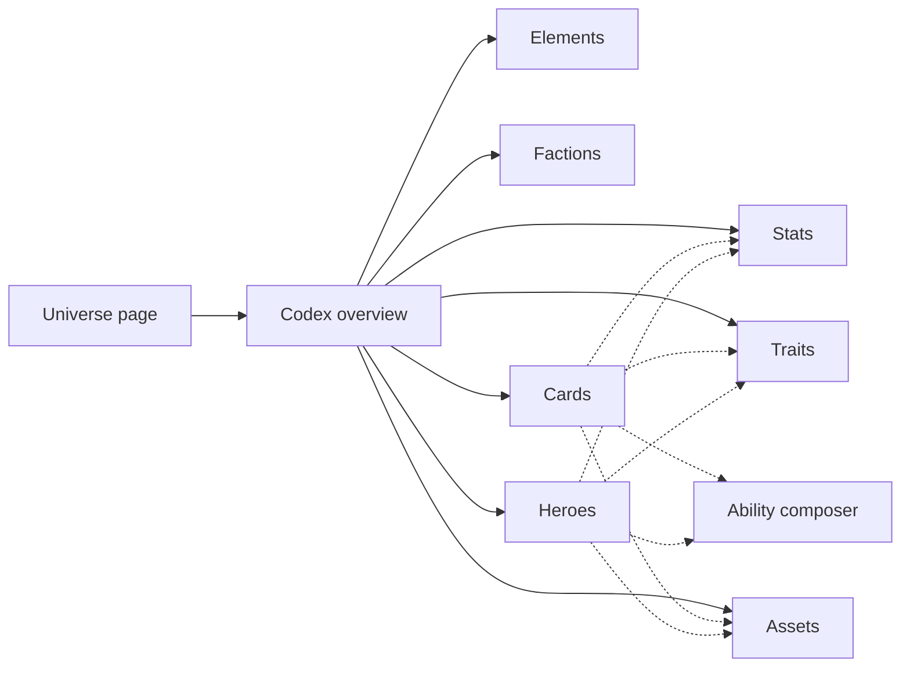

# DOD-0023: Codex part of Council

| Field     | Value                                                     |
| --------- | --------------------------------------------------------- |
| Status    | In progress                                               |
| Milestone | [Codex Realm](../milestones/Milestone-005_codex-realm.md) |
| Created   | 2026-04-22                                                |

## Description

Extend **Council** — the admin UI — so designers can author a Universe's Codex content.

The UI enters from an existing Universe page (delivered in Milestone-003) and covers authoring every Codex entity: Elements, Factions, Stats, Traits, Cards, and Heroes — plus their abilities composed per [Design-008](../design/Design-008_card-dsl.md). A minimal asset viewer is included so designers can browse files uploaded to Vault.

## Scope

Implement screens and flows for:

- navigation from a Universe into its Codex
- Element list, create, edit
- Faction list, create, edit
- Stat list, create, edit (dictionary editor — slug, name, `appliesTo`)
- Trait list, create, edit (dictionary editor — slug, name, `appliesTo`)
- Card list, create, edit (covers spell cards and summon-style cards — minion stats / traits live inline on the card prototype per Design-008)
- Hero list, create, edit
- Ability composer — trigger or passive flag, target, optional exclude expression, ordered list of effects with optional per-effect filter (shared by Card / Hero editors)
- asset mini-viewer — list and preview files uploaded to the current Universe

Visual / audio effects are deferred per [Design-008 — Out of scope](../design/Design-008_card-dsl.md#out-of-scope); the Ability composer does not pick VFX/SFX in MVP.

## Prototype

A low-fidelity prototype of the screens above is produced upfront and attached to this task. It is the spec: it shapes the Codex API contract in DOD-0020 and is consumed again when this task is implemented.

### Navigation



### Codex overview

```
┌─ Decay of Magic ▸ Codex ─────────────────────────────────┐
│                                                          │
│   Elements   →                                           │
│   Factions   →                                           │
│   Stats      →                                           │
│   Traits     →                                           │
│   Cards      →                                           │
│   Heroes     →                                           │
│   Assets     →                                           │
│                                                          │
└──────────────────────────────────────────────────────────┘
```

### Elements

A simple list page. Table of names. "New" button opens a modal or inline form with `id` (camelCase slug) and `name`. Row click opens edit. Each Universe has ~a handful of Elements.

### Factions

Same shape as Elements — list of names, create / edit via a single form. Each Universe has ~a handful of Factions.

### Stats

List table of (slug, name, `appliesTo`). "New" opens a Stat editor. Row click opens edit.

Stat editor fields:

- `id` (camelCase slug, edit-locked after create)
- `name`
- `appliesTo` (multi-select checkboxes: `minion`, `hero`, `card`)

### Traits

List table of (slug, name, `appliesTo`). "New" opens a Trait editor. Row click opens edit.

Trait editor fields:

- `id` (camelCase slug, edit-locked after create)
- `name`
- `appliesTo` (multi-select checkboxes: `minion`, `hero`, `card`)

### Cards

List table of (name, activation, factions, cost-summary). Filters at top: by activation (`emptySlot` / `enemyMinion` / `ownerMinion` / `immediate`), by faction. "New" opens a Card editor. Row click opens the same editor for the existing row.

Card editor fields:

- `name`
- `description` (rules text and flavor combined; single textarea)
- `activation` (dropdown: `emptySlot` / `enemyMinion` / `ownerMinion` / `immediate`)
- `factions` (multi-select from this Universe's Factions)
- `cost` (per-Element amount picker)
- `stats` (one input per Stat in the Universe whose `appliesTo` includes `minion`; value is amount-or-Expression; visible only when `activation: emptySlot`)
- `traits` (multi-select from the Universe's Traits whose `appliesTo` includes `minion` for `activation: emptySlot` cards, or `card` for spell cards)
- `art` (URL, picked from the asset viewer)
- abilities — ordered list built with the Ability composer

### Heroes

List table of (name, faction, pool-summary). Editor fields:

- `name`
- `description`
- `faction` (optional, single-select)
- `elements` (per-Element amount picker, same component as Card cost)
- `stats` (one input per Stat in the Universe whose `appliesTo` includes `hero`; value is amount-or-Expression)
- `traits` (multi-select from the Universe's Traits whose `appliesTo` includes `hero`)
- `art` (URL, picked from the asset viewer)
- abilities — ordered list built with the Ability composer (passive abilities are typical for hero signatures)

### Ability composer

The non-trivial UX. Shared component used inside Card and Hero editors. Builds an ability node per [Design-008 — Ability shape](../design/Design-008_card-dsl.md#ability-shape).

```
┌─ Ability ────────────────────────────────────────────────┐
│ ( ) Trigger  [ onPlay         ▾ ]                        │
│ ( ) Passive                                              │
│ Target       [ chosen          ▾ ]                       │
│ Exclude      [ (expression)         ] [ edit ]           │
│                                                          │
│ Effects                                      [+ Add]     │
│ ┌──────────────────────────────────────────────────────┐ │
│ │ 1. [ damage ▾ ]  amount: [ 10 ]                 ≡ X  │ │
│ │    filter: { eq: [target, chosen] }     [ edit ]     │ │
│ ├──────────────────────────────────────────────────────┤ │
│ │ 2. [ damage ▾ ]  amount: [ 3 ]                  ≡ X  │ │
│ │    filter: { ne: [target, chosen] }     [ edit ]     │ │
│ └──────────────────────────────────────────────────────┘ │
└──────────────────────────────────────────────────────────┘
```

- Trigger / Passive selector is mutually exclusive (radio).
- Target is a dropdown of the engine's published target slugs (`self`, `ownerHero`, `enemyHero`, `chosen`, `neighbors`, `ownerMinions`, `enemyMinions`, `allMinions`).
- Exclude is an optional Expression input — can be a bare entity reference (`self`, `chosen`, …) or a structured boolean expression.
- Each Effect row: kind selector (drives the params sub-form per the registry's per-kind schema) + ordering controls + remove + an optional per-effect filter Expression input.
- Expression inputs open the Expression editor (described below).

### Expression editor

Shared component used wherever a Card or Hero carries an Expression: ability `exclude`, per-effect `filter`, and effect / prototype fields that accept integer-or-Expression (Card and Hero `stats` values, effect `params` that take an Expression per the registry's per-kind schema).

```
┌─ Expression ─────────────────────────────────────────────┐
│ Kind  (•) Operator  ( ) Path  ( ) Literal                │
│                                                          │
│ Operator [ eq          ▾ ]                               │
│                                                          │
│ Operands                                                 │
│ ┌──────────────────────────────────────────────────────┐ │
│ │ 1. Path     [ target.faction         ▾ ]         X   │ │
│ ├──────────────────────────────────────────────────────┤ │
│ │ 2. Literal  [ "fire"                  ]          X   │ │
│ └──────────────────────────────────────────────────────┘ │
│                                                          │
│ [ Edit raw ]                                             │
└──────────────────────────────────────────────────────────┘
```

The editor handles all three Expression kinds from [Design-008 — Expression grammar](../design/Design-008_card-dsl.md#expression-grammar):

- **Operator** mode (shown above) — operator dropdown drives the operands list; the list length is fixed by the operator's arity. Each operand is itself an Expression: clicking into an operand opens the same editor recursively.
- **Path** mode — root dropdown (`self` / `ownerHero` / `enemyHero` / `target` / `chosen` / `event`) plus dotted-path text after the root.
- **Literal** mode — type-tagged input (number / boolean / string).

Switching kind preserves the current node where possible and resets it otherwise; the user can always recover via the raw-edit hatch.

`[ Edit raw ]` toggles to a textarea showing the current node as raw JSON or YAML for paste-in or quick edits; the structured view re-renders on save and surfaces parse / shape errors inline.

### Assets

Browse-and-preview screen over Vault files uploaded for this Universe. Filterable by purpose (cover, card art, hero portrait). Upload via an inline Vault mini-UI (drop-zone → pick purpose → save). Used standalone and as the picker inside Card / Hero editors.

## Result

After this task, a designer can author a Universe's complete Codex — Elements, Factions, Stats, Traits, Heroes, and Cards (including summon-style cards with inline minion stats and traits) — through Council alone, without direct API calls or seed scripts.
