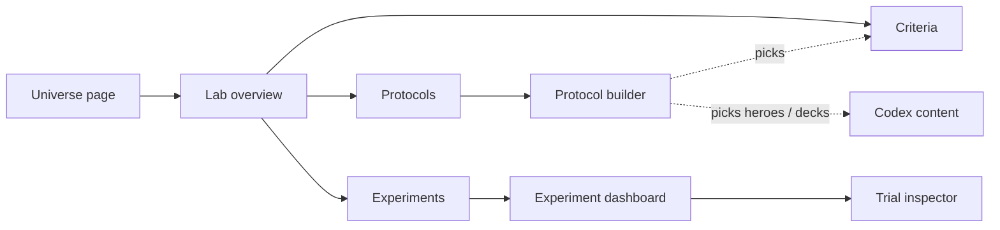

# DOD-0031: Lab UI

| Field     | Value                                                     |
| --------- | --------------------------------------------------------- |
| Status    | In progress                                               |
| Milestone | [Lab + Engine](../milestones/Milestone-007_lab-engine.md) |
| Created   | 2026-05-29                                                |

## Description

Council screens for Lab's loop — Criteria → Protocol → Experiment → Findings → Trial. Universe-scoped. The prototype below is the spec and shapes [DOD-0029](./DOD-0029_lab-api-and-tests.md).

## Navigation



## Lab overview

```
┌─ Decay of Magic ▸ Lab ───────────────────────────────────┐
│   Criteria      →   (scoring weight sets)                │
│   Protocols     →   (what to test)                       │
│   Experiments   →   (runs + findings)                    │
└──────────────────────────────────────────────────────────┘
```

## Criteria

List of (name, weighted-feature count). New / Clone / edit.

```
┌─ Criterion: Aggro lean ────────────────────────────┐
│ Name [ Aggro lean                                ] │
│                                                    │
│ Feature                                   Weight   │
│ ────────────────────────────────────────────────── │
│ ownerHero.stats.health                    [  1.0 ] │
│ enemyHero.stats.health                    [ -1.5 ] │
│ ownerMinions.totalAttack                  [  0.8 ] │
│ ownerMinions.totalHealth                  [  0.3 ] │
│ enemyMinions.totalAttack                  [ -0.5 ] │
│ ownerHero.elements.total                  [  0.0 ] │
│ ownerHero.handSize                        [  0.0 ] │
│                                                    │
│                                [ Cancel ] [ Save ] │
└────────────────────────────────────────────────────┘
```

- All catalog features shown inline, one weight input each (default `0`) — no "+ Add" gate.
- Clone copies into a new draft (history is preserved by Experiment snapshots).

## Protocol builder

```
┌─ Protocol: Fire Drake vs Wall of Fire ───────────────┐
│ Name [ Fire Drake vs Wall of Fire                 ]  │
│                                                      │
│            ── Side A ──          ── Side B ──        │
│ Hero      [ Pyromancer   ▾ ]     [ Pyromancer   ▾ ]  │
│ Deck      [ edit deck (30) ]     [ edit deck (30) ]  │
│ Guinea Pig[ greedy       ▾ ]     [ greedy       ▾ ]  │
│ Criterion [ Aggro lean   ▾ ]     [ Aggro lean   ▾ ]  │
│                                                      │
│ Turn limit [ 50 ]                                    │
│                                 [ Cancel ] [ Save ]  │
└──────────────────────────────────────────────────────┘
```

- Hero / Deck picked from the Universe's Codex content; MVP `initialState` is a hardcoded Hero + deck shape.
- Guinea Pig = character dropdown (`random` / `greedy` / `lookahead`) + its params (e.g. `depth` for `lookahead`); Criterion lists this Universe's Criteria.
- Comparison = sides differing on Guinea Pig and/or Criterion. No comparison toggle.

## Experiment launcher

```
┌─ Run experiment ──────────────────────────────────────┐
│ Protocol   Fire Drake vs Wall of Fire                 │
│ Trials     [ 1000 ]                                   │
│ Seed       [           ]  (blank → Lab generates)     │
│                                            [ Start ]  │
│ ────────────────────────────────────────────────────  │
│ Status   ▮▮▮▮▮▮▮▮▯▯▯▯  running  640 / 1000   │
└───────────────────────────────────────────────────────┘
```

- Polls `status` (`pending` → `running` → `done` / `failed`), then links into the dashboard.

## Experiment dashboard

One question per screen from the fixed taxonomy. N + confidence on every aggregate; inconclusive marker when an interval crosses 50%.

```
┌─ Experiment ▸ Is this matchup balanced? ─────[ question ▾ ]┐
│                                                            │
│  Side A  ███████████████░░░░░░░░░░░  38%  ±2%              │
│          ─────────────── 50% ───────────────               │
│  Side B  ███████████████████████░░░  62%  ±2%              │
│                                                            │
│  N = 1000   ⚠ interval crosses 50% near target —          │
│             results inconclusive, consider larger N        │
└────────────────────────────────────────────────────────────┘
```

- Questions: matchup balance · Card overpowered · Card underused · match length · best Guinea Pig · best Criterion · did this change matter (overlay two Experiments).
- Stratified questions label bars by the differing side config.

## Trial inspector

```
┌─ Trial #42 ──────────────────────────────────────────────┐
│ Score curve                                              │
│   A ╱╲      ╱╲___                          critical ▲    │
│       ╲____╱     ╲___                                    │
│   B __________________╱╲____                             │
│        ▲    ▲      ▲(sel)         Δ threshold [ 5.0 ]    │
│ ─────────────────────────────────────────────────────    │
│ Decision @ turn 6 (Side A)                               │
│   Chosen   playCard Fire Drake → slot 3   (score +7.2)   │
│   Candidates                                             │
│     playCard Fire Drake → slot 3   +7.2  ◀ chosen        │
│     playCard Fire Drake → slot 1   +6.1                  │
│     playCard Lightning → enemyHero  +3.4                 │
│     endTurn                         +0.0                 │
│   Events   SummonEvent, DamageEvent (5 → enemy Hero)     │
│   Scores   A 24.5   B 11.0                               │
│ ─────────────────────────────────────────────────────    │
│ Outcome: heroDefeated (turn 14) — Side A wins            │
└──────────────────────────────────────────────────────────┘
```

- One curve per Combatant from `Observation.scores`.
- Critical moments: read-time threshold control (not stored).
- Candidates + scores are Lab's; `random` trials show candidates without scores.
- Events = the chosen action's `events`; Outcome = `{ winner, reason }` + turns played.

## References

- [Design-009: Lab Realm](../design/Design-009_lab-realm.md)
