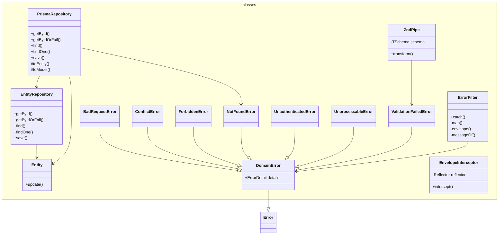

# @dod/core

<!-- poe:classes:start -->
## Classes

### Classes

| Entity | Description |
|--------|-------------|
| [Entity](src/entity.ts) | Abstract |
| errors/[BadRequestError](src/errors/bad-request.error.ts) | Extends [DomainError](src/errors/domain.error.ts) |
| errors/[ConflictError](src/errors/conflict.error.ts) | Extends [DomainError](src/errors/domain.error.ts) |
| errors/[DomainError](src/errors/domain.error.ts) | Base class for errors raised by the domain and application layers. Frontier-level code (HTTP filters, RPC handlers) maps these to transport responses.  Abstract · Extends `Error` |
| errors/[ForbiddenError](src/errors/forbidden.error.ts) | Extends [DomainError](src/errors/domain.error.ts) |
| errors/[NotFoundError](src/errors/not-found.error.ts) | Extends [DomainError](src/errors/domain.error.ts) |
| errors/[UnauthenticatedError](src/errors/unauthenticated.error.ts) | Extends [DomainError](src/errors/domain.error.ts) |
| errors/[UnprocessableError](src/errors/unprocessable.error.ts) | Extends [DomainError](src/errors/domain.error.ts) |
| errors/[ValidationFailedError](src/errors/validation-failed.error.ts) | Extends [DomainError](src/errors/domain.error.ts) |
| http/[EnvelopeInterceptor](src/http/envelope.interceptor.ts) | Implements `NestInterceptor` |
| http/[ErrorFilter](src/http/error.filter.ts) | Implements `ExceptionFilter` |
| http/[ZodPipe](src/http/zod.pipe.ts) |  |
| repositories/[EntityRepository](src/repositories/entity.repository.ts) | Abstract base for domain repositories. Defines the standard CRUD contract that all entity repositories must implement.  Abstract |
| repositories/[PrismaRepository](src/repositories/prisma.repository.ts) | Prisma-backed implementation of EntityRepository. Provides getById, find, and save via a model delegate, handling entity↔model mapping via subclasses.  Abstract |
<!-- poe:classes:end -->
