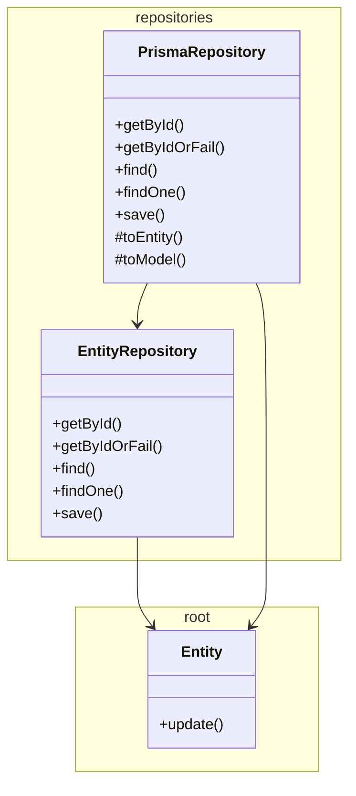

# @dod/core

<!-- poe:classes:start -->
## Classes

| Entity | Description | Notes |
|--------|-------------|-------|
| repositories/[EntityRepository](src/repositories/entity.repository.ts) | Abstract base for domain repositories. Defines the standard CRUD contract that all entity repositories must implement. | Abstract |
| repositories/[PrismaRepository](src/repositories/prisma.repository.ts) | Prisma-backed implementation of EntityRepository. Provides getById, find, and save via a model delegate, handling entity↔model mapping via subclasses. | Abstract |
| [Entity](src/entity.ts) |  | Abstract |
<!-- poe:classes:end -->
