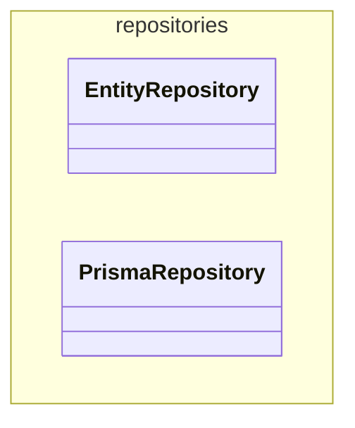

# @dod/core

<!-- poe:class-table:start -->
## Classes

### repositories

| Entity | Description | Notes |
|--------|-------------|-------|
| [EntityRepository](src/repositories/entity.repository.ts) | Abstract base for domain repositories. Defines the standard CRUD contract that all entity repositories must implement. | Abstract |
| [PrismaRepository](src/repositories/prisma.repository.ts) | Prisma-backed implementation of EntityRepository. Provides getById, find, and save via a model delegate, handling entity↔model mapping via subclasses. | Abstract |
<!-- poe:class-table:end -->

<!-- poe:class-diagram:start -->
## Class Diagram

<!-- poe:class-diagram:end -->
