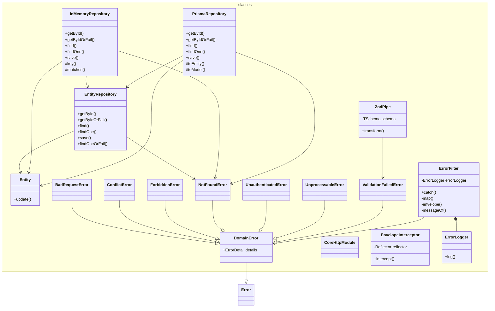

# @dod/core

<!-- poe:classes:start -->
## Classes

```mermaid
classDiagram
  namespace classes {
    class Entity {
      +update()
    }
    class BadRequestError
    class ConflictError
    class DomainError {
      +ErrorDetail details
    }
    class ForbiddenError
    class NotFoundError
    class UnauthenticatedError
    class UnprocessableError
    class ValidationFailedError
    class CoreHttpModule
    class EnvelopeInterceptor {
      -Reflector reflector
      +intercept()
    }
    class ErrorFilter {
      -ErrorLogger errorLogger
      +catch()
      -map()
      -envelope()
      -messageOf()
    }
    class ErrorLogger {
      +log()
    }
    class ZodPipe {
      -TSchema schema
      +transform()
    }
    class EntityRepository {
      +getById()
      +getByIdOrFail()
      +find()
      +findOne()
      +save()
      +findOneOrFail()
    }
    class InMemoryRepository {
      +getById()
      +getByIdOrFail()
      +find()
      +findOne()
      +save()
      #key()
      #matches()
    }
    class PrismaRepository {
      +getById()
      +getByIdOrFail()
      +find()
      +findOne()
      +save()
      #toEntity()
      #toModel()
    }
  }

  BadRequestError --|> DomainError
  ConflictError --|> DomainError
  DomainError --|> Error
  ForbiddenError --|> DomainError
  NotFoundError --|> DomainError
  UnauthenticatedError --|> DomainError
  UnprocessableError --|> DomainError
  ValidationFailedError --|> DomainError
  ErrorFilter *-- ErrorLogger
  ErrorFilter --> DomainError
  ZodPipe --> ValidationFailedError
  EntityRepository --> Entity
  EntityRepository --> NotFoundError
  InMemoryRepository --> Entity
  InMemoryRepository --> NotFoundError
  InMemoryRepository --> EntityRepository
  PrismaRepository --> Entity
  PrismaRepository --> NotFoundError
  PrismaRepository --> EntityRepository
```

| Entity | Description |
|--------|-------------|
| [Entity](src/entity.ts#L2) | Abstract |
| errors/[BadRequestError](src/errors/bad-request.error.ts#L4) | Signals a malformed or unacceptable request that doesn't fit the more specific domain errors.  Extends [DomainError](src/errors/domain.error.ts#L2) |
| errors/[ConflictError](src/errors/conflict.error.ts#L4) | Signals that the operation conflicts with current state, such as a duplicate identifier or a concurrent modification.  Extends [DomainError](src/errors/domain.error.ts#L2) |
| errors/[DomainError](src/errors/domain.error.ts#L2) | Base class for errors raised by the domain and application layers. Frontier-level code (HTTP filters, RPC handlers) maps these to transport responses.  Abstract · Extends `Error` |
| errors/[ForbiddenError](src/errors/forbidden.error.ts#L4) | Signals that the caller is authenticated but not authorized for the requested operation.  Extends [DomainError](src/errors/domain.error.ts#L2) |
| errors/[NotFoundError](src/errors/not-found.error.ts#L4) | Signals that the requested resource does not exist.  Extends [DomainError](src/errors/domain.error.ts#L2) |
| errors/[UnauthenticatedError](src/errors/unauthenticated.error.ts#L4) | Signals that the caller is not authenticated.  Extends [DomainError](src/errors/domain.error.ts#L2) |
| errors/[UnprocessableError](src/errors/unprocessable.error.ts#L4) | Signals that the request is well-formed but rejected on semantic grounds — a domain rule prevents the operation from completing.  Extends [DomainError](src/errors/domain.error.ts#L2) |
| errors/[ValidationFailedError](src/errors/validation-failed.error.ts#L4) | Signals that input failed schema validation. Carries per-field details so callers can surface structured feedback.  Extends [DomainError](src/errors/domain.error.ts#L2) |
| http/[CoreHttpModule](src/http/core-http.module.ts#L16) |  |
| http/[EnvelopeInterceptor](src/http/envelope.interceptor.ts#L13) | Implements `NestInterceptor` |
| http/[ErrorFilter](src/http/error.filter.ts#L50) | Implements `ExceptionFilter` |
| http/[ErrorLogger](src/http/error.logger.ts#L17) |  |
| http/[ZodPipe](src/http/zod.pipe.ts#L29) |  |
| repositories/[EntityRepository](src/repositories/entity.repository.ts#L2) | Abstract base for domain repositories. Defines the standard CRUD contract that all entity repositories must implement.  Abstract |
| repositories/[InMemoryRepository](src/repositories/in-memory.repository.ts#L3) | In-memory implementation of EntityRepository. Provides getById, find, and save via a per-instance Map; intended for tests and prototypes where persistence is out of scope.  Abstract |
| repositories/[PrismaRepository](src/repositories/prisma.repository.ts#L9) | Prisma-backed implementation of EntityRepository. Provides getById, find, and save via a model delegate, handling entity↔model mapping via subclasses.  Abstract |
<!-- poe:classes:end -->

<!-- poe:footer:start -->
> This document was inspected and assembled by Inspector Poe.
<!-- poe:footer:end -->
