# @dod/engine

<!-- poe:header:start -->
Battle engine — match rules: card effects, abilities, combat, turn flow
<!-- poe:header:end -->

<!-- poe:classes:start -->
## Classes

```mermaid
classDiagram
  namespace classes {
    class BattleEngine {
      +observe()
      +submit()
      +peek()
    }
    class BattleEvalContext {
      -Battle battle
      -CombatantId perspective
      -Entity self
      +Entity target
      +withTarget()
      +resolve()
      -resolveRoot()
    }
    class CardArchetype {
      +string id
      +Activation activation
      +ElementPool cost
      +Record stats
      +toDto()
      +rollStats()
    }
    class CodexContent {
      +CardArchetype cards
      +HeroArchetype heroes
      +toDto()
      +card()
      +hero()
    }
    class HeroArchetype {
      +string id
      +StatBlock stats
      +ElementPool elements
      +string traits
      +toDto()
    }
    class IllegalActionError
    class BinaryExpression {
      #Expression left
      #Expression right
    }
    class ContainsExpression {
      +evaluate()
    }
    class DivExpression {
      +evaluate()
    }
    class EqExpression {
      +evaluate()
    }
    class MaxByExpression {
      +evaluate()
    }
    class NeExpression {
      +evaluate()
    }
    class RankByExpression {
      +evaluate()
    }
    class SubExpression {
      +evaluate()
    }
    class ComparisonExpression {
      +evaluate()
      #compare()
    }
    class GteExpression {
      #compare()
    }
    class GtExpression {
      #compare()
    }
    class LteExpression {
      #compare()
    }
    class LtExpression {
      #compare()
    }
    class EvalContext {
      +resolve()
    }
    class Expression {
      +evaluateNumber()
      +evaluate()
      #toNumber()
      #toBoolean()
      #list()
      #strings()
      #statOf()
    }
    class ExpressionFactory {
      +from()
      -fromOperator()
    }
    class AddExpression {
      #combine()
    }
    class AndExpression {
      +evaluate()
    }
    class MaxExpression {
      #combine()
    }
    class MinExpression {
      #combine()
    }
    class MulExpression {
      #combine()
    }
    class NaryExpression {
      #Expression operands
    }
    class NaryNumericExpression {
      +evaluate()
      #combine()
    }
    class OrExpression {
      +evaluate()
    }
    class LiteralExpression {
      -number value
      +evaluate()
    }
    class PathExpression {
      -string path
      +evaluate()
    }
    class SumTopByExpression {
      -Expression collection
      -Expression count
      -Expression stat
      +evaluate()
    }
    class CeilExpression {
      +evaluate()
    }
    class CountExpression {
      +evaluate()
    }
    class NotExpression {
      +evaluate()
    }
    class UnaryExpression {
      #Expression operand
    }
    class MockEngine {
      -MockState state
      +observe()
      +submit()
      +peek()
      -resolvePlayCard()
      -summon()
      -endTurn()
      -dealToHero()
      -turnLimitOutcome()
      -emptySlots()
      -validateTarget()
      -affordable()
    }
    class Battle {
      +Combatant combatants
      +Minion minions
      +Turn turn
      +Outcome outcome
      +toDto()
      +clone()
      +combatant()
      +activeCombatant()
      +opponent()
      +hero()
      +minionsOf()
      +summon()
      +advanceTo()
      +end()
    }
    class Card {
      +string id
      +string archetypeId
      +toDto()
    }
    class Combatant {
      +CombatantId id
      +Hero hero
      +Card hand
      +Card deck
      +toDto()
      +draw()
      +play()
    }
    class Hero {
      +string archetypeId
      +StatBlock stats
      +ElementPool elements
      +string traits
      +number health
      +boolean isDead
      +toDto()
      +damage()
      +affords()
      +spend()
    }
    class Minion {
      +string id
      +string archetypeId
      +CombatantId controllerId
      +number slot
      +StatBlock stats
      +string traits
      +number attack
      +toDto()
    }
    class Turn {
      +CombatantId activeCombatantId
      +number number
      +toDto()
      +next()
    }
    class Rng {
      -RandomGenerator generator
      +nextInt()
      +next()
      +clone()
      +shuffle()
    }
    class Ruleset {
      +number slotsPerCombatant
      +number startingHandSize
      +number drawPerTurn
      +number turnLimit
      +toDto()
    }
  }

  BattleEngine --> Battle
  BattleEvalContext --|> EvalContext
  BattleEvalContext *-- Battle
  BattleEvalContext --> Combatant
  BattleEvalContext --> Hero
  BattleEvalContext --> Minion
  CardArchetype --> EvalContext
  CardArchetype --> Expression
  CardArchetype --> ExpressionFactory
  CardArchetype --> Card
  CodexContent *-- CardArchetype
  CodexContent *-- HeroArchetype
  CodexContent --> IllegalActionError
  CodexContent --> Card
  CodexContent --> Hero
  HeroArchetype --> Hero
  IllegalActionError --|> Error
  BinaryExpression --|> Expression
  BinaryExpression *-- Expression
  ContainsExpression --|> BinaryExpression
  ContainsExpression --> EvalContext
  ContainsExpression --> Expression
  DivExpression --|> BinaryExpression
  DivExpression --> EvalContext
  DivExpression --> Expression
  EqExpression --|> BinaryExpression
  EqExpression --> EvalContext
  EqExpression --> Expression
  MaxByExpression --|> BinaryExpression
  MaxByExpression --> EvalContext
  MaxByExpression --> Expression
  NeExpression --|> BinaryExpression
  NeExpression --> EvalContext
  NeExpression --> Expression
  RankByExpression --|> BinaryExpression
  RankByExpression --> EvalContext
  RankByExpression --> Expression
  SubExpression --|> BinaryExpression
  SubExpression --> EvalContext
  SubExpression --> Expression
  ComparisonExpression --|> BinaryExpression
  ComparisonExpression --> EvalContext
  GteExpression --|> ComparisonExpression
  GteExpression --> Expression
  GtExpression --|> ComparisonExpression
  GtExpression --> Expression
  LteExpression --|> ComparisonExpression
  LteExpression --> Expression
  LtExpression --|> ComparisonExpression
  LtExpression --> Expression
  Expression --> EvalContext
  ExpressionFactory --> Expression
  ExpressionFactory --> LiteralExpression
  ExpressionFactory --> PathExpression
  AddExpression --|> NaryNumericExpression
  AddExpression --> Expression
  AndExpression --|> NaryExpression
  AndExpression --> EvalContext
  AndExpression --> Expression
  MaxExpression --|> NaryNumericExpression
  MaxExpression --> Expression
  MinExpression --|> NaryNumericExpression
  MinExpression --> Expression
  MulExpression --|> NaryNumericExpression
  MulExpression --> Expression
  NaryExpression --|> Expression
  NaryExpression *-- Expression
  NaryNumericExpression --|> NaryExpression
  NaryNumericExpression --> EvalContext
  OrExpression --|> NaryExpression
  OrExpression --> EvalContext
  OrExpression --> Expression
  LiteralExpression --|> Expression
  PathExpression --|> Expression
  PathExpression --> EvalContext
  SumTopByExpression --|> Expression
  SumTopByExpression *-- Expression
  SumTopByExpression --> EvalContext
  CeilExpression --|> UnaryExpression
  CeilExpression --> EvalContext
  CeilExpression --> Expression
  CountExpression --|> UnaryExpression
  CountExpression --> EvalContext
  CountExpression --> Expression
  NotExpression --|> UnaryExpression
  NotExpression --> EvalContext
  NotExpression --> Expression
  UnaryExpression --|> Expression
  UnaryExpression *-- Expression
  MockEngine --|> BattleEngine
  MockEngine --> BattleEvalContext
  MockEngine --> CardArchetype
  MockEngine --> IllegalActionError
  MockEngine --> EvalContext
  MockEngine --> Expression
  MockEngine --> ExpressionFactory
  MockEngine --> Battle
  MockEngine --> Card
  MockEngine --> Combatant
  MockEngine --> Hero
  MockEngine --> Minion
  MockEngine --> Turn
  Battle *-- Combatant
  Battle *-- Minion
  Battle *-- Turn
  Battle --> Hero
  Combatant *-- Hero
  Combatant *-- Card
  Combatant --> IllegalActionError
  Minion --> Combatant
  Turn --> Combatant
  Ruleset --> Combatant
  Ruleset --> Turn
```

| Entity | Description |
|--------|-------------|
| [BattleEngine](src/BattleEngine.ts#L39) | Abstract |
| [BattleEvalContext](src/BattleEvalContext.ts#L4) | Resolves DSL paths against a live battle from one combatant's perspective — the roots `ownerHero`, `enemyMinions`, `self`, `target`, and so on — then walks the remaining segments into the addressed object.  Extends [EvalContext](src/expression/context.ts#L2) |
| codex/[CardArchetype](src/codex/CardArchetype.ts#L15) | A card prototype from the Codex: its cost, stat formulas, and activation. |
| codex/[CodexContent](src/codex/CodexContent.ts#L9) | The Codex content a battle draws on: card and hero prototypes, by id. |
| codex/[HeroArchetype](src/codex/HeroArchetype.ts#L9) | A hero prototype from the Codex: starting stats, elements, and traits. |
| errors/[IllegalActionError](src/errors/IllegalActionError.ts#L1) | Raised when an action is submitted that the rules do not permit.  Extends `Error` |
| expression/binary/[BinaryExpression](src/expression/binary/BinaryExpression.ts#L3) | Base for operators that take exactly two operands.  Abstract · Extends [Expression](src/expression/Expression.ts#L7) |
| expression/binary/[ContainsExpression](src/expression/binary/ContainsExpression.ts#L3) | True when the left list contains the right value.  Extends [BinaryExpression](src/expression/binary/BinaryExpression.ts#L3) |
| expression/binary/[DivExpression](src/expression/binary/DivExpression.ts#L3) | Left operand divided by the right.  Extends [BinaryExpression](src/expression/binary/BinaryExpression.ts#L3) |
| expression/binary/[EqExpression](src/expression/binary/EqExpression.ts#L3) | True when both operands evaluate equal.  Extends [BinaryExpression](src/expression/binary/BinaryExpression.ts#L3) |
| expression/binary/[MaxByExpression](src/expression/binary/MaxByExpression.ts#L3) | The highest value of a stat across a collection, or 0 when empty.  Extends [BinaryExpression](src/expression/binary/BinaryExpression.ts#L3) |
| expression/binary/[NeExpression](src/expression/binary/NeExpression.ts#L3) | True when the operands evaluate unequal.  Extends [BinaryExpression](src/expression/binary/BinaryExpression.ts#L3) |
| expression/binary/[RankByExpression](src/expression/binary/RankByExpression.ts#L3) | The 1-based rank of the context target within a collection ordered by a stat, highest first.  Extends [BinaryExpression](src/expression/binary/BinaryExpression.ts#L3) |
| expression/binary/[SubExpression](src/expression/binary/SubExpression.ts#L3) | Left operand minus the right.  Extends [BinaryExpression](src/expression/binary/BinaryExpression.ts#L3) |
| expression/comparison/[ComparisonExpression](src/expression/comparison/ComparisonExpression.ts#L3) | Base for two-operand numeric comparisons.  Abstract · Extends [BinaryExpression](src/expression/binary/BinaryExpression.ts#L3) |
| expression/comparison/[GteExpression](src/expression/comparison/GteExpression.ts#L2) | True when the left operand is greater than or equal to the right.  Extends [ComparisonExpression](src/expression/comparison/ComparisonExpression.ts#L3) |
| expression/comparison/[GtExpression](src/expression/comparison/GtExpression.ts#L2) | True when the left operand is greater than the right.  Extends [ComparisonExpression](src/expression/comparison/ComparisonExpression.ts#L3) |
| expression/comparison/[LteExpression](src/expression/comparison/LteExpression.ts#L2) | True when the left operand is less than or equal to the right.  Extends [ComparisonExpression](src/expression/comparison/ComparisonExpression.ts#L3) |
| expression/comparison/[LtExpression](src/expression/comparison/LtExpression.ts#L2) | True when the left operand is less than the right.  Extends [ComparisonExpression](src/expression/comparison/ComparisonExpression.ts#L3) |
| expression/[EvalContext](src/expression/context.ts#L2) | The contract an expression evaluates against: a resolver from DSL paths to values, plus the current target candidate. Binding these to a concrete battle is the caller's responsibility, not the expression layer's.  Abstract |
| expression/[Expression](src/expression/Expression.ts#L7) | Base of the expression AST: evaluates against a perspective into a live battle and yields a number, boolean, string, or entity collection.  Abstract |
| expression/[ExpressionFactory](src/expression/ExpressionFactory.ts#L55) | Parses Codex expression JSON into an executable expression tree, dispatching each operator keyword to the node that owns it.  Implements `ExpressionParser` |
| expression/nary/[AddExpression](src/expression/nary/AddExpression.ts#L2) | Sum of its operands.  Extends [NaryNumericExpression](src/expression/nary/NaryNumericExpression.ts#L3) |
| expression/nary/[AndExpression](src/expression/nary/AndExpression.ts#L3) | True when every operand is truthy.  Extends [NaryExpression](src/expression/nary/NaryExpression.ts#L3) |
| expression/nary/[MaxExpression](src/expression/nary/MaxExpression.ts#L2) | Largest of its operands.  Extends [NaryNumericExpression](src/expression/nary/NaryNumericExpression.ts#L3) |
| expression/nary/[MinExpression](src/expression/nary/MinExpression.ts#L2) | Smallest of its operands.  Extends [NaryNumericExpression](src/expression/nary/NaryNumericExpression.ts#L3) |
| expression/nary/[MulExpression](src/expression/nary/MulExpression.ts#L2) | Product of its operands.  Extends [NaryNumericExpression](src/expression/nary/NaryNumericExpression.ts#L3) |
| expression/nary/[NaryExpression](src/expression/nary/NaryExpression.ts#L3) | Base for operators that take a variable number of operands.  Abstract · Extends [Expression](src/expression/Expression.ts#L7) |
| expression/nary/[NaryNumericExpression](src/expression/nary/NaryNumericExpression.ts#L3) | Base for variadic operators that fold their operands into a single number.  Abstract · Extends [NaryExpression](src/expression/nary/NaryExpression.ts#L3) |
| expression/nary/[OrExpression](src/expression/nary/OrExpression.ts#L3) | True when any operand is truthy.  Extends [NaryExpression](src/expression/nary/NaryExpression.ts#L3) |
| expression/other/[LiteralExpression](src/expression/other/LiteralExpression.ts#L3) | A constant number or boolean.  Extends [Expression](src/expression/Expression.ts#L7) |
| expression/other/[PathExpression](src/expression/other/PathExpression.ts#L4) | Reads a value from the battle by dotted path (such as enemyHero.stats.health), resolved from the evaluating combatant's perspective.  Extends [Expression](src/expression/Expression.ts#L7) |
| expression/other/[SumTopByExpression](src/expression/other/SumTopByExpression.ts#L4) | Sums a stat across the top N entities of a collection, ranked by that stat.  Extends [Expression](src/expression/Expression.ts#L7) |
| expression/unary/[CeilExpression](src/expression/unary/CeilExpression.ts#L3) | Rounds its numeric operand up to the nearest integer.  Extends [UnaryExpression](src/expression/unary/UnaryExpression.ts#L3) |
| expression/unary/[CountExpression](src/expression/unary/CountExpression.ts#L3) | The number of entities in its collection operand.  Extends [UnaryExpression](src/expression/unary/UnaryExpression.ts#L3) |
| expression/unary/[NotExpression](src/expression/unary/NotExpression.ts#L3) | Logical negation of its boolean operand.  Extends [UnaryExpression](src/expression/unary/UnaryExpression.ts#L3) |
| expression/unary/[UnaryExpression](src/expression/unary/UnaryExpression.ts#L3) | Base for operators that take a single operand.  Abstract · Extends [Expression](src/expression/Expression.ts#L7) |
| mock/[MockEngine](src/mock/MockEngine.ts#L55) | Extends [BattleEngine](src/BattleEngine.ts#L39) |
| model/[Battle](src/model/Battle.ts#L13) | The full battle state: combatants, minions in play, the turn, and outcome. |
| model/[Card](src/model/Card.ts#L5) | A card instance in a combatant's hand or deck. |
| model/[Combatant](src/model/Combatant.ts#L12) | One side of a battle: a hero plus that player's hand and deck. |
| model/[Hero](src/model/Hero.ts#L9) | A combatant's hero — the avatar holding life, elements, and traits. |
| model/[Minion](src/model/Minion.ts#L12) | A minion in play — a unit a combatant controls, occupying a slot. |
| model/[Turn](src/model/Turn.ts#L7) | Whose turn it is, and the turn counter. |
| [Rng](src/Rng.ts#L13) | The engine's random source: a seeded xoroshiro128+ generator. Deterministic and cloneable, so matches replay from a seed and fork for look-ahead. |
| [Ruleset](src/Ruleset.ts#L7) | Match configuration: slot count, hand/draw sizes, and the turn limit. |
<!-- poe:classes:end -->

<!-- poe:footer:start -->
> This document was inspected and assembled by Inspector Poe.
<!-- poe:footer:end -->
