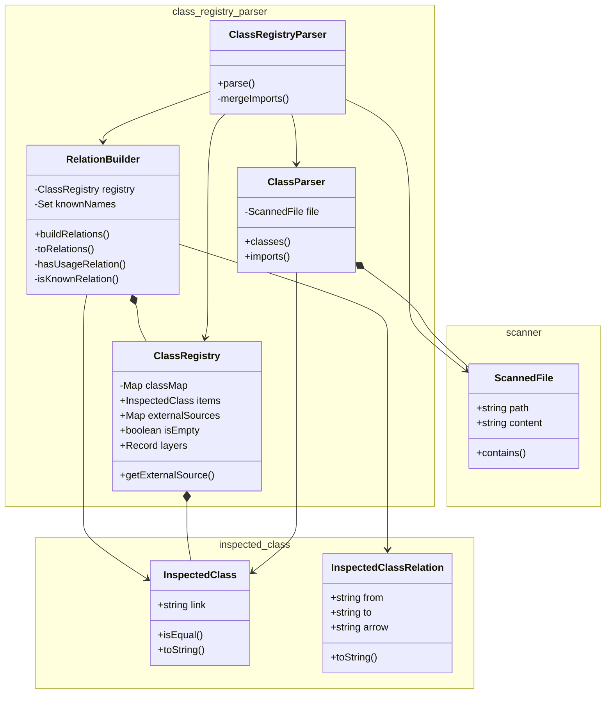
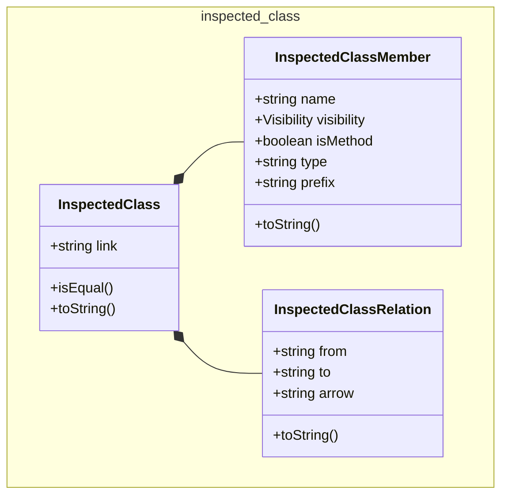
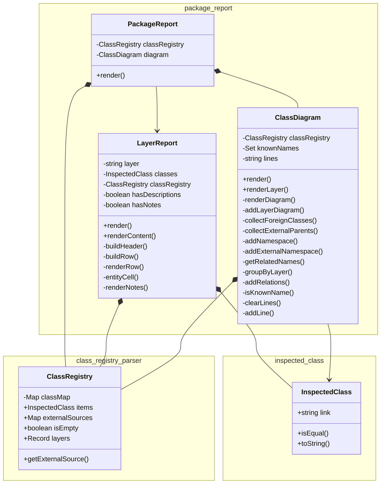
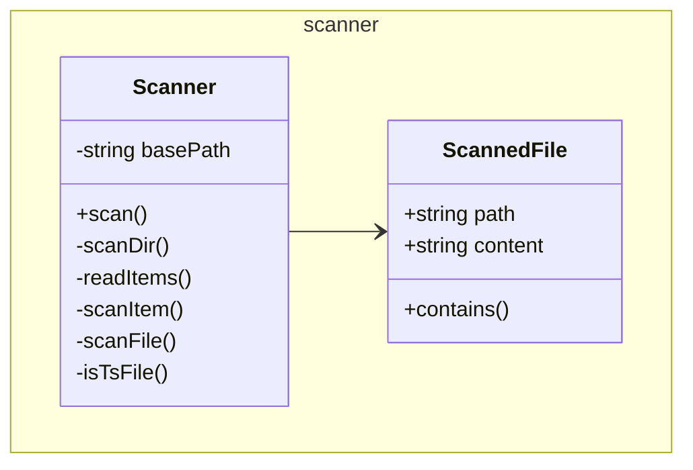
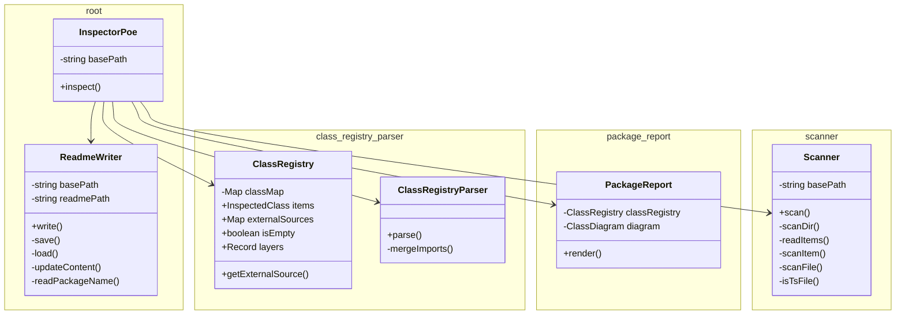

# @dod/poe

<!-- poe:classes:start -->
## Classes

### ClassRegistryParser

| Entity | Description |
|--------|-------------|
| [ClassParser](src/ClassRegistryParser/ClassParser.ts) | Parses a single scanned file and extracts class definitions and imports |
| [ClassRegistry](src/ClassRegistryParser/ClassRegistry.ts) | Collection of inspected classes |
| [ClassRegistryParser](src/ClassRegistryParser/ClassRegistryParser.ts) | Parses a collection of scanned files into a ClassRegistry |
| [RelationBuilder](src/ClassRegistryParser/RelationBuilder.ts) | Builds relations between inspected classes and enriches them with the results |

### InspectedClass

| Entity | Description |
|--------|-------------|
| [InspectedClass](src/InspectedClass/InspectedClass.ts) | Represents a single class discovered during inspection |
| [InspectedClassMember](src/InspectedClass/InspectedClassMember.ts) |  |
| [InspectedClassRelation](src/InspectedClass/InspectedClassRelation.ts) |  |

### PackageReport

| Entity | Description |
|--------|-------------|
| [ClassDiagram](src/PackageReport/ClassDiagram.ts) | Generates a Mermaid class diagram from inspected classes |
| [LayerReport](src/PackageReport/LayerReport.ts) | Describes classes belonging to a specific layer |
| [PackageReport](src/PackageReport/PackageReport.ts) | Combined report grouping class tables and diagrams by layer |

### Scanner

| Entity | Description |
|--------|-------------|
| [ScannedFile](src/Scanner/ScannedFile.ts) |  |
| [Scanner](src/Scanner/Scanner.ts) | Searches the project for classes worthy of inspection |

### root

| Entity | Description |
|--------|-------------|
| [InspectorPoe](src/InspectorPoe.ts) | Inspector Poe himself. Coordinates the inspection process |
| [ReadmeWriter](src/ReadmeWriter.ts) | Updates README files with generated class tables |
<!-- poe:classes:end -->
