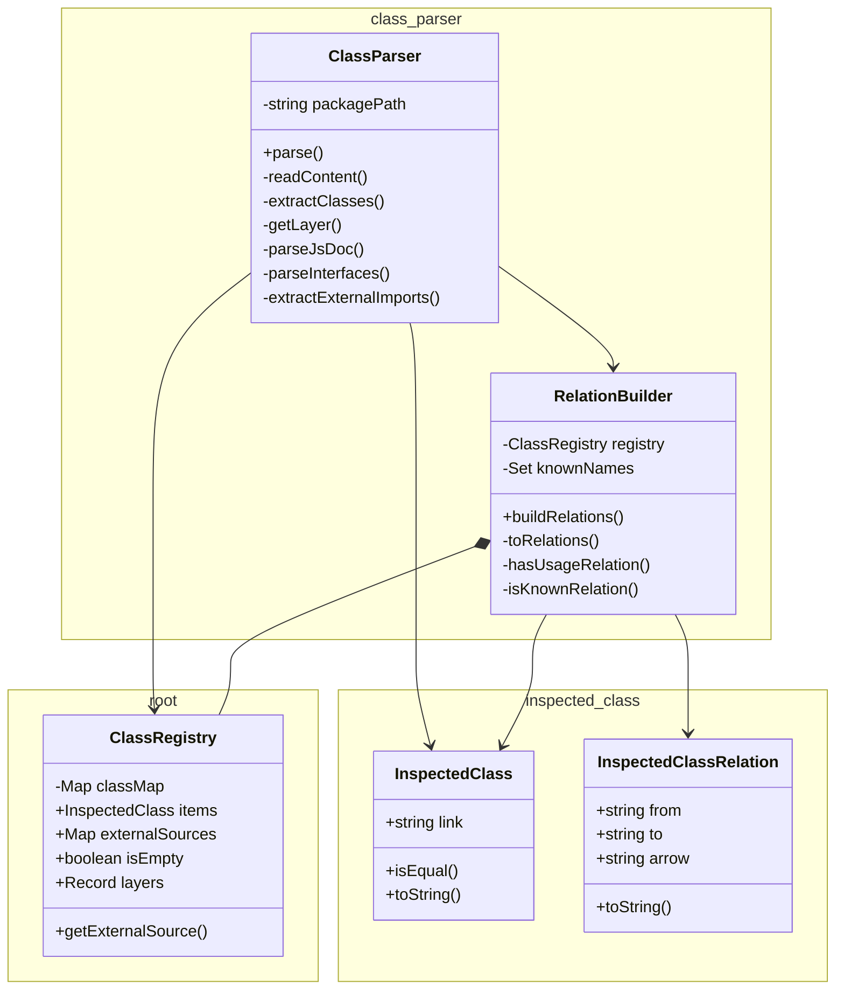
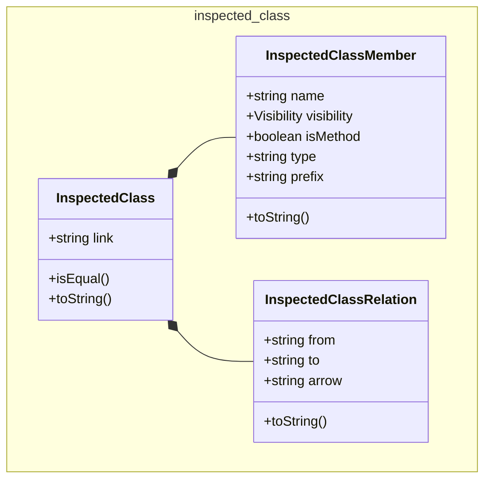
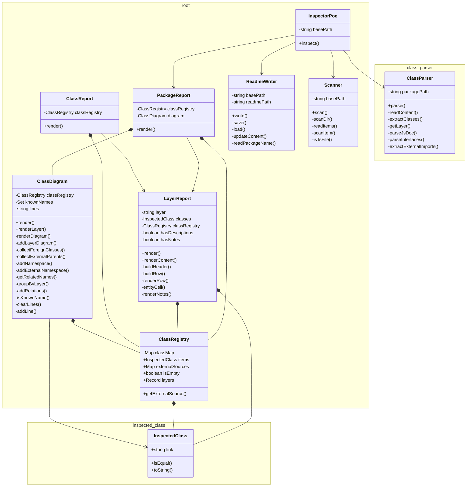

# @dod/poe

<!-- poe:classes:start -->
## Classes

### ClassParser

| Entity | Description |
|--------|-------------|
| [ClassParser](src/ClassParser/ClassParser.ts) | Parses source files and extracts inspected classes |
| [RelationBuilder](src/ClassParser/RelationBuilder.ts) | Builds relations between inspected classes and enriches them with the results |

### InspectedClass

| Entity | Description |
|--------|-------------|
| [InspectedClass](src/InspectedClass/InspectedClass.ts) | Represents a single class discovered during inspection |
| [InspectedClassMember](src/InspectedClass/InspectedClassMember.ts) |  |
| [InspectedClassRelation](src/InspectedClass/InspectedClassRelation.ts) |  |

### root

| Entity | Description |
|--------|-------------|
| [ClassDiagram](src/ClassDiagram.ts) | Generates a Mermaid class diagram from inspected classes |
| [ClassRegistry](src/ClassRegistry.ts) | Collection of inspected classes |
| [ClassReport](src/ClassReport.ts) | Aggregated report describing inspected classes |
| [InspectorPoe](src/InspectorPoe.ts) | Inspector Poe himself. Coordinates the inspection process |
| [LayerReport](src/LayerReport.ts) | Describes classes belonging to a specific layer |
| [PackageReport](src/PackageReport.ts) | Combined report grouping class tables and diagrams by layer |
| [ReadmeWriter](src/ReadmeWriter.ts) | Updates README files with generated class tables |
| [Scanner](src/Scanner.ts) | Searches the project for classes worthy of inspection |
<!-- poe:classes:end -->
