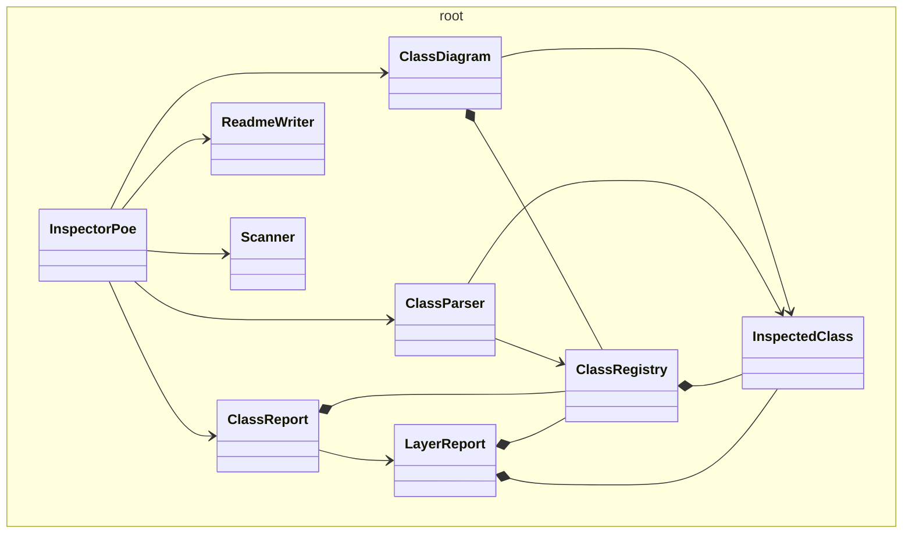

# @dod/poe

<!-- poe:class-table:start -->
## Classes

### root

| Entity | Description |
|--------|-------------|
| [ClassDiagram](src/ClassDiagram.ts) | Generates a Mermaid class diagram from inspected classes |
| [ClassParser](src/ClassParser.ts) | Parses source files and extracts inspected classes |
| [ClassRegistry](src/ClassRegistry.ts) | Collection of inspected classes |
| [ClassReport](src/ClassReport.ts) | Aggregated report describing inspected classes |
| [InspectedClass](src/InspectedClass.ts) | Represents a single class discovered during inspection |
| [InspectorPoe](src/InspectorPoe.ts) | Inspector Poe himself. Coordinates the inspection process |
| [LayerReport](src/LayerReport.ts) | Describes classes belonging to a specific layer |
| [ReadmeWriter](src/ReadmeWriter.ts) | Updates README files with generated class tables |
| [Scanner](src/Scanner.ts) | Searches the project for classes worthy of inspection |
<!-- poe:class-table:end -->

<!-- poe:class-diagram:start -->
## Class Diagram

<!-- poe:class-diagram:end -->
