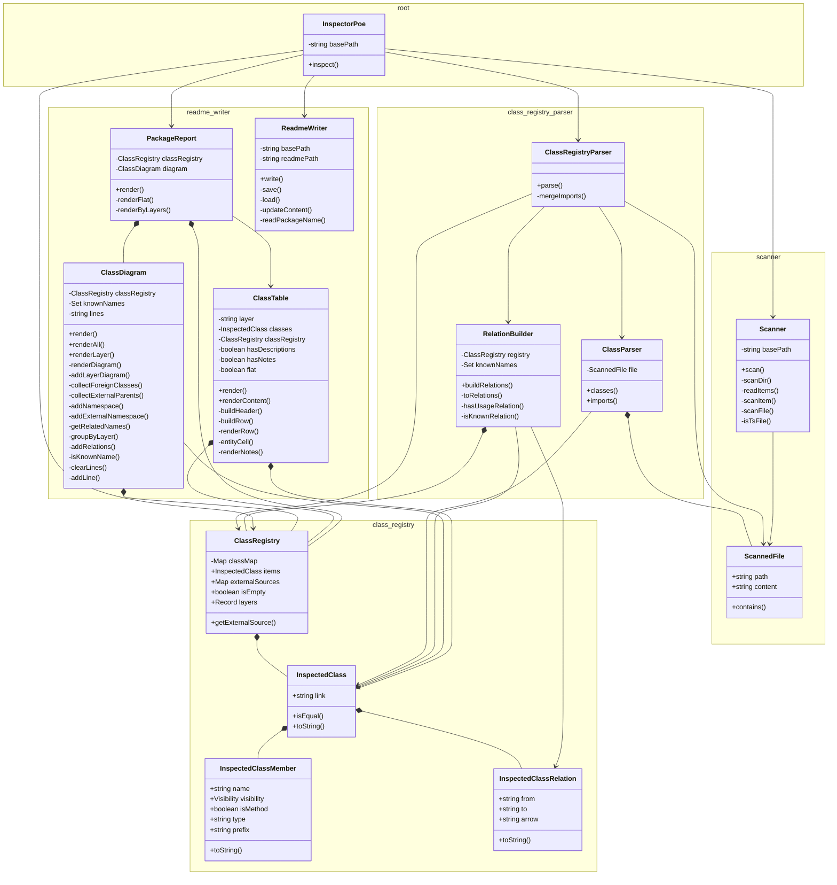

# @dod/poe

<!-- poe:classes:start -->
## Classes

| Entity | Description |
|--------|-------------|
| ClassRegistry/[ClassRegistry](src/ClassRegistry/ClassRegistry.ts) | Collection of inspected classes |
| ClassRegistry/[InspectedClass](src/ClassRegistry/InspectedClass.ts) | Represents a single class discovered during inspection |
| ClassRegistry/[InspectedClassMember](src/ClassRegistry/InspectedClassMember.ts) | Represents a single field, getter, or method of an inspected class |
| ClassRegistry/[InspectedClassRelation](src/ClassRegistry/InspectedClassRelation.ts) | Represents a directed relation between two classes in a diagram |
| ClassRegistryParser/[ClassParser](src/ClassRegistryParser/ClassParser.ts) | Parses a single scanned file and extracts class definitions and imports |
| ClassRegistryParser/[ClassRegistryParser](src/ClassRegistryParser/ClassRegistryParser.ts) | Parses a collection of scanned files into a ClassRegistry |
| ClassRegistryParser/[RelationBuilder](src/ClassRegistryParser/RelationBuilder.ts) | Builds relations between inspected classes |
| ReadmeWriter/[ClassDiagram](src/ReadmeWriter/ClassDiagram.ts) | Generates a Mermaid class diagram from inspected classes |
| ReadmeWriter/[ClassTable](src/ReadmeWriter/ClassTable.ts) | Renders a markdown table of inspected classes |
| ReadmeWriter/[PackageReport](src/ReadmeWriter/PackageReport.ts) | Combined report grouping class tables and diagrams by layer |
| ReadmeWriter/[ReadmeWriter](src/ReadmeWriter/ReadmeWriter.ts) | Updates README files with generated class tables |
| Scanner/[ScannedFile](src/Scanner/ScannedFile.ts) | Holds the raw content of a scanned source file |
| Scanner/[Scanner](src/Scanner/Scanner.ts) | Searches the project for classes worthy of inspection |
| [InspectorPoe](src/InspectorPoe.ts) | Inspector Poe himself. Coordinates the inspection process |
<!-- poe:classes:end -->
