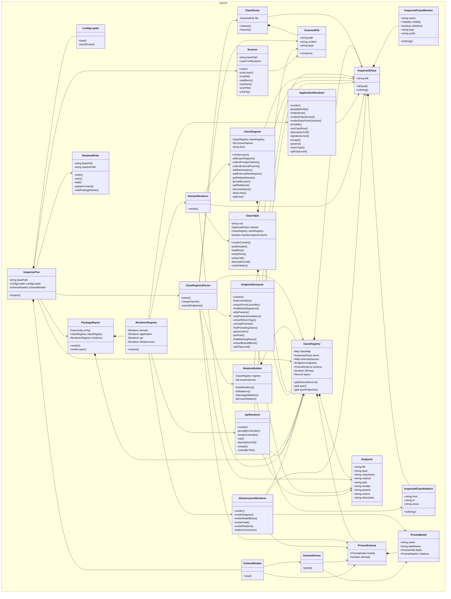

# @dod/poe

<!-- poe:classes:start -->
## Classes

### Classes

| Entity | Description |
|--------|-------------|
| ClassRegistry/[ClassRegistry](src/ClassRegistry/ClassRegistry.ts) | Collection of inspected classes plus any extracted endpoints and schema |
| ClassRegistry/[InspectedClass](src/ClassRegistry/InspectedClass.ts) | Represents a single class discovered during inspection |
| ClassRegistry/[InspectedClassMember](src/ClassRegistry/InspectedClassMember.ts) | Represents a single field, getter, or method of an inspected class |
| ClassRegistry/[InspectedClassRelation](src/ClassRegistry/InspectedClassRelation.ts) | Represents a directed relation between two classes in a diagram |
| ClassRegistryParser/[ClassParser](src/ClassRegistryParser/ClassParser.ts) | Parses a single scanned file and extracts class definitions and imports |
| ClassRegistryParser/[ClassRegistryParser](src/ClassRegistryParser/ClassRegistryParser.ts) | Parses a collection of scanned files into a ClassRegistry |
| ClassRegistryParser/[RelationBuilder](src/ClassRegistryParser/RelationBuilder.ts) | Builds relations between inspected classes |
| Config/[ConfigLoader](src/Config/ConfigLoader.ts) | Resolves and loads the Poe configuration for a target package |
| Endpoints/[Endpoint](src/Endpoints/Endpoint.ts) | A single HTTP endpoint exposed by a controller |
| Endpoints/[EndpointExtractor](src/Endpoints/EndpointExtractor.ts) | Parses controller source files and extracts HTTP endpoints |
| [InspectorPoe](src/InspectorPoe.ts) | Inspector Poe himself. Coordinates the inspection process |
| ReadmeWriter/[ClassDiagram](src/ReadmeWriter/ClassDiagram.ts) | Generates a Mermaid class diagram for a single layer |
| ReadmeWriter/[ClassTable](src/ReadmeWriter/ClassTable.ts) | Renders a markdown table of inspected classes |
| ReadmeWriter/[PackageReport](src/ReadmeWriter/PackageReport.ts) | Renders the full package report by dispatching each configured layer to its matching renderer |
| ReadmeWriter/[ReadmeWriter](src/ReadmeWriter/ReadmeWriter.ts) | Updates README files with generated class tables |
| Renderers/[ApiRenderer](src/Renderers/ApiRenderer.ts) | Renders a layer as per-controller endpoint tables  Implements `Renderer` |
| Renderers/[ApplicationRenderer](src/Renderers/ApplicationRenderer.ts) | Renders a layer as a use-case table. Entry points (facades without a parent base) get a separate section. Handlers and abstract bases are hidden as implementation detail.  Implements `Renderer` |
| Renderers/[DomainRenderer](src/Renderers/DomainRenderer.ts) | Renders a layer as a Mermaid class diagram plus a table of its classes  Implements `Renderer` |
| Renderers/[InfrastructureRenderer](src/Renderers/InfrastructureRenderer.ts) | Renders a layer as an ER diagram derived from the Prisma schema  Implements `Renderer` |
| Renderers/[RendererRegistry](src/Renderers/RendererRegistry.ts) | Resolves a renderer by kind |
| Scanner/[ScannedFile](src/Scanner/ScannedFile.ts) | Holds the raw content of a scanned source file |
| Scanner/[Scanner](src/Scanner/Scanner.ts) | Searches the project for classes worthy of inspection |
| Schema/[PrismaModel](src/Schema/PrismaSchema.ts) |  |
| Schema/[PrismaSchema](src/Schema/PrismaSchema.ts) |  |
| Schema/[SchemaParser](src/Schema/SchemaParser.ts) | Parses a Prisma schema file into a PrismaSchema |
| Schema/[SchemaReader](src/Schema/SchemaReader.ts) | Reads and parses the Prisma schema for a package, if present |
<!-- poe:classes:end -->
