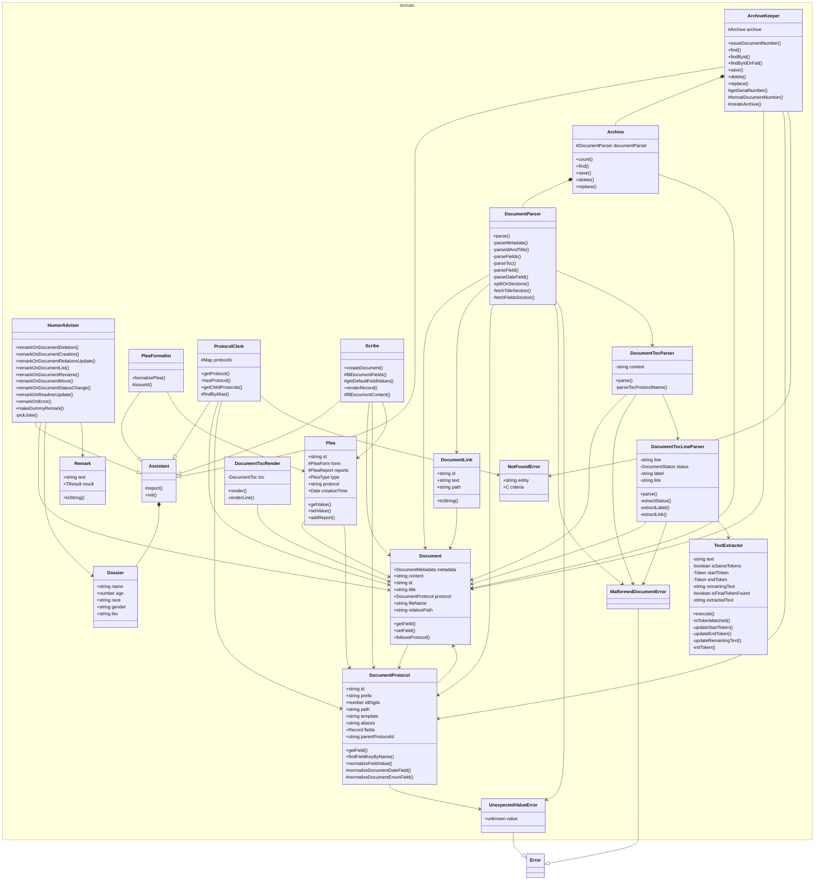

# zok

<!-- poe:classes:start -->
## Classes

### Application

#### Entry points

- [Zok](src/application/Zok.ts)

#### Document

| Use case | Description |
|----------|-------------|
| [ChangeStatusDutyInstruction](src/application/instructions/ChangeStatusDutyInstruction.ts) | Returns: `Document` |
| [CreateDocumentDutyInstruction](src/application/instructions/CreateDocumentDutyInstruction.ts) | Returns: `Document` |
| [DeleteDocumentDutyInstruction](src/application/instructions/DeleteDocumentDutyInstruction.ts) | Returns: `Document` |
| [ListDocumentsDutyInstruction](src/application/instructions/ListDocumentsDutyInstruction.ts) | Returns: `Document[]` |
| [MoveDocumentDutyInstruction](src/application/instructions/MoveDocumentDutyInstruction.ts) | Returns: `Document` |
| [RenameDocumentDutyInstruction](src/application/instructions/RenameDocumentDutyInstruction.ts) | Returns: `Document` |
| [UpdateDocumentRelationsDutyInstruction](src/application/instructions/UpdateDocumentRelationsDutyInstruction.ts) | Returns: `Document \| undefined` |

#### Other

| Use case | Description |
|----------|-------------|
| [UpdateReadmeDutyInstruction](src/application/instructions/UpdateReadmeDutyInstruction.ts) |  |

### Domain

| Entity | Description |
|--------|-------------|
| assistants/[ArchiveKeeper](src/domain/assistants/ArchiveKeeper.ts) | Abstract · Extends [Assistant](src/domain/assistants/Assistant.ts) |
| assistants/[Assistant](src/domain/assistants/Assistant.ts) | Abstract |
| assistants/[HumorAdvisor](src/domain/assistants/HumorAdvisor.ts) | Extends [Assistant](src/domain/assistants/Assistant.ts) |
| assistants/[PleaFormalist](src/domain/assistants/PleaFormalist.ts) | Abstract · Extends [Assistant](src/domain/assistants/Assistant.ts) |
| assistants/[ProtocolClerk](src/domain/assistants/ProtocolClerk.ts) | Abstract · Extends [Assistant](src/domain/assistants/Assistant.ts) |
| assistants/[Scribe](src/domain/assistants/Scribe.ts) | Abstract · Extends [Assistant](src/domain/assistants/Assistant.ts) |
| entities/[Document](src/domain/entities/Document.ts) |  |
| entities/[DocumentLink](src/domain/entities/DocumentLink.ts) |  |
| entities/[DocumentProtocol](src/domain/entities/DocumentProtocol.ts) |  |
| entities/[Dossier](src/domain/entities/Dossier.ts) |  |
| entities/[Plea](src/domain/entities/Plea.ts) |  |
| entities/[Remark](src/domain/entities/Remark.ts) |  |
| errors/[MalformedDocumentError](src/domain/errors/MalformedDocumentError.ts) | Extends `Error` |
| errors/[NotFoundError](src/domain/errors/NotFoundError.ts) |  |
| errors/[UnexpectedValueError](src/domain/errors/UnexpectedValueError.ts) | Extends `Error` |
| tools/[Archive](src/domain/tools/Archive.ts) | Abstract |
| tools/parser/[DocumentParser](src/domain/tools/parser/DocumentParser.ts) |  |
| tools/parser/[DocumentTocLineParser](src/domain/tools/parser/DocumentTocLineParser.ts) |  |
| tools/parser/[DocumentTocParser](src/domain/tools/parser/DocumentTocParser.ts) |  |
| tools/parser/[TextExtractor](src/domain/tools/parser/TextExtractor.ts) |  |
| tools/render/[DocumentTocRender](src/domain/tools/render/DocumentTocRender.ts) |  |
<!-- poe:classes:end -->
