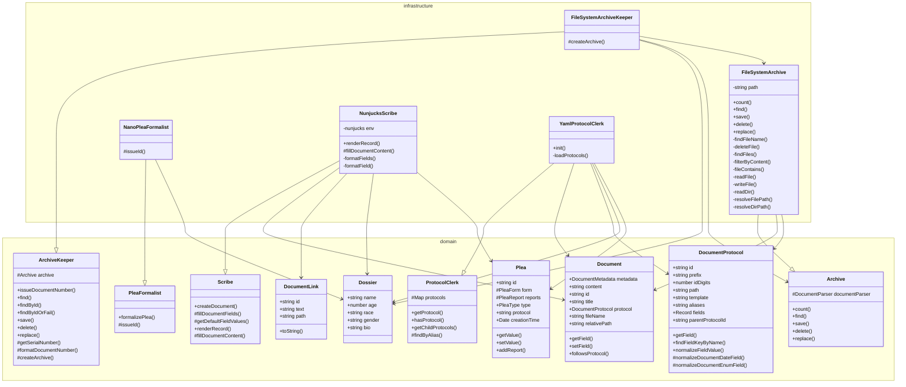

# zok

<!-- poe:classes:start -->
## Classes

### application

```mermaid
classDiagram
  namespace application {
    class Zok {
      +ZokAssistants assistants
      +handleTextPlea()
      +handlePlea()
      +announce()
      +findDocuments()
      +init()
      -executeCommand()
      -executeQuery()
      -updateDocumentRelations()
      -updateReadme()
      -report()
    }
    class ChangeStatusDutyInstruction {
      +execute()
      -resolveStatusValue()
    }
    class CreateDocumentDutyInstruction {
      +execute()
      -enrichParams()
      -resolveParentDocument()
      -getActiveDocument()
    }
    class DeleteDocumentDutyInstruction {
      +execute()
    }
    class DutyInstruction {
      #TParams params
      +Plea plea
      +ZokAssistants assistants
      +execute()
      #getDocument()
    }
    class ListDocumentsDutyInstruction {
      +execute()
      -getDocuments()
    }
    class MoveDocumentDutyInstruction {
      +execute()
      -resolveParentLink()
      -cleanOldParentToc()
    }
    class RenameDocumentDutyInstruction {
      +execute()
      -rename()
      -updateChildLinks()
      -replaceTitleInContent()
      -buildHeading()
    }
    class UpdateDocumentRelationsDutyInstruction {
      +execute()
      -getDocumentParent()
      -updateToc()
      -createToc()
      -replaceTocContent()
    }
    class UpdateReadmeDutyInstruction {
      +execute()
      -getReadmeForProtocol()
      -createReadmeForProtocol()
      -updateReadme()
      -getDocuments()
      -createToc()
      -replaceTocContent()
    }
  }
  namespace domain {
    class Assistant {
      #report()
      +init()
    }
    class HumorAdvisor {
      +remarkOnDocumentDeletion()
      +remarkOnDocumentCreation()
      +remarkOnDocumentRelationsUpdate()
      +remarkOnDocumentList()
      +remarkOnDocumentRename()
      +remarkOnDocumentMove()
      +remarkOnDocumentStatusChange()
      +remarkOnReadmeUpdate()
      +remarkOnError()
      +makeDummyRemark()
      -pickJoke()
    }
    class Document {
      +DocumentMetadata metadata
      +string content
      +string id
      +string title
      +DocumentProtocol protocol
      +string fileName
      +string relativePath
      +getField()
      +setField()
      +followsProtocol()
    }
    class Dossier {
      +string name
      +number age
      +string race
      +string gender
      +string bio
    }
    class Plea {
      +string id
      #PleaForm form
      #PleaReport reports
      +PleaType type
      +string protocol
      +Date creationTime
      +getValue()
      +setValue()
      +addReport()
    }
    class Remark {
      +string text
      +TResult result
      +toString()
    }
    class UnexpectedValueError {
      +unknown value
    }
    class DocumentLink {
      +string id
      +string text
      +string path
      +toString()
    }
    class DocumentProtocol {
      +string id
      +string prefix
      +number idDigits
      +string path
      +string template
      +string aliases
      +Record fields
      +string parentProtocolId
      +getField()
      +findFieldKeyByName()
      +normalizeFieldValue()
      #normalizeDocumentDateField()
      #normalizeDocumentEnumField()
    }
    class DocumentTocRender {
      -DocumentToc toc
      +render()
      -renderLine()
    }
  }

  Zok --> ChangeStatusDutyInstruction
  Zok --> CreateDocumentDutyInstruction
  Zok --> DeleteDocumentDutyInstruction
  Zok --> DutyInstruction
  Zok --> ListDocumentsDutyInstruction
  Zok --> MoveDocumentDutyInstruction
  Zok --> RenameDocumentDutyInstruction
  Zok --> UpdateDocumentRelationsDutyInstruction
  Zok --> UpdateReadmeDutyInstruction
  Zok --> Assistant
  Zok --> HumorAdvisor
  Zok --> Document
  Zok --> Dossier
  Zok --> Plea
  Zok --> Remark
  ChangeStatusDutyInstruction --|> DutyInstruction
  ChangeStatusDutyInstruction --> Document
  ChangeStatusDutyInstruction --> Remark
  ChangeStatusDutyInstruction --> UnexpectedValueError
  CreateDocumentDutyInstruction --|> DutyInstruction
  CreateDocumentDutyInstruction --> Document
  CreateDocumentDutyInstruction --> DocumentLink
  CreateDocumentDutyInstruction --> DocumentProtocol
  CreateDocumentDutyInstruction --> Remark
  DeleteDocumentDutyInstruction --|> DutyInstruction
  DeleteDocumentDutyInstruction --> Document
  DeleteDocumentDutyInstruction --> Remark
  DutyInstruction --> Zok
  DutyInstruction --> Assistant
  DutyInstruction --> Document
  DutyInstruction --> DocumentProtocol
  DutyInstruction --> Plea
  DutyInstruction --> Remark
  ListDocumentsDutyInstruction --|> DutyInstruction
  ListDocumentsDutyInstruction --> Document
  ListDocumentsDutyInstruction --> Remark
  MoveDocumentDutyInstruction --|> DutyInstruction
  MoveDocumentDutyInstruction --> UpdateDocumentRelationsDutyInstruction
  MoveDocumentDutyInstruction --> Document
  MoveDocumentDutyInstruction --> DocumentLink
  MoveDocumentDutyInstruction --> Remark
  MoveDocumentDutyInstruction --> UnexpectedValueError
  RenameDocumentDutyInstruction --|> DutyInstruction
  RenameDocumentDutyInstruction --> Document
  RenameDocumentDutyInstruction --> DocumentLink
  RenameDocumentDutyInstruction --> Remark
  UpdateDocumentRelationsDutyInstruction --|> DutyInstruction
  UpdateDocumentRelationsDutyInstruction --> Document
  UpdateDocumentRelationsDutyInstruction --> DocumentLink
  UpdateDocumentRelationsDutyInstruction --> DocumentProtocol
  UpdateDocumentRelationsDutyInstruction --> Remark
  UpdateDocumentRelationsDutyInstruction --> DocumentTocRender
  UpdateReadmeDutyInstruction --|> DutyInstruction
  UpdateReadmeDutyInstruction --> Document
  UpdateReadmeDutyInstruction --> DocumentProtocol
  UpdateReadmeDutyInstruction --> Remark
  UpdateReadmeDutyInstruction --> DocumentTocRender
```

| Entity | Notes |
|--------|-------|
| [Zok](src/application/Zok.ts) |  |
| instructions/[ChangeStatusDutyInstruction](src/application/instructions/ChangeStatusDutyInstruction.ts) | Extends [DutyInstruction](src/application/instructions/DutyInstruction.ts) |
| instructions/[CreateDocumentDutyInstruction](src/application/instructions/CreateDocumentDutyInstruction.ts) | Extends [DutyInstruction](src/application/instructions/DutyInstruction.ts) |
| instructions/[DeleteDocumentDutyInstruction](src/application/instructions/DeleteDocumentDutyInstruction.ts) | Extends [DutyInstruction](src/application/instructions/DutyInstruction.ts) |
| instructions/[DutyInstruction](src/application/instructions/DutyInstruction.ts) | Abstract |
| instructions/[ListDocumentsDutyInstruction](src/application/instructions/ListDocumentsDutyInstruction.ts) | Extends [DutyInstruction](src/application/instructions/DutyInstruction.ts) |
| instructions/[MoveDocumentDutyInstruction](src/application/instructions/MoveDocumentDutyInstruction.ts) | Extends [DutyInstruction](src/application/instructions/DutyInstruction.ts) |
| instructions/[RenameDocumentDutyInstruction](src/application/instructions/RenameDocumentDutyInstruction.ts) | Extends [DutyInstruction](src/application/instructions/DutyInstruction.ts) |
| instructions/[UpdateDocumentRelationsDutyInstruction](src/application/instructions/UpdateDocumentRelationsDutyInstruction.ts) | Extends [DutyInstruction](src/application/instructions/DutyInstruction.ts) |
| instructions/[UpdateReadmeDutyInstruction](src/application/instructions/UpdateReadmeDutyInstruction.ts) | Extends [DutyInstruction](src/application/instructions/DutyInstruction.ts) |

### domain

| Entity | Notes |
|--------|-------|
| assistants/[ArchiveKeeper](src/domain/assistants/ArchiveKeeper.ts) | Abstract · Extends [Assistant](src/domain/assistants/Assistant.ts) |
| assistants/[Assistant](src/domain/assistants/Assistant.ts) | Abstract |
| assistants/[HumorAdvisor](src/domain/assistants/HumorAdvisor.ts) | Extends [Assistant](src/domain/assistants/Assistant.ts) |
| assistants/[PleaFormalist](src/domain/assistants/PleaFormalist.ts) | Abstract · Extends [Assistant](src/domain/assistants/Assistant.ts) |
| assistants/[ProtocolClerk](src/domain/assistants/ProtocolClerk.ts) | Abstract · Extends [Assistant](src/domain/assistants/Assistant.ts) |
| assistants/[Scribe](src/domain/assistants/Scribe.ts) | Abstract · Extends [Assistant](src/domain/assistants/Assistant.ts) |
| entities/[Document](src/domain/entities/Document.ts) |  |
| entities/[DocumentLink](src/domain/entities/DocumentLink.ts) |  |
| entities/[DocumentProtocol](src/domain/entities/DocumentProtocol.ts) |  |
| entities/[Dossier](src/domain/entities/Dossier.ts) |  |
| entities/[Plea](src/domain/entities/Plea.ts) |  |
| entities/[Remark](src/domain/entities/Remark.ts) |  |
| errors/[MalformedDocumentError](src/domain/errors/MalformedDocumentError.ts) | Extends `Error` |
| errors/[NotFoundError](src/domain/errors/NotFoundError.ts) |  |
| errors/[UnexpectedValueError](src/domain/errors/UnexpectedValueError.ts) | Extends `Error` |
| tools/[Archive](src/domain/tools/Archive.ts) | Abstract |
| tools/parser/[DocumentParser](src/domain/tools/parser/DocumentParser.ts) |  |
| tools/parser/[DocumentTocLineParser](src/domain/tools/parser/DocumentTocLineParser.ts) |  |
| tools/parser/[DocumentTocParser](src/domain/tools/parser/DocumentTocParser.ts) |  |
| tools/parser/[TextExtractor](src/domain/tools/parser/TextExtractor.ts) |  |
| tools/render/[DocumentTocRender](src/domain/tools/render/DocumentTocRender.ts) |  |

### infrastructure

| Entity | Notes |
|--------|-------|
| archive/[FileSystemArchive](src/infrastructure/archive/FileSystemArchive.ts) | Extends [Archive](src/domain/tools/Archive.ts) |
| assistants/[FileSystemArchiveKeeper](src/infrastructure/assistants/FileSystemArchiveKeeper.ts) | Extends [ArchiveKeeper](src/domain/assistants/ArchiveKeeper.ts) |
| assistants/[NanoPleaFormalist](src/infrastructure/assistants/NanoPleaFormalist.ts) | Extends [PleaFormalist](src/domain/assistants/PleaFormalist.ts) |
| assistants/[NunjucksScribe](src/infrastructure/assistants/NunjucksScribe.ts) | Extends [Scribe](src/domain/assistants/Scribe.ts) |
| assistants/[YamlProtocolClerk](src/infrastructure/assistants/YamlProtocolClerk.ts) | Extends [ProtocolClerk](src/domain/assistants/ProtocolClerk.ts) |
<!-- poe:classes:end -->
