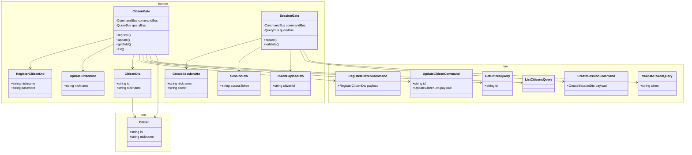
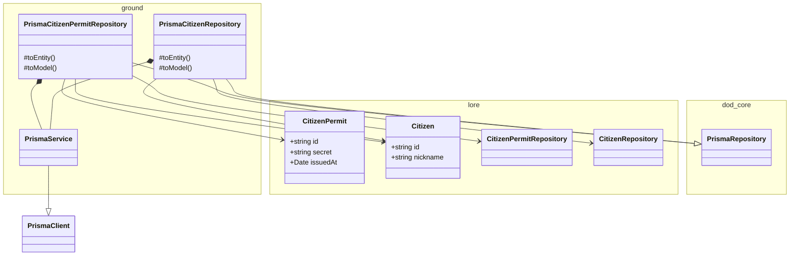
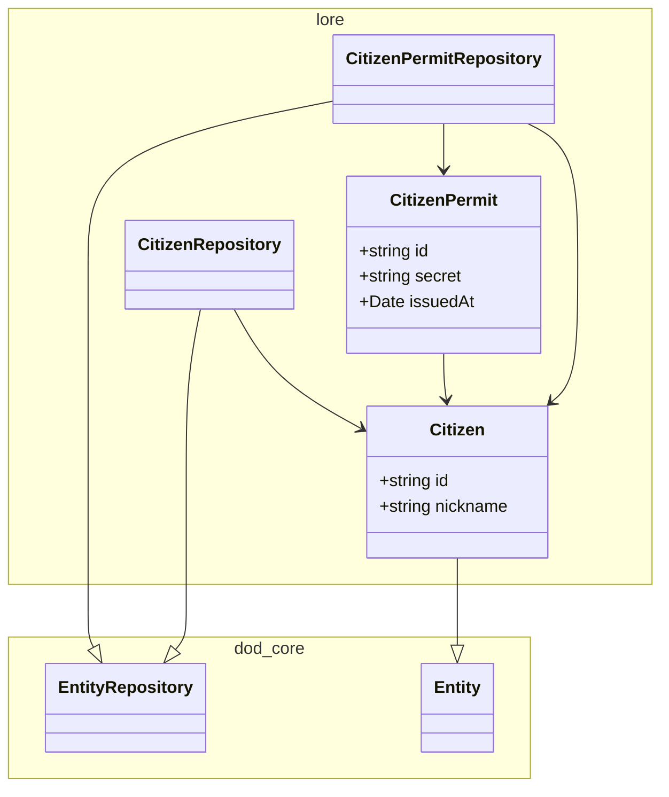
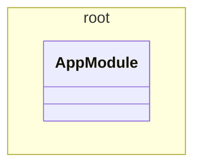

# citizen

<!-- poe:classes:start -->
## Classes

### frontier

| Entity |
|--------|
| dto/body/[CreateSessionDto](src/frontier/dto/body/create-session.dto.ts) |
| dto/body/[RegisterCitizenDto](src/frontier/dto/body/register-citizen.dto.ts) |
| dto/body/[UpdateCitizenDto](src/frontier/dto/body/update-citizen.dto.ts) |
| dto/[CitizenDto](src/frontier/dto/citizen.dto.ts) |
| dto/[SessionDto](src/frontier/dto/session.dto.ts) |
| dto/[TokenPayloadDto](src/frontier/dto/token-payload.dto.ts) |
| gates/[CitizenGate](src/frontier/gates/citizen.gate.ts) |
| gates/[SessionGate](src/frontier/gates/session.gate.ts) |

### ground

| Entity | Notes |
|--------|-------|
| [PrismaService](src/ground/prisma.service.ts) | Extends `PrismaClient` · Implements `OnModuleInit`, `OnModuleDestroy` |
| repositories/[PrismaCitizenPermitRepository](src/ground/repositories/prisma-citizen-permit.repository.ts) | Extends `PrismaRepository` |
| repositories/[PrismaCitizenRepository](src/ground/repositories/prisma-citizen.repository.ts) | Extends `PrismaRepository` |

### law

```mermaid
classDiagram
  namespace law {
    class CreateSessionCommand {
      +CreateSessionDto payload
    }
    class CreateSessionHandler {
      +execute()
      -findCitizenByNickname()
      -loadPermit()
      -verifySecret()
    }
    class RegisterCitizenCommand {
      +RegisterCitizenDto payload
    }
    class RegisterCitizenHandler {
      +execute()
      -assertNicknameAvailable()
    }
    class UpdateCitizenCommand {
      +string id
      +UpdateCitizenDto payload
    }
    class UpdateCitizenHandler {
      +execute()
    }
    class GetCitizenQuery {
      +string id
    }
    class GetCitizenHandler {
      +execute()
    }
    class ListCitizensQuery
    class ListCitizensHandler {
      +execute()
    }
    class ValidateTokenQuery {
      +string token
    }
    class ValidateTokenHandler {
      +execute()
    }
  }
  namespace frontier {
    class CreateSessionDto {
      +string nickname
      +string secret
    }
    class SessionDto {
      +string accessToken
    }
    class RegisterCitizenDto {
      +string nickname
      +string password
    }
    class CitizenDto {
      +string id
      +string nickname
    }
    class UpdateCitizenDto {
      +string nickname
    }
    class TokenPayloadDto {
      +string citizenId
    }
  }
  namespace lore {
    class CitizenRepository
    class CitizenPermitRepository
    class CitizenPermit {
      +string id
      +string secret
      +Date issuedAt
    }
    class Citizen {
      +string id
      +string nickname
    }
  }
  namespace nestjs_cqrs {
    class Command
    class Query
  }

  CreateSessionCommand --|> Command
  CreateSessionCommand *-- CreateSessionDto
  CreateSessionCommand --> SessionDto
  CreateSessionHandler *-- CitizenRepository
  CreateSessionHandler *-- CitizenPermitRepository
  CreateSessionHandler --> SessionDto
  CreateSessionHandler --> CreateSessionCommand
  CreateSessionHandler --> CitizenPermit
  CreateSessionHandler --> Citizen
  RegisterCitizenCommand --|> Command
  RegisterCitizenCommand *-- RegisterCitizenDto
  RegisterCitizenCommand --> CitizenDto
  RegisterCitizenCommand --> Citizen
  RegisterCitizenHandler *-- CitizenRepository
  RegisterCitizenHandler *-- CitizenPermitRepository
  RegisterCitizenHandler --> CitizenDto
  RegisterCitizenHandler --> RegisterCitizenCommand
  RegisterCitizenHandler --> CitizenPermit
  RegisterCitizenHandler --> Citizen
  UpdateCitizenCommand --|> Command
  UpdateCitizenCommand *-- UpdateCitizenDto
  UpdateCitizenCommand --> CitizenDto
  UpdateCitizenCommand --> Citizen
  UpdateCitizenHandler *-- CitizenRepository
  UpdateCitizenHandler --> CitizenDto
  UpdateCitizenHandler --> UpdateCitizenCommand
  UpdateCitizenHandler --> Citizen
  GetCitizenQuery --|> Query
  GetCitizenQuery --> CitizenDto
  GetCitizenQuery --> Citizen
  GetCitizenHandler *-- CitizenRepository
  GetCitizenHandler --> CitizenDto
  GetCitizenHandler --> GetCitizenQuery
  GetCitizenHandler --> Citizen
  ListCitizensQuery --|> Query
  ListCitizensQuery --> CitizenDto
  ListCitizensQuery --> Citizen
  ListCitizensHandler *-- CitizenRepository
  ListCitizensHandler --> CitizenDto
  ListCitizensHandler --> ListCitizensQuery
  ListCitizensHandler --> Citizen
  ValidateTokenQuery --|> Query
  ValidateTokenQuery --> TokenPayloadDto
  ValidateTokenHandler --> TokenPayloadDto
  ValidateTokenHandler --> ValidateTokenQuery
```

| Entity | Notes |
|--------|-------|
| commands/[CreateSessionCommand](src/law/commands/create-session.command.ts) | Extends `Command` |
| commands/[CreateSessionHandler](src/law/commands/create-session.command.ts) | Implements `ICommandHandler` |
| commands/[RegisterCitizenCommand](src/law/commands/register-citizen.command.ts) | Extends `Command` |
| commands/[RegisterCitizenHandler](src/law/commands/register-citizen.command.ts) | Implements `ICommandHandler` |
| commands/[UpdateCitizenCommand](src/law/commands/update-citizen.command.ts) | Extends `Command` |
| commands/[UpdateCitizenHandler](src/law/commands/update-citizen.command.ts) | Implements `ICommandHandler` |
| queries/[GetCitizenQuery](src/law/queries/get-citizen.query.ts) | Extends `Query` |
| queries/[GetCitizenHandler](src/law/queries/get-citizen.query.ts) | Implements `IQueryHandler` |
| queries/[ListCitizensQuery](src/law/queries/list-citizens.query.ts) | Extends `Query` |
| queries/[ListCitizensHandler](src/law/queries/list-citizens.query.ts) | Implements `IQueryHandler` |
| queries/[ValidateTokenQuery](src/law/queries/validate-token.query.ts) | Extends `Query` |
| queries/[ValidateTokenHandler](src/law/queries/validate-token.query.ts) | Implements `IQueryHandler` |

### lore

| Entity | Notes |
|--------|-------|
| entities/[CitizenPermit](src/lore/entities/citizen-permit.entity.ts) |  |
| entities/[Citizen](src/lore/entities/citizen.entity.ts) | Extends `Entity` |
| repositories/[CitizenPermitRepository](src/lore/repositories/citizen-permit.repository.ts) | Abstract · Extends `EntityRepository` |
| repositories/[CitizenRepository](src/lore/repositories/citizen.repository.ts) | Abstract · Extends `EntityRepository` |

### root

| Entity |
|--------|
| [AppModule](src/app.module.ts) |
<!-- poe:classes:end -->
