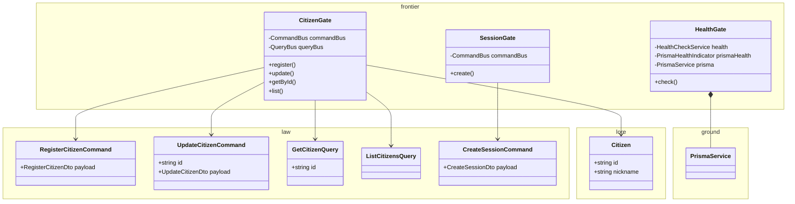
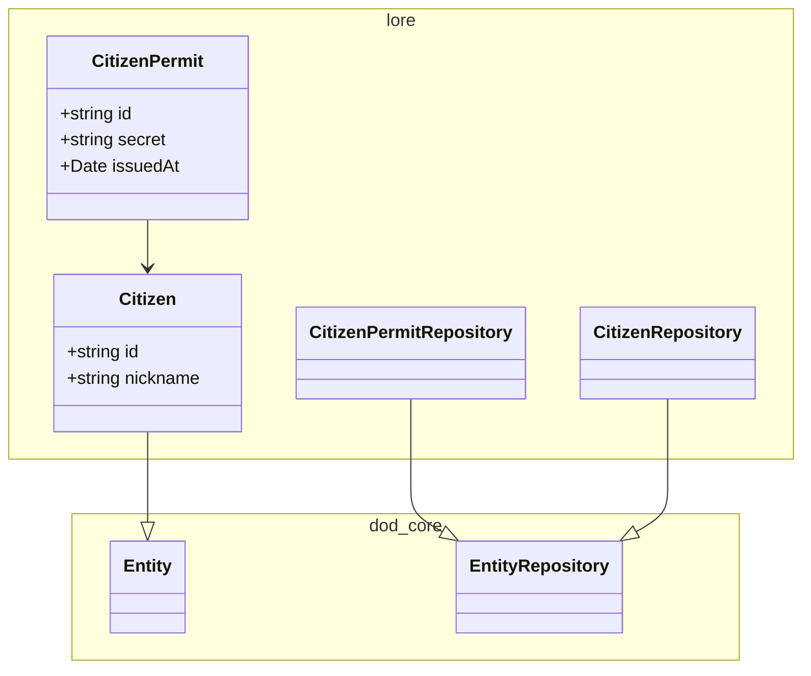
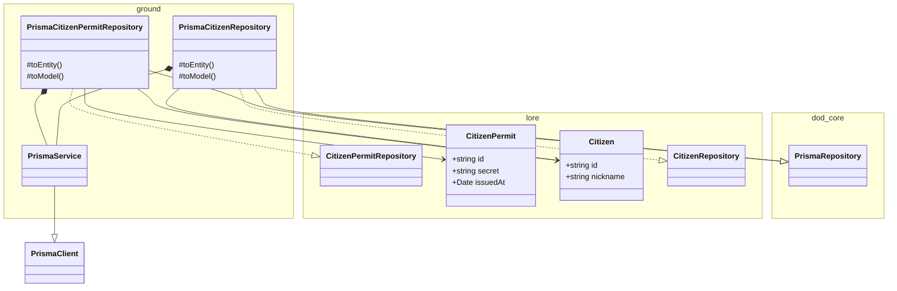

# citizen

## CLI

Run administrative commands via the NestJS application context (requires `DATABASE_URL` in `.env` or environment):

```bash
npm run cli -- <command> [options]
```

### Commands

#### `citizen:create`

Register a new citizen with a hashed password.

```bash
npm run cli -- citizen:create --nickname <name> --password <secret>
```

| Option | Required | Description |
|--------|----------|-------------|
| `--nickname` | yes | Citizen nickname |
| `--password` | yes | Citizen password (min 8 characters) |

<!-- poe:classes:start -->
## Classes

### Frontier



| Entity |
|--------|
| gates/[CitizenGate](src/frontier/gates/citizen.gate.ts) |
| gates/[HealthGate](src/frontier/gates/health.gate.ts) |
| gates/[SessionGate](src/frontier/gates/session.gate.ts) |

### Law

| Use case | Description |
|----------|-------------|
| [CreateSessionCommand](src/law/commands/create-session.command.ts) | Params: `(payload: CreateSessionDto)`<br>Returns: `SessionDto` |
| [RegisterCitizenCommand](src/law/commands/register-citizen.command.ts) | Params: `(payload: RegisterCitizenDto)`<br>Returns: `CitizenDto` |
| [UpdateCitizenCommand](src/law/commands/update-citizen.command.ts) | Params: `(id: string, payload: UpdateCitizenDto)`<br>Returns: `CitizenDto` |
| [GetCitizenQuery](src/law/queries/get-citizen.query.ts) | Params: `(id: string)`<br>Returns: `CitizenDto` |
| [ListCitizensQuery](src/law/queries/list-citizens.query.ts) | Returns: `CitizenDto[]` |

### Lore



| Entity | Description |
|--------|-------------|
| entities/[CitizenPermit](src/lore/entities/citizen-permit.entity.ts) |  |
| entities/[Citizen](src/lore/entities/citizen.entity.ts) | Extends `Entity` |
| repositories/[CitizenPermitRepository](src/lore/repositories/citizen-permit.repository.ts) | Abstract · Extends `EntityRepository` |
| repositories/[CitizenRepository](src/lore/repositories/citizen.repository.ts) | Abstract · Extends `EntityRepository` |

### Ground



| Entity | Description |
|--------|-------------|
| [PrismaService](src/ground/prisma.service.ts) | Extends `PrismaClient` · Implements `OnModuleInit`, `OnModuleDestroy` |
| repositories/[PrismaCitizenPermitRepository](src/ground/repositories/prisma-citizen-permit.repository.ts) | Extends `PrismaRepository` · Implements [CitizenPermitRepository](src/lore/repositories/citizen-permit.repository.ts) |
| repositories/[PrismaCitizenRepository](src/ground/repositories/prisma-citizen.repository.ts) | Extends `PrismaRepository` · Implements [CitizenRepository](src/lore/repositories/citizen.repository.ts) |
<!-- poe:classes:end -->
