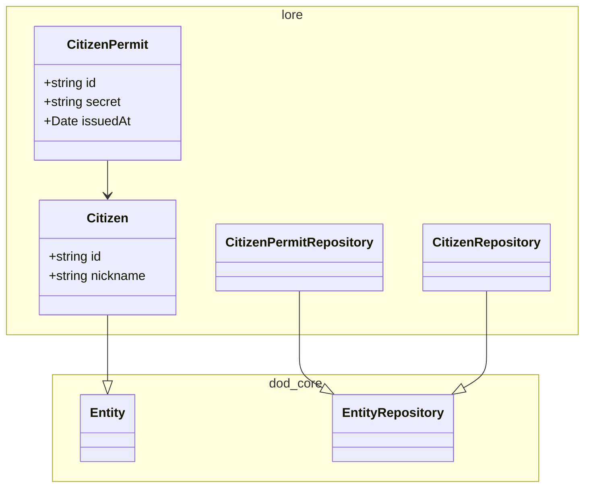
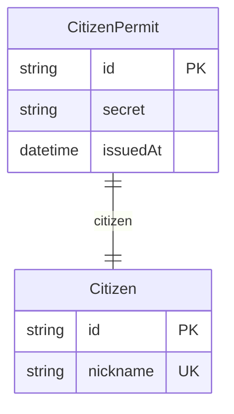

# citizen

<!-- poe:header:start -->
Citizenship registry — player accounts and sessions

**On this page**

- [CLI](#cli)
- [Frontier](#frontier)
- [Law](#law)
- [Lore](#lore)
- [Ground](#ground)
<!-- poe:header:end -->

## CLI

Run administrative commands via the NestJS application context (requires `DATABASE_URL` in `.env` or environment):

```bash
pnpm run cli -- <command> [options]
```

### Commands

#### `citizen:create`

Register a new citizen with a hashed password.

```bash
pnpm run cli -- citizen:create --nickname <name> --password <secret>
```

| Option | Required | Description |
|--------|----------|-------------|
| `--nickname` | yes | Citizen nickname |
| `--password` | yes | Citizen password (min 8 characters) |

<!-- poe:classes:start -->
## Frontier

### [Citizen](src/frontier/gates/citizen.gate.ts)

| Endpoint | Description |
|----------|-------------|
| POST /v1/citizen | Param `dto`: [`RegisterCitizenDto`](../../packages/api-contract/src/contracts/citizen.ts#L13)<br>Returns: [`CitizenDto`](../../packages/api-contract/src/contracts/citizen.ts#L7) |
| PATCH /v1/citizen/:id | Param `id`: `string`<br>Param `dto`: [`UpdateCitizenDto`](../../packages/api-contract/src/contracts/citizen.ts#L18)<br>Returns: [`CitizenDto`](../../packages/api-contract/src/contracts/citizen.ts#L7) |
| GET /v1/citizen/:id | Param `id`: `string`<br>Returns: [`CitizenDto`](../../packages/api-contract/src/contracts/citizen.ts#L7) |
| GET /v1/citizen | Returns: [`CitizenDto`](../../packages/api-contract/src/contracts/citizen.ts#L7)[] |

### [Health](src/frontier/gates/health.gate.ts)

| Endpoint | Description |
|----------|-------------|
| GET /v1/health | Returns: `HealthCheckResult` |

### [Session](src/frontier/gates/session.gate.ts)

| Endpoint | Description |
|----------|-------------|
| POST /v1/session | Param `dto`: [`CreateSessionDto`](../../packages/api-contract/src/contracts/session.ts#L12)<br>Returns: [`SessionDto`](../../packages/api-contract/src/contracts/session.ts#L6) |

## Law

### Citizen

| Use case | Description |
|----------|-------------|
| [RegisterCitizenCommand](src/law/commands/register-citizen.command.ts#L18) | Param `payload`: [`RegisterCitizenDto`](../../packages/api-contract/src/contracts/citizen.ts#L13)<br>Returns: [`CitizenDto`](../../packages/api-contract/src/contracts/citizen.ts#L7) |
| [UpdateCitizenCommand](src/law/commands/update-citizen.command.ts#L7) | Param `id`: `string`<br>Param `payload`: [`UpdateCitizenDto`](../../packages/api-contract/src/contracts/citizen.ts#L18)<br>Returns: [`CitizenDto`](../../packages/api-contract/src/contracts/citizen.ts#L7) |
| [GetCitizenQuery](src/law/queries/get-citizen.query.ts#L7) | Param `id`: `string`<br>Returns: [`CitizenDto`](../../packages/api-contract/src/contracts/citizen.ts#L7) |
| [ListCitizensQuery](src/law/queries/list-citizens.query.ts#L7) | Returns: [`CitizenDto`](../../packages/api-contract/src/contracts/citizen.ts#L7)[] |

### Session

| Use case | Description |
|----------|-------------|
| [CreateSessionCommand](src/law/commands/create-session.command.ts#L11) | Param `payload`: [`CreateSessionDto`](../../packages/api-contract/src/contracts/session.ts#L12)<br>Returns: [`SessionDto`](../../packages/api-contract/src/contracts/session.ts#L6) |

## Lore


```mermaid
classDiagram
  namespace lore {
    class CitizenPermit {
      +string id
      +string secret
      +Date issuedAt
    }
    class Citizen {
      +string id
      +string nickname
    }
    class CitizenPermitRepository
    class CitizenRepository
  }
  namespace dod_core {
    class Entity
    class EntityRepository
  }

  CitizenPermit --> Citizen
  Citizen --|> Entity
  CitizenPermitRepository --|> EntityRepository
  CitizenRepository --|> EntityRepository
```

| Entity | Description |
|--------|-------------|
| entities/[CitizenPermit](src/lore/entities/citizen-permit.entity.ts#L6) |  |
| entities/[Citizen](src/lore/entities/citizen.entity.ts#L7) | Extends `Entity` |
| repositories/[CitizenPermitRepository](src/lore/repositories/citizen-permit.repository.ts#L4) | Abstract · Extends `EntityRepository` |
| repositories/[CitizenRepository](src/lore/repositories/citizen.repository.ts#L4) | Abstract · Extends `EntityRepository` |

## Ground


```mermaid
erDiagram
  Citizen {
    string id PK
    string nickname UK
  }
  CitizenPermit {
    string id PK
    string secret
    datetime issuedAt
  }
  CitizenPermit ||--|| Citizen : citizen
```
<!-- poe:classes:end -->

<!-- poe:footer:start -->
> This document was inspected and assembled by Inspector Poe.
<!-- poe:footer:end -->
