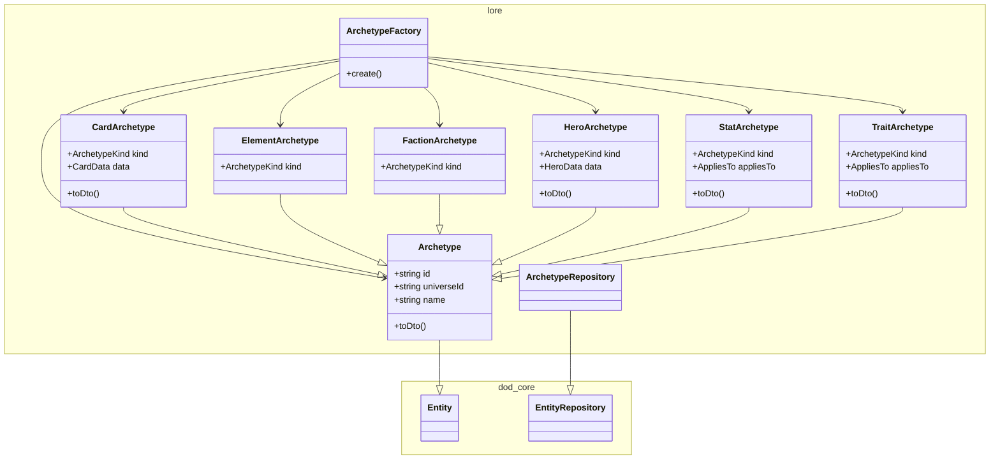
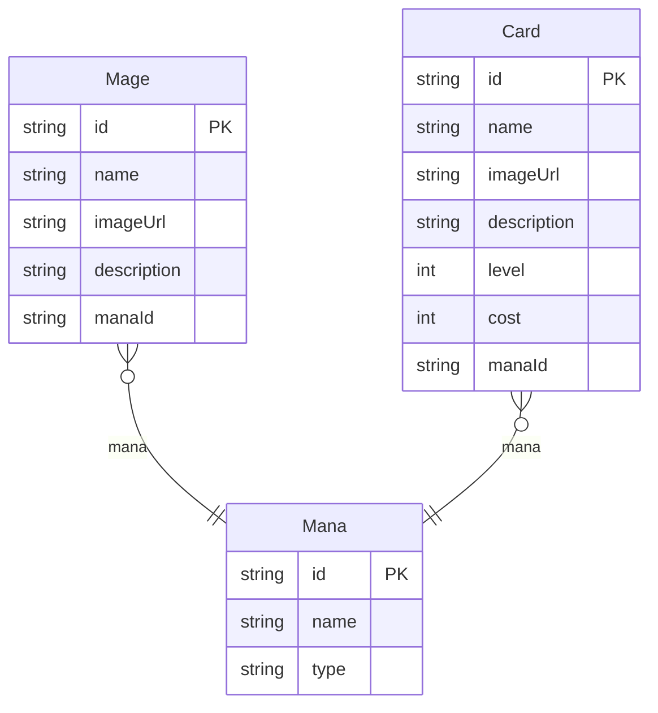

# Codex service

Game content management service

## Entities

| Entity      | Description                                                                                                                                               |
| ----------- | --------------------------------------------------------------------------------------------------------------------------------------------------------- |
| **Card**    | Spells and creatures. Each card belongs to one mana and may have multiple abilities.                                                                      |
| **Ability** | Actions a card can perform. Composed of one or more effects. Supports conditional triggers                                                                |
| **Effect**  | Atomic action within an ability (damage, heal, buff/debuff)                                                                                               |
| **Mage**    | Playable character specializing in a mana. Determines starting cards and unique perks                                                                     |
| **Mana**    | • **Core mana**: Fire, Water, Earth, Air (common for all mages)<br>• **Special mana**: Necromancy, Demonology, Chaos, etc (specific to a particular mage) |

## Bash commands

```bash
# Connect to the database
psql -h 127.0.0.1 -U ruler -d codex

# Generate a migration
npm run prisma:generate migration_name

# Apply migrations to dev DB
npm run prisma:migrate:dev
```

<!-- poe:classes:start -->
## Classes

### Frontier

#### [Card](src/frontier/gates/card.gate.ts)

| Endpoint | Description |
|----------|-------------|
| POST /v1/card | Params: `(dto: CreateCardDto)`<br>Returns: `CardDto` |
| PATCH /v1/card/:id | Params: `(id: string, dto: UpdateCardDto)`<br>Returns: `CardDto` |
| GET /v1/card/:id | Params: `(id: string)`<br>Returns: `CardDto` |
| GET /v1/card | Params: `(universeId: string)`<br>Returns: `CardDto[]` |

#### [Element](src/frontier/gates/element.gate.ts)

| Endpoint | Description |
|----------|-------------|
| POST /v1/element | Params: `(dto: CreateElementDto)`<br>Returns: `ElementDto` |
| PATCH /v1/element/:id | Params: `(id: string, dto: UpdateElementDto)`<br>Returns: `ElementDto` |
| GET /v1/element/:id | Params: `(id: string)`<br>Returns: `ElementDto` |
| GET /v1/element | Params: `(universeId: string)`<br>Returns: `ElementDto[]` |

#### [Faction](src/frontier/gates/faction.gate.ts)

| Endpoint | Description |
|----------|-------------|
| POST /v1/faction | Params: `(dto: CreateFactionDto)`<br>Returns: `FactionDto` |
| PATCH /v1/faction/:id | Params: `(id: string, dto: UpdateFactionDto)`<br>Returns: `FactionDto` |
| GET /v1/faction/:id | Params: `(id: string)`<br>Returns: `FactionDto` |
| GET /v1/faction | Params: `(universeId: string)`<br>Returns: `FactionDto[]` |

#### [Health](src/frontier/gates/health.gate.ts)

| Endpoint | Description |
|----------|-------------|
| GET /v1/health | Returns: `HealthCheckResult` |

#### [Hero](src/frontier/gates/hero.gate.ts)

| Endpoint | Description |
|----------|-------------|
| POST /v1/hero | Params: `(dto: CreateHeroDto)`<br>Returns: `HeroDto` |
| PATCH /v1/hero/:id | Params: `(id: string, dto: UpdateHeroDto)`<br>Returns: `HeroDto` |
| GET /v1/hero/:id | Params: `(id: string)`<br>Returns: `HeroDto` |
| GET /v1/hero | Params: `(universeId: string)`<br>Returns: `HeroDto[]` |

#### [Stat](src/frontier/gates/stat.gate.ts)

| Endpoint | Description |
|----------|-------------|
| POST /v1/stat | Params: `(dto: CreateStatDto)`<br>Returns: `StatDto` |
| PATCH /v1/stat/:id | Params: `(id: string, dto: UpdateStatDto)`<br>Returns: `StatDto` |
| GET /v1/stat/:id | Params: `(id: string)`<br>Returns: `StatDto` |
| GET /v1/stat | Params: `(universeId: string)`<br>Returns: `StatDto[]` |

#### [Trait](src/frontier/gates/trait.gate.ts)

| Endpoint | Description |
|----------|-------------|
| POST /v1/trait | Params: `(dto: CreateTraitDto)`<br>Returns: `TraitDto` |
| PATCH /v1/trait/:id | Params: `(id: string, dto: UpdateTraitDto)`<br>Returns: `TraitDto` |
| GET /v1/trait/:id | Params: `(id: string)`<br>Returns: `TraitDto` |
| GET /v1/trait | Params: `(universeId: string)`<br>Returns: `TraitDto[]` |

### Law

#### Entry points

- [CreateArchetypeCommand](src/law/commands/create-archetype.command.ts)
- [UpdateArchetypeCommand](src/law/commands/update-archetype.command.ts)
- [GetArchetypeQuery](src/law/queries/get-archetype.query.ts)
- [ListArchetypesQuery](src/law/queries/list-archetypes.query.ts)

### Lore



| Entity | Description |
|--------|-------------|
| [ArchetypeFactory](src/lore/archetype-factory.ts) | Constructs Archetype subclass instances from raw payloads, dispatching by<br>ArchetypeKind. |
| entities/[Archetype](src/lore/entities/archetype.entity.ts) | Base class for codex content prototypes — designer-authored, universe-scoped<br>definitions of the things that exist in a game. Subclasses split into<br>content (Hero, Card) and dictionaries (Element, Faction, Stat, Trait) that<br>content references.<br><br>Abstract · Extends `Entity` |
| entities/[CardArchetype](src/lore/entities/card-archetype.entity.ts) | The primary playable object's prototype. Cards live in decks, are played by<br>spending their Cost, and either resolve immediately as spells or summon a<br>persistent minion onto the battlefield. Summon-style cards carry the<br>minion's stats and traits inline.<br><br>Extends [Archetype](src/lore/entities/archetype.entity.ts) |
| entities/[ElementArchetype](src/lore/entities/element-archetype.entity.ts) | A fundamental kind of currency, affinity, or school in a Universe (e.g.<br>fire, credits, tide). Used as Cost on Cards, as the starting pool on Heroes,<br>and as a mechanical axis for abilities.<br><br>Extends [Archetype](src/lore/entities/archetype.entity.ts) |
| entities/[FactionArchetype](src/lore/entities/faction-archetype.entity.ts) | A grouping of Heroes and Cards inside a Universe. Expresses identity and<br>mechanical synergy; entities may belong to zero, one, or many.<br><br>Extends [Archetype](src/lore/entities/archetype.entity.ts) |
| entities/[HeroArchetype](src/lore/entities/hero-archetype.entity.ts) | A playable character prototype. Defines identity, an Element pool, optional<br>Stats/Traits/Abilities, and an optional Faction — the player's state at<br>match start.<br><br>Extends [Archetype](src/lore/entities/archetype.entity.ts) |
| entities/[StatArchetype](src/lore/entities/stat-archetype.entity.ts) | A numeric attribute slug a Universe permits on its entities (e.g. attack,<br>health, armor). Declares which entity types it may attach to via<br>`appliesTo`; runtime semantics belong to the engine, not the dictionary.<br><br>Extends [Archetype](src/lore/entities/archetype.entity.ts) |
| entities/[TraitArchetype](src/lore/entities/trait-archetype.entity.ts) | A named tag slug a Universe permits on its entities (e.g. wall, charge,<br>spell). Drives keyword abilities, targeting filters, and damage-source<br>classification; declares which entity types it may attach to via<br>`appliesTo`.<br><br>Extends [Archetype](src/lore/entities/archetype.entity.ts) |
| repositories/[ArchetypeRepository](src/lore/repositories/archetype.repository.ts) | Repository for codex archetypes. Scoped per Universe; entries are keyed by<br>(universeId, id).<br><br>Abstract · Extends `EntityRepository` |

### Ground


<!-- poe:classes:end -->
