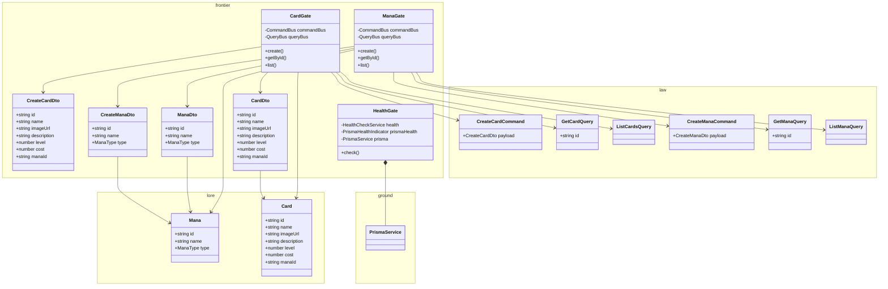
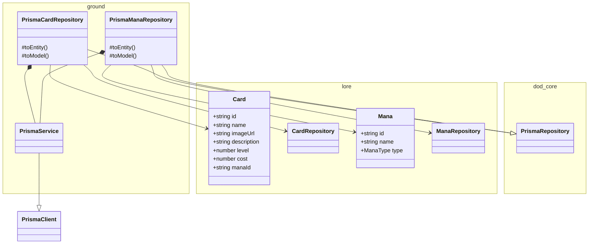
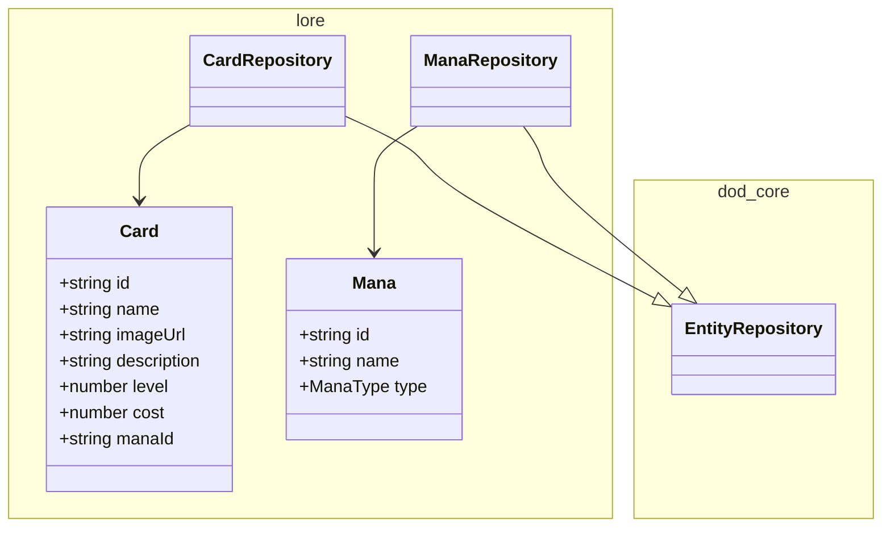
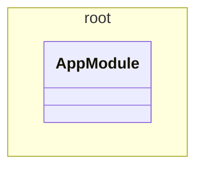

# Codex service

Game content management service

## Entities

| Entity      | Description                                                                                                                                               |
| ----------- | --------------------------------------------------------------------------------------------------------------------------------------------------------- |
| **Card**    | Spells and creatures. Each card belongs to one mana and may have multiple abilities.                                                                      |
| **Ability** | Actions a card can perform. Composed of one or more effects. Supports conditional triggers                                                                |
| **Effect**  | Atomic action within an ability (damage, heal, buff/debuff)                                                                                               |
| **Mage**    | Playable character specializing in a mana. Determines starting cards and unique perks                                                                     |
| **Mana**    | • **Core mana**: Fire, Water, Earth, Air (common for all mages)<br>• **Special mana**: Necromancy, Demonology, Chaos, etc (specific to a particular mage) |

## Bash commands

```bash
# Connect to the database
psql -h 127.0.0.1 -U ruler -d codex

# Generate a migration
npm run prisma:generate migration_name

# Apply migrations to dev DB
npm run prisma:migrate:dev
```

<!-- poe:classes:start -->
## Classes

### frontier



| Entity |
|--------|
| dto/body/[CreateCardDto](src/frontier/dto/body/create-card.dto.ts) |
| dto/body/[CreateManaDto](src/frontier/dto/body/create-mana.dto.ts) |
| dto/[CardDto](src/frontier/dto/card.dto.ts) |
| dto/[ManaDto](src/frontier/dto/mana.dto.ts) |
| gates/[CardGate](src/frontier/gates/card.gate.ts) |
| gates/[HealthGate](src/frontier/gates/health.gate.ts) |
| gates/[ManaGate](src/frontier/gates/mana.gate.ts) |

### ground



| Entity | Notes |
|--------|-------|
| [PrismaService](src/ground/prisma.service.ts) | Extends `PrismaClient` · Implements `OnModuleInit`, `OnModuleDestroy` |
| repositories/[PrismaCardRepository](src/ground/repositories/prisma-card.repository.ts) | Extends `PrismaRepository` |
| repositories/[PrismaManaRepository](src/ground/repositories/prisma-mana.repository.ts) | Extends `PrismaRepository` |

### law

```mermaid
classDiagram
  namespace law {
    class CreateCardCommand {
      +CreateCardDto payload
    }
    class CreateCardHandler {
      +execute()
    }
    class CreateManaCommand {
      +CreateManaDto payload
    }
    class CreateManaHandler {
      +execute()
    }
    class GetCardQuery {
      +string id
    }
    class GetCardHandler {
      +execute()
    }
    class GetManaQuery {
      +string id
    }
    class GetManaHandler {
      +execute()
    }
    class ListCardsQuery
    class ListCardsHandler {
      +execute()
    }
    class ListManaQuery
    class ListManaHandler {
      +execute()
    }
  }
  namespace frontier {
    class CreateCardDto {
      +string id
      +string name
      +string imageUrl
      +string description
      +number level
      +number cost
      +string manaId
    }
    class CardDto {
      +string id
      +string name
      +string imageUrl
      +string description
      +number level
      +number cost
      +string manaId
    }
    class CreateManaDto {
      +string id
      +string name
      +ManaType type
    }
    class ManaDto {
      +string id
      +string name
      +ManaType type
    }
  }
  namespace lore {
    class Card {
      +string id
      +string name
      +string imageUrl
      +string description
      +number level
      +number cost
      +string manaId
    }
    class CardRepository
    class Mana {
      +string id
      +string name
      +ManaType type
    }
    class ManaRepository
  }
  namespace nestjs_cqrs {
    class Command
    class Query
  }

  CreateCardCommand --|> Command
  CreateCardCommand *-- CreateCardDto
  CreateCardCommand --> CardDto
  CreateCardCommand --> Card
  CreateCardHandler *-- CardRepository
  CreateCardHandler --> CardDto
  CreateCardHandler --> CreateCardCommand
  CreateCardHandler --> Card
  CreateManaCommand --|> Command
  CreateManaCommand *-- CreateManaDto
  CreateManaCommand --> ManaDto
  CreateManaCommand --> Mana
  CreateManaHandler *-- ManaRepository
  CreateManaHandler --> ManaDto
  CreateManaHandler --> CreateManaCommand
  CreateManaHandler --> Mana
  GetCardQuery --|> Query
  GetCardQuery --> CardDto
  GetCardQuery --> Card
  GetCardHandler *-- CardRepository
  GetCardHandler --> CardDto
  GetCardHandler --> GetCardQuery
  GetCardHandler --> Card
  GetManaQuery --|> Query
  GetManaQuery --> ManaDto
  GetManaQuery --> Mana
  GetManaHandler *-- ManaRepository
  GetManaHandler --> ManaDto
  GetManaHandler --> GetManaQuery
  GetManaHandler --> Mana
  ListCardsQuery --|> Query
  ListCardsQuery --> CardDto
  ListCardsQuery --> Card
  ListCardsHandler *-- CardRepository
  ListCardsHandler --> CardDto
  ListCardsHandler --> ListCardsQuery
  ListCardsHandler --> Card
  ListManaQuery --|> Query
  ListManaQuery --> ManaDto
  ListManaQuery --> Mana
  ListManaHandler *-- ManaRepository
  ListManaHandler --> ManaDto
  ListManaHandler --> ListManaQuery
  ListManaHandler --> Mana
```



| Entity | Notes |
|--------|-------|
| commands/[CreateCardCommand](src/law/commands/create-card.command.ts) | Extends `Command` |
| commands/[CreateCardHandler](src/law/commands/create-card.command.ts) | Implements `ICommandHandler` |
| commands/[CreateManaCommand](src/law/commands/create-mana.command.ts) | Extends `Command` |
| commands/[CreateManaHandler](src/law/commands/create-mana.command.ts) | Implements `ICommandHandler` |
| queries/[GetCardQuery](src/law/queries/get-card.query.ts) | Extends `Query` |
| queries/[GetCardHandler](src/law/queries/get-card.query.ts) | Implements `IQueryHandler` |
| queries/[GetManaQuery](src/law/queries/get-mana.query.ts) | Extends `Query` |
| queries/[GetManaHandler](src/law/queries/get-mana.query.ts) | Implements `IQueryHandler` |
| queries/[ListCardsQuery](src/law/queries/list-cards.query.ts) | Extends `Query` |
| queries/[ListCardsHandler](src/law/queries/list-cards.query.ts) | Implements `IQueryHandler` |
| queries/[ListManaQuery](src/law/queries/list-mana.query.ts) | Extends `Query` |
| queries/[ListManaHandler](src/law/queries/list-mana.query.ts) | Implements `IQueryHandler` |

### lore



| Entity | Description | Notes |
|--------|-------------|-------|
| entities/[Card](src/lore/entities/card.entity.ts) | Spells and creatures. Each card belongs to one mana and may have multiple abilities |  |
| entities/[Mana](src/lore/entities/mana.entity.ts) | • Core mana: Fire, Water, Earth, Air (common for all mages)<br>• Special mana: Necromancy, Demonology, Chaos, etc (specific to a particular mage) |  |
| repositories/[CardRepository](src/lore/repositories/card.repository.ts) |  | Abstract · Extends `EntityRepository` |
| repositories/[ManaRepository](src/lore/repositories/mana.repository.ts) |  | Abstract · Extends `EntityRepository` |

### root



| Entity |
|--------|
| [AppModule](src/app.module.ts) |
<!-- poe:classes:end -->
