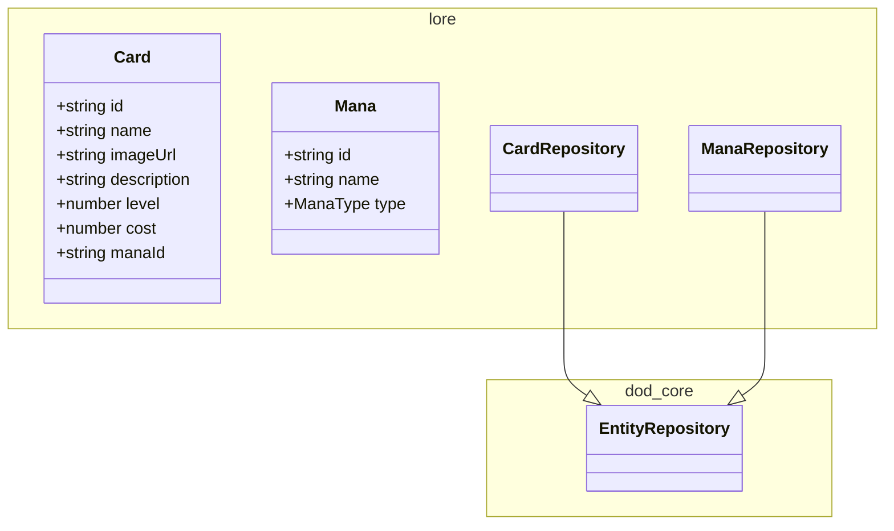
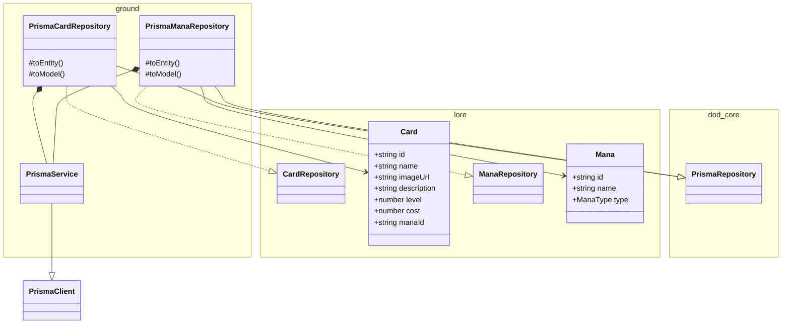

# Codex service

Game content management service

## Entities

| Entity      | Description                                                                                                                                               |
| ----------- | --------------------------------------------------------------------------------------------------------------------------------------------------------- |
| **Card**    | Spells and creatures. Each card belongs to one mana and may have multiple abilities.                                                                      |
| **Ability** | Actions a card can perform. Composed of one or more effects. Supports conditional triggers                                                                |
| **Effect**  | Atomic action within an ability (damage, heal, buff/debuff)                                                                                               |
| **Mage**    | Playable character specializing in a mana. Determines starting cards and unique perks                                                                     |
| **Mana**    | • **Core mana**: Fire, Water, Earth, Air (common for all mages)<br>• **Special mana**: Necromancy, Demonology, Chaos, etc (specific to a particular mage) |

## Bash commands

```bash
# Connect to the database
psql -h 127.0.0.1 -U ruler -d codex

# Generate a migration
npm run prisma:generate migration_name

# Apply migrations to dev DB
npm run prisma:migrate:dev
```

<!-- poe:classes:start -->
## Classes

### Frontier

#### [Card](src/frontier/gates/card.gate.ts)

| Endpoint | Description |
|----------|-------------|
| POST /v1/card | Params: `(dto: CreateCardDto)`<br>Returns: `CardDto` |
| GET /v1/card/:id | Params: `(id: string)`<br>Returns: `CardDto` |
| GET /v1/card | Returns: `CardDto[]` |

#### [Health](src/frontier/gates/health.gate.ts)

| Endpoint | Description |
|----------|-------------|
| GET /v1/health | Returns: `HealthCheckResult` |

#### [Mana](src/frontier/gates/mana.gate.ts)

| Endpoint | Description |
|----------|-------------|
| POST /v1/mana | Params: `(dto: CreateManaDto)`<br>Returns: `ManaDto` |
| GET /v1/mana/:id | Params: `(id: string)`<br>Returns: `ManaDto` |
| GET /v1/mana | Returns: `ManaDto[]` |

### Law

#### Card

| Use case | Description |
|----------|-------------|
| [CreateCardCommand](src/law/commands/create-card.command.ts) | Params: `(payload: CreateCardDto)`<br>Returns: `CardDto` |
| [GetCardQuery](src/law/queries/get-card.query.ts) | Params: `(id: string)`<br>Returns: `CardDto` |
| [ListCardsQuery](src/law/queries/list-cards.query.ts) | Returns: `CardDto[]` |

#### Mana

| Use case | Description |
|----------|-------------|
| [CreateManaCommand](src/law/commands/create-mana.command.ts) | Params: `(payload: CreateManaDto)`<br>Returns: `ManaDto` |
| [GetManaQuery](src/law/queries/get-mana.query.ts) | Params: `(id: string)`<br>Returns: `ManaDto` |
| [ListManaQuery](src/law/queries/list-mana.query.ts) | Returns: `ManaDto[]` |

### Lore



| Entity | Description |
|--------|-------------|
| entities/[Card](src/lore/entities/card.entity.ts) | Spells and creatures. Each card belongs to one mana and may have multiple abilities |
| entities/[Mana](src/lore/entities/mana.entity.ts) | • Core mana: Fire, Water, Earth, Air (common for all mages)<br>• Special mana: Necromancy, Demonology, Chaos, etc (specific to a particular mage) |
| repositories/[CardRepository](src/lore/repositories/card.repository.ts) | Abstract · Extends `EntityRepository` |
| repositories/[ManaRepository](src/lore/repositories/mana.repository.ts) | Abstract · Extends `EntityRepository` |

### Ground



| Entity | Description |
|--------|-------------|
| [PrismaService](src/ground/prisma.service.ts) | Extends `PrismaClient` · Implements `OnModuleInit`, `OnModuleDestroy` |
| repositories/[PrismaCardRepository](src/ground/repositories/prisma-card.repository.ts) | Extends `PrismaRepository` · Implements [CardRepository](src/lore/repositories/card.repository.ts) |
| repositories/[PrismaManaRepository](src/ground/repositories/prisma-mana.repository.ts) | Extends `PrismaRepository` · Implements [ManaRepository](src/lore/repositories/mana.repository.ts) |
<!-- poe:classes:end -->
