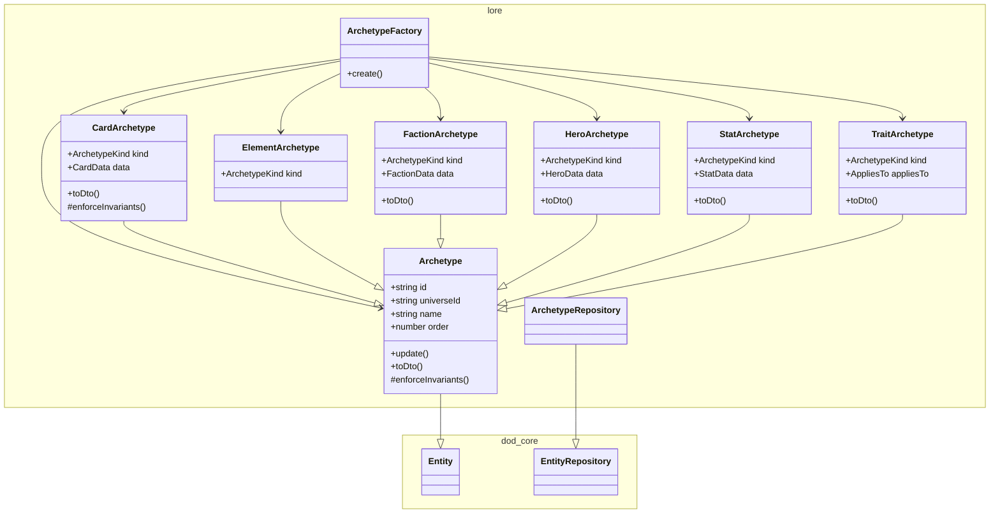
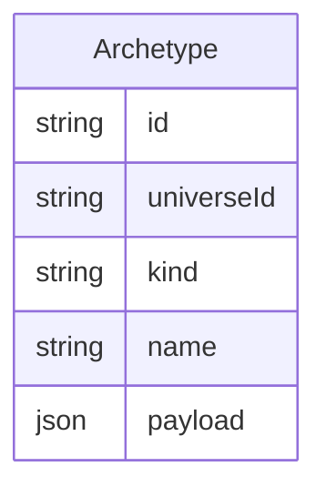

# Codex service

<!-- poe:header:start -->
**On this page**

- [Entities](#entities)
- [Bash commands](#bash-commands)
- [Frontier](#frontier)
- [Law](#law)
- [Lore](#lore)
- [Ground](#ground)
<!-- poe:header:end -->

Game content management service

## Entities

| Entity      | Description                                                                                                                                               |
| ----------- | --------------------------------------------------------------------------------------------------------------------------------------------------------- |
| **Card**    | Spells and creatures. Each card belongs to one mana and may have multiple abilities.                                                                      |
| **Ability** | Actions a card can perform. Composed of one or more effects. Supports conditional triggers                                                                |
| **Effect**  | Atomic action within an ability (damage, heal, buff/debuff)                                                                                               |
| **Mage**    | Playable character specializing in a mana. Determines starting cards and unique perks                                                                     |
| **Mana**    | • **Core mana**: Fire, Water, Earth, Air (common for all mages)<br>• **Special mana**: Necromancy, Demonology, Chaos, etc (specific to a particular mage) |

## Bash commands

```bash
# Connect to the database
psql -h 127.0.0.1 -U ruler -d codex

# Generate a migration
pnpm run prisma:generate migration_name

# Apply migrations to dev DB
pnpm run prisma:migrate:dev
```

<!-- poe:classes:start -->
## Frontier

### [Card](src/frontier/gates/card.gate.ts)

| Endpoint | Description |
|----------|-------------|
| POST /v1/card | Param `dto`: [`CreateCardDto`](../../packages/api-contract/src/contracts/codex.ts#L400)<br>Returns: [`CardDto`](../../packages/api-contract/src/contracts/codex.ts#L397) |
| PATCH /v1/card/:id | Param `id`: `string`<br>Param `dto`: [`UpdateCardDto`](../../packages/api-contract/src/contracts/codex.ts#L421)<br>Returns: [`CardDto`](../../packages/api-contract/src/contracts/codex.ts#L397) |
| GET /v1/card/:id | Param `id`: `string`<br>Returns: [`CardDto`](../../packages/api-contract/src/contracts/codex.ts#L397) |
| GET /v1/card | Param `universeId`: `string`<br>Returns: [`CardDto`](../../packages/api-contract/src/contracts/codex.ts#L397)[] |

### [Element](src/frontier/gates/element.gate.ts)

| Endpoint | Description |
|----------|-------------|
| POST /v1/element | Param `dto`: [`CreateElementDto`](../../packages/api-contract/src/contracts/codex.ts#L322)<br>Returns: [`ElementDto`](../../packages/api-contract/src/contracts/codex.ts#L319) |
| PATCH /v1/element/:id | Param `id`: `string`<br>Param `dto`: [`UpdateElementDto`](../../packages/api-contract/src/contracts/codex.ts#L325)<br>Returns: [`ElementDto`](../../packages/api-contract/src/contracts/codex.ts#L319) |
| GET /v1/element/:id | Param `id`: `string`<br>Returns: [`ElementDto`](../../packages/api-contract/src/contracts/codex.ts#L319) |
| GET /v1/element | Param `universeId`: `string`<br>Returns: [`ElementDto`](../../packages/api-contract/src/contracts/codex.ts#L319)[] |

### [Faction](src/frontier/gates/faction.gate.ts)

| Endpoint | Description |
|----------|-------------|
| POST /v1/faction | Param `dto`: [`CreateFactionDto`](../../packages/api-contract/src/contracts/codex.ts#L333)<br>Returns: [`FactionDto`](../../packages/api-contract/src/contracts/codex.ts#L330) |
| PATCH /v1/faction/:id | Param `id`: `string`<br>Param `dto`: [`UpdateFactionDto`](../../packages/api-contract/src/contracts/codex.ts#L338)<br>Returns: [`FactionDto`](../../packages/api-contract/src/contracts/codex.ts#L330) |
| GET /v1/faction/:id | Param `id`: `string`<br>Returns: [`FactionDto`](../../packages/api-contract/src/contracts/codex.ts#L330) |
| GET /v1/faction | Param `universeId`: `string`<br>Returns: [`FactionDto`](../../packages/api-contract/src/contracts/codex.ts#L330)[] |

### [Health](src/frontier/gates/health.gate.ts)

| Endpoint | Description |
|----------|-------------|
| GET /v1/health | Returns: `HealthCheckResult` |

### [Hero](src/frontier/gates/hero.gate.ts)

| Endpoint | Description |
|----------|-------------|
| POST /v1/hero | Param `dto`: [`CreateHeroDto`](../../packages/api-contract/src/contracts/codex.ts#L433)<br>Returns: [`HeroDto`](../../packages/api-contract/src/contracts/codex.ts#L430) |
| PATCH /v1/hero/:id | Param `id`: `string`<br>Param `dto`: [`UpdateHeroDto`](../../packages/api-contract/src/contracts/codex.ts#L442)<br>Returns: [`HeroDto`](../../packages/api-contract/src/contracts/codex.ts#L430) |
| GET /v1/hero/:id | Param `id`: `string`<br>Returns: [`HeroDto`](../../packages/api-contract/src/contracts/codex.ts#L430) |
| GET /v1/hero | Param `universeId`: `string`<br>Returns: [`HeroDto`](../../packages/api-contract/src/contracts/codex.ts#L430)[] |

### [Stat](src/frontier/gates/stat.gate.ts)

| Endpoint | Description |
|----------|-------------|
| POST /v1/stat | Param `dto`: [`CreateStatDto`](../../packages/api-contract/src/contracts/codex.ts#L347)<br>Returns: [`StatDto`](../../packages/api-contract/src/contracts/codex.ts#L344) |
| PATCH /v1/stat/:id | Param `id`: `string`<br>Param `dto`: [`UpdateStatDto`](../../packages/api-contract/src/contracts/codex.ts#L353)<br>Returns: [`StatDto`](../../packages/api-contract/src/contracts/codex.ts#L344) |
| GET /v1/stat/:id | Param `id`: `string`<br>Returns: [`StatDto`](../../packages/api-contract/src/contracts/codex.ts#L344) |
| GET /v1/stat | Param `universeId`: `string`<br>Returns: [`StatDto`](../../packages/api-contract/src/contracts/codex.ts#L344)[] |

### [Trait](src/frontier/gates/trait.gate.ts)

| Endpoint | Description |
|----------|-------------|
| POST /v1/trait | Param `dto`: [`CreateTraitDto`](../../packages/api-contract/src/contracts/codex.ts#L361)<br>Returns: [`TraitDto`](../../packages/api-contract/src/contracts/codex.ts#L358) |
| PATCH /v1/trait/:id | Param `id`: `string`<br>Param `dto`: [`UpdateTraitDto`](../../packages/api-contract/src/contracts/codex.ts#L366)<br>Returns: [`TraitDto`](../../packages/api-contract/src/contracts/codex.ts#L358) |
| GET /v1/trait/:id | Param `id`: `string`<br>Returns: [`TraitDto`](../../packages/api-contract/src/contracts/codex.ts#L358) |
| GET /v1/trait | Param `universeId`: `string`<br>Returns: [`TraitDto`](../../packages/api-contract/src/contracts/codex.ts#L358)[] |

## Law

### Entry points

- [CreateArchetypeCommand](src/law/commands/create-archetype.command.ts#L9)
- [UpdateArchetypeCommand](src/law/commands/update-archetype.command.ts#L8)
- [GetArchetypeQuery](src/law/queries/get-archetype.query.ts#L6)
- [ListArchetypesQuery](src/law/queries/list-archetypes.query.ts#L6)

## Lore


```mermaid
classDiagram
  namespace lore {
    class ArchetypeFactory {
      +create()
    }
    class Archetype {
      +string id
      +string universeId
      +string name
      +number order
      +update()
      +toDto()
      #enforceInvariants()
    }
    class CardArchetype {
      +ArchetypeKind kind
      +CardData data
      +toDto()
      #enforceInvariants()
    }
    class ElementArchetype {
      +ArchetypeKind kind
    }
    class FactionArchetype {
      +ArchetypeKind kind
      +FactionData data
      +toDto()
    }
    class HeroArchetype {
      +ArchetypeKind kind
      +HeroData data
      +toDto()
    }
    class StatArchetype {
      +ArchetypeKind kind
      +StatData data
      +toDto()
    }
    class TraitArchetype {
      +ArchetypeKind kind
      +AppliesTo appliesTo
      +toDto()
    }
    class ArchetypeRepository
  }
  namespace dod_core {
    class Entity
    class EntityRepository
  }

  ArchetypeFactory --> Archetype
  ArchetypeFactory --> CardArchetype
  ArchetypeFactory --> ElementArchetype
  ArchetypeFactory --> FactionArchetype
  ArchetypeFactory --> HeroArchetype
  ArchetypeFactory --> StatArchetype
  ArchetypeFactory --> TraitArchetype
  Archetype --|> Entity
  CardArchetype --|> Archetype
  ElementArchetype --|> Archetype
  FactionArchetype --|> Archetype
  HeroArchetype --|> Archetype
  StatArchetype --|> Archetype
  TraitArchetype --|> Archetype
  ArchetypeRepository --|> EntityRepository
```

| Entity | Description |
|--------|-------------|
| [ArchetypeFactory](src/lore/archetype-factory.ts#L20) | Constructs Archetype subclass instances from raw payloads, dispatching by<br>ArchetypeKind. |
| entities/[Archetype](src/lore/entities/archetype.entity.ts#L19) | Base class for codex content prototypes — designer-authored, universe-scoped<br>definitions of the things that exist in a game. Subclasses split into<br>content (Hero, Card) and dictionaries (Element, Faction, Stat, Trait) that<br>content references.<br><br>Abstract · Extends `Entity` |
| entities/[CardArchetype](src/lore/entities/card-archetype.entity.ts#L6) | The primary playable object's prototype. Cards live in decks, are played by<br>spending their Cost, and either resolve immediately as spells or summon a<br>persistent minion onto the battlefield. Summon-style cards carry the<br>minion's stats and traits inline.<br><br>Extends [Archetype](src/lore/entities/archetype.entity.ts#L19) |
| entities/[ElementArchetype](src/lore/entities/element-archetype.entity.ts#L2) | A fundamental kind of currency, affinity, or school in a Universe (e.g.<br>fire, credits, tide). Used as Cost on Cards, as the starting pool on Heroes,<br>and as a mechanical axis for abilities.<br><br>Extends [Archetype](src/lore/entities/archetype.entity.ts#L19) |
| entities/[FactionArchetype](src/lore/entities/faction-archetype.entity.ts#L6) | A grouping of Heroes and Cards inside a Universe. Expresses identity and<br>mechanical synergy; entities may belong to zero, one, or many. Optionally<br>binds to a set of Elements that restrict cost choices for cards in the<br>Faction.<br><br>Extends [Archetype](src/lore/entities/archetype.entity.ts#L19) |
| entities/[HeroArchetype](src/lore/entities/hero-archetype.entity.ts#L6) | A playable character prototype. Defines identity, an Element pool, optional<br>Stats/Traits/Abilities, and an optional Faction — the player's state at<br>match start.<br><br>Extends [Archetype](src/lore/entities/archetype.entity.ts#L19) |
| entities/[StatArchetype](src/lore/entities/stat-archetype.entity.ts#L6) | A numeric attribute slug a Universe permits on its entities (e.g. attack,<br>health, armor). Declares which entity types it may attach to via<br>`appliesTo`; runtime semantics belong to the engine, not the dictionary.<br>`required` flags whether entity editors render an inline input by default.<br><br>Extends [Archetype](src/lore/entities/archetype.entity.ts#L19) |
| entities/[TraitArchetype](src/lore/entities/trait-archetype.entity.ts#L5) | A named tag slug a Universe permits on its entities (e.g. wall, charge,<br>spell). Drives keyword abilities, targeting filters, and damage-source<br>classification; declares which entity types it may attach to via<br>`appliesTo`.<br><br>Extends [Archetype](src/lore/entities/archetype.entity.ts#L19) |
| repositories/[ArchetypeRepository](src/lore/repositories/archetype.repository.ts#L4) | Repository for codex archetypes. Scoped per Universe; entries are keyed by<br>(universeId, id).<br><br>Abstract · Extends `EntityRepository` |

## Ground


```mermaid
erDiagram
  Archetype {
    string id
    string universeId
    string kind
    string name
    json payload
  }
```
<!-- poe:classes:end -->

<!-- poe:footer:start -->
> This document was inspected and assembled by Inspector Poe.
<!-- poe:footer:end -->
