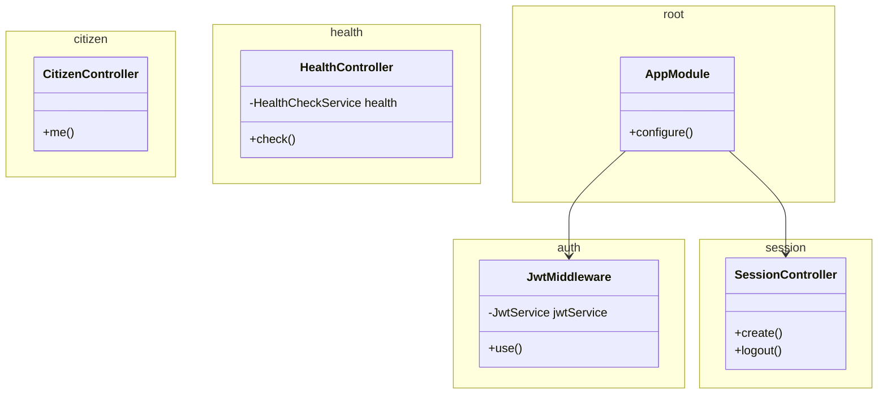

# Gateway service

A classical gateway proxy that sits between clients and services.

<!-- poe:classes:start -->
## Classes

| Entity | Notes |
|--------|-------|
| auth/[JwtMiddleware](src/auth/jwt.middleware.ts) | Implements `NestMiddleware` |
| citizen/[CitizenController](src/citizen/citizen.controller.ts) |  |
| health/[HealthController](src/health/health.controller.ts) |  |
| session/[SessionController](src/session/session.controller.ts) |  |
| [AppModule](src/app.module.ts) | Implements `NestModule` |
<!-- poe:classes:end -->
