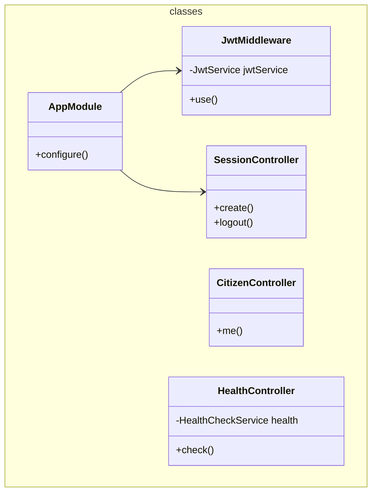

# Gateway service

<!-- poe:header:start -->
API gateway — routes requests to downstream realms
<!-- poe:header:end -->

A classical gateway proxy that sits between clients and services.

<!-- poe:classes:start -->
## Classes

```mermaid
classDiagram
  namespace classes {
    class AppModule {
      +configure()
    }
    class JwtMiddleware {
      -JwtService jwtService
      +use()
    }
    class CitizenController {
      +me()
    }
    class HealthController {
      -HealthCheckService health
      +check()
    }
    class SessionController {
      +create()
      +logout()
    }
  }

  AppModule --> JwtMiddleware
  AppModule --> SessionController
```

| Entity | Description |
|--------|-------------|
| [AppModule](src/app.module.ts#L47) | Implements `NestModule` |
| auth/[JwtMiddleware](src/auth/jwt.middleware.ts#L8) | Implements `NestMiddleware` |
| citizen/[CitizenController](src/citizen/citizen.controller.ts#L5) |  |
| health/[HealthController](src/health/health.controller.ts#L11) |  |
| session/[SessionController](src/session/session.controller.ts#L20) |  |
<!-- poe:classes:end -->

<!-- poe:footer:start -->
> This document was inspected and assembled by Inspector Poe.
<!-- poe:footer:end -->
