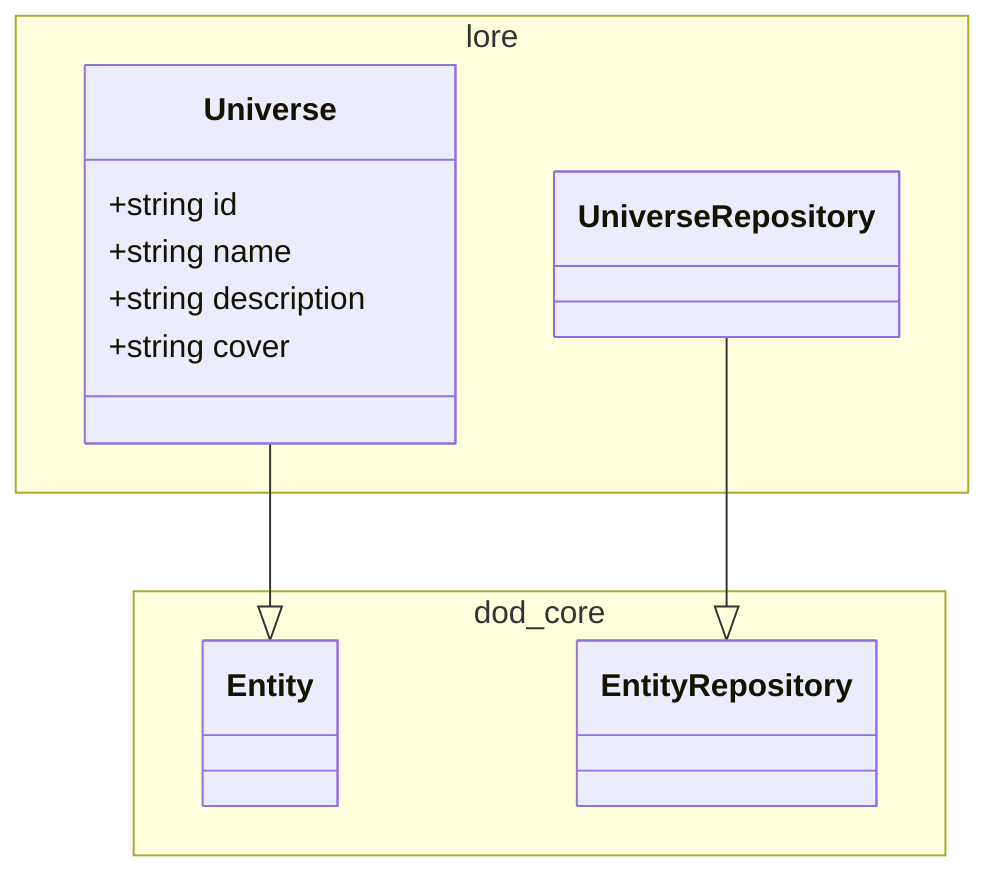
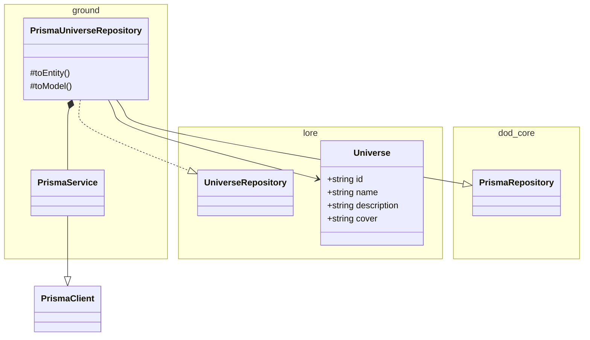

# universe

<!-- poe:classes:start -->
## Classes

### Frontier

| Entity |
|--------|
| gates/[HealthGate](src/frontier/gates/health.gate.ts) |
| gates/[UniverseGate](src/frontier/gates/universe.gate.ts) |

### Law

| Use case | Description |
|----------|-------------|
| [CreateUniverseCommand](src/law/commands/create-universe.command.ts) | Params: `(payload: CreateUniverseDto)` Returns: `UniverseDto`  Creates a new universe. Fails when the name is already taken |
| [UpdateUniverseCommand](src/law/commands/update-universe.command.ts) | Params: `(id: string, payload: UpdateUniverseDto)` Returns: `UniverseDto`  Updates an existing universe. Only fields present in the payload are changed. Fails if the new name collides with another universe |
| [GetUniverseQuery](src/law/queries/get-universe.query.ts) | Params: `(id: string)` Returns: `UniverseDto`  Fetches a single universe by id. Fails when the id is unknown |
| [ListUniversesQuery](src/law/queries/list-universes.query.ts) | Returns: `UniverseDto[]`  Lists every universe currently registered in the realm |

### Lore

| Entity | Description |
|--------|-------------|
| entities/[Universe](src/lore/entities/universe.entity.ts) | Extends `Entity` |
| repositories/[UniverseRepository](src/lore/repositories/universe.repository.ts) | Abstract · Extends `EntityRepository` |

### Ground

| Entity | Description |
|--------|-------------|
| [PrismaService](src/ground/prisma.service.ts) | Extends `PrismaClient` · Implements `OnModuleInit`, `OnModuleDestroy` |
| repositories/[PrismaUniverseRepository](src/ground/repositories/prisma-universe.repository.ts) | Extends `PrismaRepository` · Implements [UniverseRepository](src/lore/repositories/universe.repository.ts) |
<!-- poe:classes:end -->
