# universe

<!-- poe:classes:start -->
## Classes

```mermaid
classDiagram
  namespace frontier {
    class CreateUniverseDto {
      +string id
      +string name
      +string description
      +string cover
    }
    class UpdateUniverseDto {
      +string name
      +string description
      +string cover
    }
    class UniverseDto {
      +string id
      +string name
      +string description
      +string cover
    }
    class UniverseGate {
      -CommandBus commandBus
      -QueryBus queryBus
      +create()
      +update()
      +getById()
      +list()
    }
  }
  namespace ground {
    class PrismaService
    class PrismaUniverseRepository {
      #toEntity()
      #toModel()
    }
  }
  namespace law {
    class CreateUniverseCommand {
      +CreateUniverseDto payload
    }
    class CreateUniverseHandler {
      +execute()
      -assertNameAvailable()
    }
    class UpdateUniverseCommand {
      +string id
      +UpdateUniverseDto payload
    }
    class UpdateUniverseHandler {
      +execute()
      -assertNameAvailable()
    }
    class GetUniverseQuery {
      +string id
    }
    class GetUniverseHandler {
      +execute()
    }
    class ListUniversesQuery
    class ListUniversesHandler {
      +execute()
    }
  }
  namespace lore {
    class Universe {
      +string id
      +string name
      +string description
      +string cover
    }
    class UniverseRepository
  }
  namespace root {
    class AppModule
  }
  namespace dod_core {
    class PrismaRepository
    class Entity
    class EntityRepository
  }
  namespace nestjs_cqrs {
    class Command
    class Query
  }

  UniverseDto --> Universe
  UniverseGate --> CreateUniverseDto
  UniverseGate --> UpdateUniverseDto
  UniverseGate --> UniverseDto
  UniverseGate --> CreateUniverseCommand
  UniverseGate --> UpdateUniverseCommand
  UniverseGate --> GetUniverseQuery
  UniverseGate --> ListUniversesQuery
  UniverseGate --> Universe
  PrismaService --|> PrismaClient
  PrismaUniverseRepository --|> PrismaRepository
  PrismaUniverseRepository *-- PrismaService
  PrismaUniverseRepository --> Universe
  PrismaUniverseRepository --> UniverseRepository
  CreateUniverseCommand --|> Command
  CreateUniverseCommand *-- CreateUniverseDto
  CreateUniverseCommand --> UniverseDto
  CreateUniverseCommand --> Universe
  CreateUniverseHandler *-- UniverseRepository
  CreateUniverseHandler --> UniverseDto
  CreateUniverseHandler --> CreateUniverseCommand
  CreateUniverseHandler --> Universe
  UpdateUniverseCommand --|> Command
  UpdateUniverseCommand *-- UpdateUniverseDto
  UpdateUniverseCommand --> UniverseDto
  UpdateUniverseCommand --> Universe
  UpdateUniverseHandler *-- UniverseRepository
  UpdateUniverseHandler --> UniverseDto
  UpdateUniverseHandler --> UpdateUniverseCommand
  UpdateUniverseHandler --> Universe
  GetUniverseQuery --|> Query
  GetUniverseQuery --> UniverseDto
  GetUniverseQuery --> Universe
  GetUniverseHandler *-- UniverseRepository
  GetUniverseHandler --> UniverseDto
  GetUniverseHandler --> GetUniverseQuery
  GetUniverseHandler --> Universe
  ListUniversesQuery --|> Query
  ListUniversesQuery --> UniverseDto
  ListUniversesQuery --> Universe
  ListUniversesHandler *-- UniverseRepository
  ListUniversesHandler --> UniverseDto
  ListUniversesHandler --> ListUniversesQuery
  ListUniversesHandler --> Universe
  Universe --|> Entity
  UniverseRepository --|> EntityRepository
  UniverseRepository --> Universe
```

| Entity | Notes |
|--------|-------|
| frontier/dto/body/[CreateUniverseDto](src/frontier/dto/body/create-universe.dto.ts) |  |
| frontier/dto/body/[UpdateUniverseDto](src/frontier/dto/body/update-universe.dto.ts) |  |
| frontier/dto/[UniverseDto](src/frontier/dto/universe.dto.ts) |  |
| frontier/gates/[UniverseGate](src/frontier/gates/universe.gate.ts) |  |
| ground/[PrismaService](src/ground/prisma.service.ts) | Extends `PrismaClient` · Implements `OnModuleInit`, `OnModuleDestroy` |
| ground/repositories/[PrismaUniverseRepository](src/ground/repositories/prisma-universe.repository.ts) | Extends `PrismaRepository` |
| law/commands/[CreateUniverseCommand](src/law/commands/create-universe.command.ts) | Extends `Command` |
| law/commands/[CreateUniverseHandler](src/law/commands/create-universe.command.ts) | Implements `ICommandHandler` |
| law/commands/[UpdateUniverseCommand](src/law/commands/update-universe.command.ts) | Extends `Command` |
| law/commands/[UpdateUniverseHandler](src/law/commands/update-universe.command.ts) | Implements `ICommandHandler` |
| law/queries/[GetUniverseQuery](src/law/queries/get-universe.query.ts) | Extends `Query` |
| law/queries/[GetUniverseHandler](src/law/queries/get-universe.query.ts) | Implements `IQueryHandler` |
| law/queries/[ListUniversesQuery](src/law/queries/list-universes.query.ts) | Extends `Query` |
| law/queries/[ListUniversesHandler](src/law/queries/list-universes.query.ts) | Implements `IQueryHandler` |
| lore/entities/[Universe](src/lore/entities/universe.entity.ts) | Extends `Entity` |
| lore/repositories/[UniverseRepository](src/lore/repositories/universe.repository.ts) | Abstract · Extends `EntityRepository` |
| [AppModule](src/app.module.ts) |  |
<!-- poe:classes:end -->
