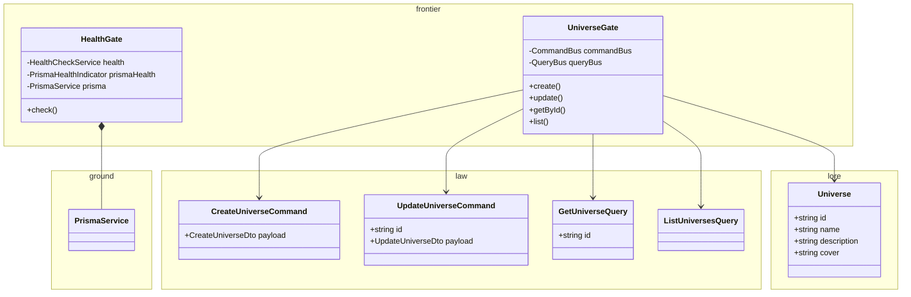
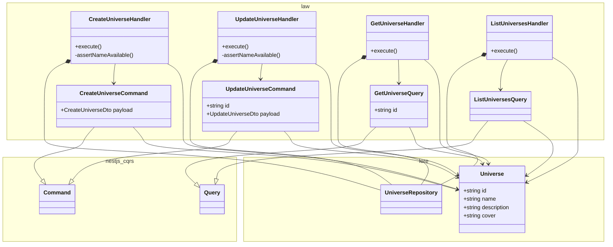
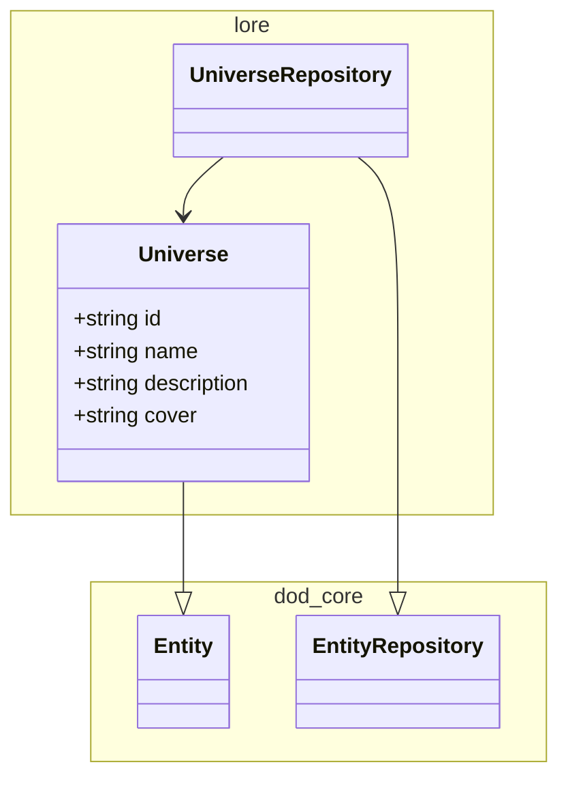
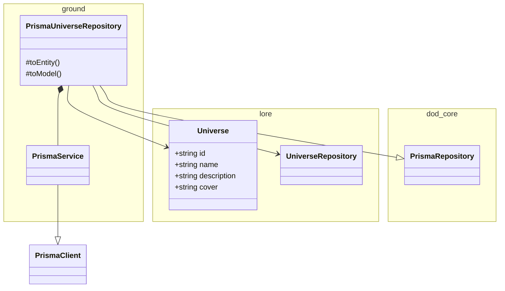

# universe

<!-- poe:classes:start -->
## Classes

### Frontier

| Entity |
|--------|
| gates/[HealthGate](src/frontier/gates/health.gate.ts) |
| gates/[UniverseGate](src/frontier/gates/universe.gate.ts) |

### Law

| Entity | Description |
|--------|-------------|
| commands/[CreateUniverseCommand](src/law/commands/create-universe.command.ts) | Extends `Command` |
| commands/[CreateUniverseHandler](src/law/commands/create-universe.command.ts) | Implements `ICommandHandler` |
| commands/[UpdateUniverseCommand](src/law/commands/update-universe.command.ts) | Extends `Command` |
| commands/[UpdateUniverseHandler](src/law/commands/update-universe.command.ts) | Implements `ICommandHandler` |
| queries/[GetUniverseQuery](src/law/queries/get-universe.query.ts) | Extends `Query` |
| queries/[GetUniverseHandler](src/law/queries/get-universe.query.ts) | Implements `IQueryHandler` |
| queries/[ListUniversesQuery](src/law/queries/list-universes.query.ts) | Extends `Query` |
| queries/[ListUniversesHandler](src/law/queries/list-universes.query.ts) | Implements `IQueryHandler` |

### Lore

| Entity | Description |
|--------|-------------|
| entities/[Universe](src/lore/entities/universe.entity.ts) | Extends `Entity` |
| repositories/[UniverseRepository](src/lore/repositories/universe.repository.ts) | Abstract · Extends `EntityRepository` |

### Ground

| Entity | Description |
|--------|-------------|
| [PrismaService](src/ground/prisma.service.ts) | Extends `PrismaClient` · Implements `OnModuleInit`, `OnModuleDestroy` |
| repositories/[PrismaUniverseRepository](src/ground/repositories/prisma-universe.repository.ts) | Extends `PrismaRepository` |
<!-- poe:classes:end -->
