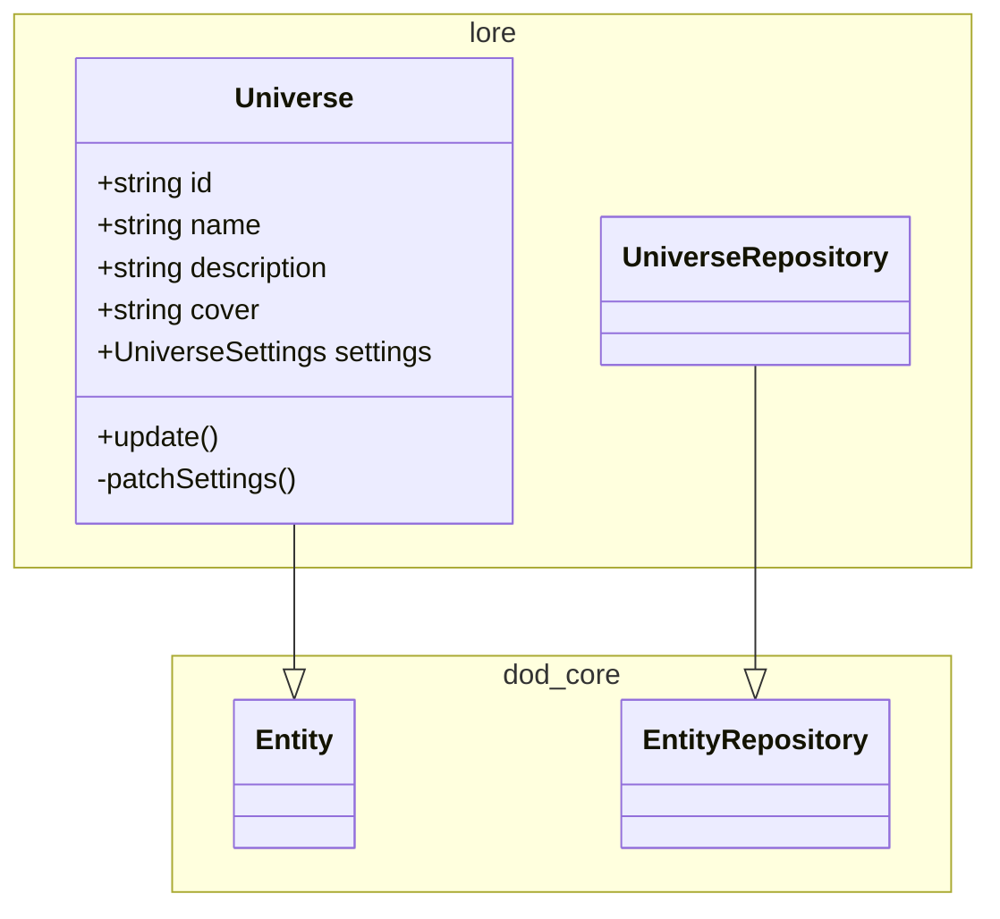
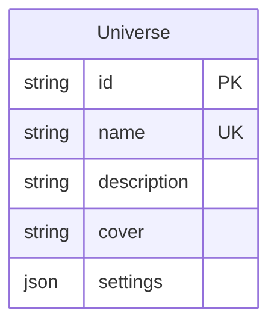

# universe

<!-- poe:header:start -->
**On this page**

- [Frontier](#frontier)
- [Law](#law)
- [Lore](#lore)
- [Ground](#ground)
<!-- poe:header:end -->

<!-- poe:classes:start -->
## Frontier

### [Health](src/frontier/gates/health.gate.ts)

| Endpoint | Description |
|----------|-------------|
| GET /v1/health | Returns: `HealthCheckResult` |

### [Universe](src/frontier/gates/universe.gate.ts)

| Endpoint | Description |
|----------|-------------|
| POST /v1/universe | Param `dto`: [`CreateUniverseDto`](../../packages/api-contract/src/contracts/universe.ts#L38) Returns: [`UniverseDto`](../../packages/api-contract/src/contracts/universe.ts#L29) |
| PATCH /v1/universe/:id | Param `id`: `string` Param `dto`: [`UpdateUniverseDto`](../../packages/api-contract/src/contracts/universe.ts#L46) Returns: [`UniverseDto`](../../packages/api-contract/src/contracts/universe.ts#L29) |
| GET /v1/universe/:id | Param `id`: `string` Returns: [`UniverseDto`](../../packages/api-contract/src/contracts/universe.ts#L29) |
| GET /v1/universe | Returns: [`UniverseSummaryDto`](../../packages/api-contract/src/contracts/universe.ts#L24)[] |

## Law

### Universe

| Use case | Description |
|----------|-------------|
| [CreateUniverseCommand](src/law/commands/create-universe.command.ts#L13) | Param `payload`: [`CreateUniverseDto`](../../packages/api-contract/src/contracts/universe.ts#L38) Returns: [`UniverseDto`](../../packages/api-contract/src/contracts/universe.ts#L29)  Creates a new universe. Fails when the name is already taken |
| [UpdateUniverseCommand](src/law/commands/update-universe.command.ts#L12) | Param `id`: `string` Param `payload`: [`UpdateUniverseDto`](../../packages/api-contract/src/contracts/universe.ts#L46) Returns: [`UniverseDto`](../../packages/api-contract/src/contracts/universe.ts#L29)  Updates an existing universe. Only fields present in the payload are changed. Fails if the new name collides with another universe |
| [GetUniverseQuery](src/law/queries/get-universe.query.ts#L7) | Param `id`: `string` Returns: [`UniverseDto`](../../packages/api-contract/src/contracts/universe.ts#L29)  Fetches a single universe by id. Fails when the id is unknown |

### UniverseSummary

| Use case | Description |
|----------|-------------|
| [ListUniversesQuery](src/law/queries/list-universes.query.ts#L7) | Returns: [`UniverseSummaryDto`](../../packages/api-contract/src/contracts/universe.ts#L24)[]  Lists every universe currently registered in the realm. Returns the summary projection (no settings) to keep the list view light |

## Lore

```mermaid
classDiagram
  namespace lore {
    class Universe {
      +string id
      +string name
      +string description
      +string cover
      +UniverseSettings settings
      +update()
      -patchSettings()
    }
    class UniverseRepository
  }
  namespace dod_core {
    class Entity
    class EntityRepository
  }

  Universe --|> Entity
  UniverseRepository --|> EntityRepository
```

| Entity | Description |
|--------|-------------|
| entities/[Universe](src/lore/entities/universe.entity.ts#L14) | Extends `Entity` |
| repositories/[UniverseRepository](src/lore/repositories/universe.repository.ts#L4) | Abstract · Extends `EntityRepository` |

## Ground

```mermaid
erDiagram
  Universe {
    string id PK
    string name UK
    string description
    string cover
    json settings
  }
```
<!-- poe:classes:end -->

<!-- poe:footer:start -->
> This document was inspected and assembled by Inspector Poe.
<!-- poe:footer:end -->
