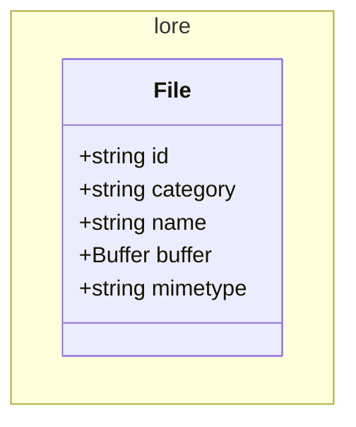

# Vault service

Manages files: upload, storage, etc

<!-- poe:classes:start -->
## Classes

### Frontier

#### [File](src/frontier/gates/file.gate.ts)

| Endpoint | Description |
|----------|-------------|
| POST /v1/file | Params: `(body: UploadFileDto, uploadedFile: Express.Multer.File)` Returns: `FileDto` |

#### [Health](src/frontier/gates/health.gate.ts)

| Endpoint | Description |
|----------|-------------|
| GET /v1/health | Returns: `HealthCheckResult` |

### Law

#### File

| Use case | Description |
|----------|-------------|
| [TransformFileCommand](src/law/commands/transform-file.command.ts) | Params: `(file: File, transform: FileTransform)` Returns: `File` |
| [UploadFileCommand](src/law/commands/upload-file.command.ts) | Params: `(file: File, transform: FileTransform)` Returns: `FileDto` |

### Lore

| Entity |
|--------|
| [File](src/lore/file.entity.ts) |
<!-- poe:classes:end -->
