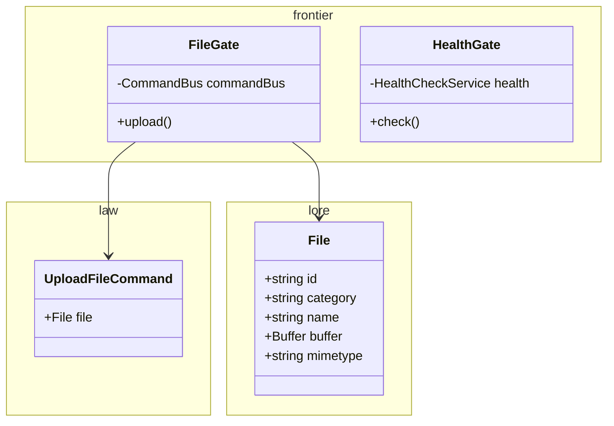
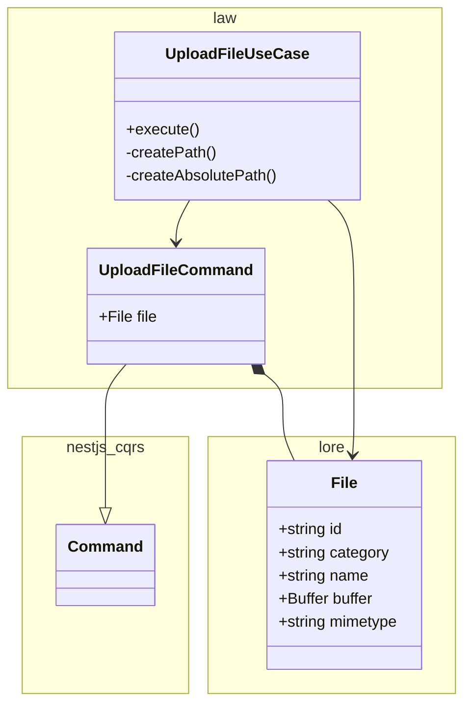
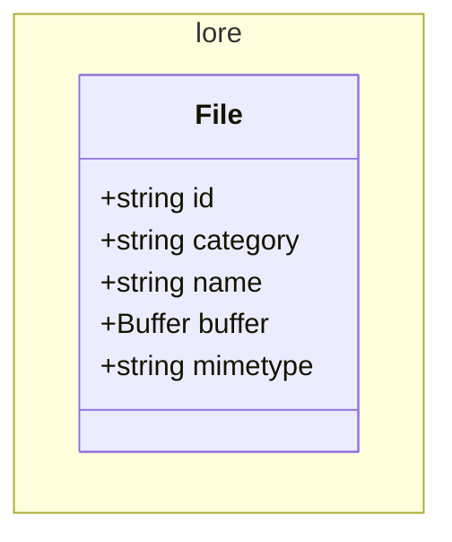

# Vault service

Manages files: upload, storage, etc

<!-- poe:classes:start -->
## Classes

### Frontier

| Entity |
|--------|
| gates/[FileGate](src/frontier/gates/file.gate.ts) |
| gates/[HealthGate](src/frontier/gates/health.gate.ts) |

### Law

| Entity | Description |
|--------|-------------|
| commands/[UploadFileCommand](src/law/commands/upload-file.command.ts) | Extends `Command` |
| commands/[UploadFileUseCase](src/law/commands/upload-file.command.ts) | Implements `ICommandHandler` |

### Lore

| Entity |
|--------|
| [File](src/lore/file.entity.ts) |
<!-- poe:classes:end -->
