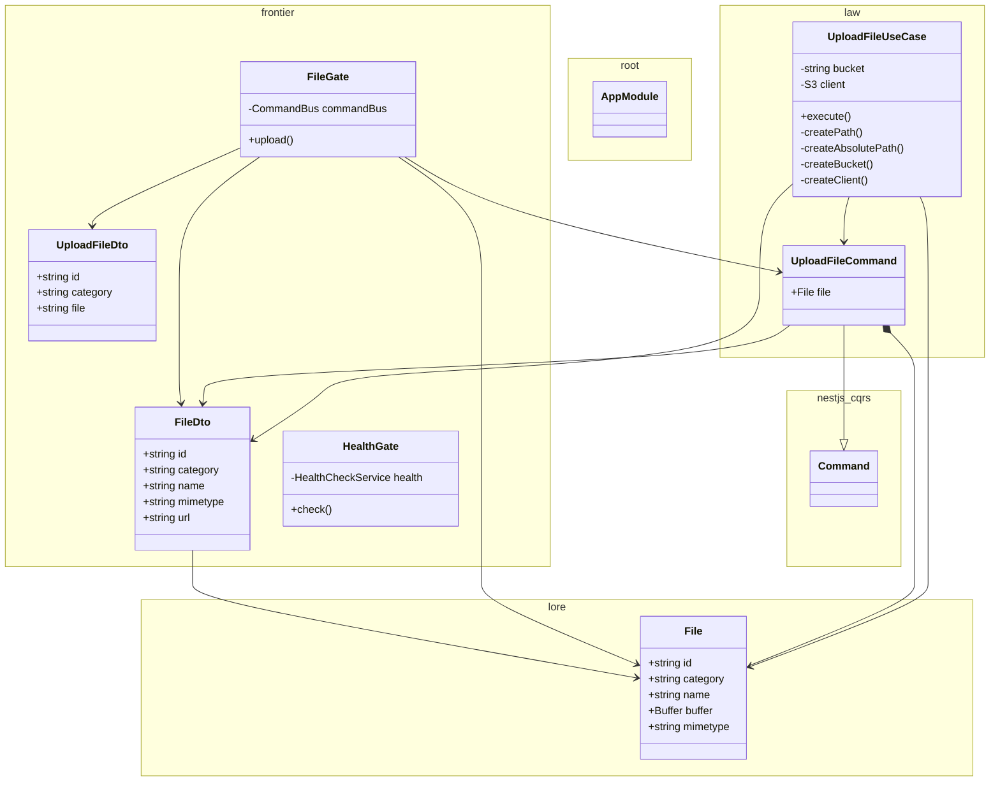

# Vault service

Manages files: upload, storage, etc

<!-- poe:classes:start -->
## Classes

| Entity | Notes |
|--------|-------|
| frontier/dto/[FileDto](src/frontier/dto/file.dto.ts) |  |
| frontier/dto/[UploadFileDto](src/frontier/dto/upload-file.dto.ts) |  |
| frontier/gates/[FileGate](src/frontier/gates/file.gate.ts) |  |
| frontier/gates/[HealthGate](src/frontier/gates/health.gate.ts) |  |
| law/commands/[UploadFileCommand](src/law/commands/upload-file.command.ts) | Extends `Command` |
| law/commands/[UploadFileUseCase](src/law/commands/upload-file.command.ts) | Implements `ICommandHandler` |
| lore/[File](src/lore/file.entity.ts) |  |
| [AppModule](src/app.module.ts) |  |
<!-- poe:classes:end -->
