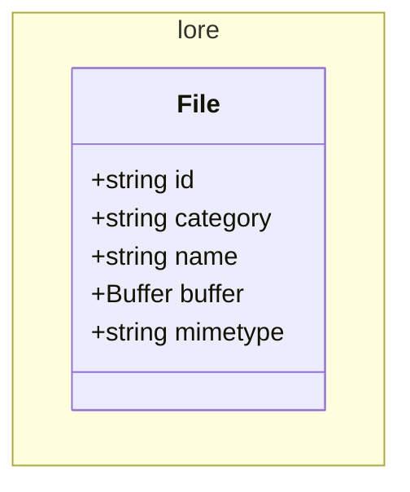

# Vault service

<!-- poe:header:start -->
File vault — upload, storage, and serving of assets

**On this page**

- [Frontier](#frontier)
- [Law](#law)
- [Lore](#lore)
<!-- poe:header:end -->

Manages files: upload, storage, etc

<!-- poe:classes:start -->
## Frontier

### [File](src/frontier/gates/file.gate.ts)

| Endpoint | Description |
|----------|-------------|
| POST /v1/file | Param `body`: [`UploadFileDto`](../../packages/api-contract/src/contracts/vault.ts#L54) Param `uploadedFile`: `Express`.`Multer`.[`File`](src/lore/file.entity.ts#L12) Returns: [`FileDto`](../../packages/api-contract/src/contracts/vault.ts#L10) |

### [Health](src/frontier/gates/health.gate.ts)

| Endpoint | Description |
|----------|-------------|
| GET /v1/health | Returns: `HealthCheckResult` |

## Law

### File

| Use case | Description |
|----------|-------------|
| [TransformFileCommand](src/law/commands/transform-file.command.ts#L10) | Param `file`: [`File`](src/lore/file.entity.ts#L12) Param `transform`: `FileTransform` Returns: [`File`](src/lore/file.entity.ts#L12) |
| [UploadFileCommand](src/law/commands/upload-file.command.ts#L28) | Param `file`: [`File`](src/lore/file.entity.ts#L12) Param `transform`: `FileTransform` Returns: [`FileDto`](../../packages/api-contract/src/contracts/vault.ts#L10) |

## Lore

```mermaid
classDiagram
  namespace lore {
    class File {
      +string id
      +string category
      +string name
      +Buffer buffer
      +string mimetype
    }
  }
```

| Entity |
|--------|
| [File](src/lore/file.entity.ts#L12) |
<!-- poe:classes:end -->

<!-- poe:footer:start -->
> This document was inspected and assembled by Inspector Poe.
<!-- poe:footer:end -->
