# Codex service

Game content management service

## Entities

| Entity      | Description                                                                                                                                               |
| ----------- | --------------------------------------------------------------------------------------------------------------------------------------------------------- |
| **Card**    | Spells and creatures. Each card belongs to one mana and may have multiple abilities.                                                                      |
| **Ability** | Actions a card can perform. Composed of one or more effects. Supports conditional triggers                                                                |
| **Effect**  | Atomic action within an ability (damage, heal, buff/debuff)                                                                                               |
| **Mage**    | Playable character specializing in a mana. Determines starting cards and unique perks                                                                     |
| **Mana**    | • **Core mana**: Fire, Water, Earth, Air (common for all mages)<br>• **Special mana**: Necromancy, Demonology, Chaos, etc (specific to a particular mage) |

## Bash commands

```bash
# Connect to the database
psql -h 127.0.0.1 -U ruler -d codex

# Generate a migration
npm run prisma:generate migration_name

# Apply migrations to dev DB
npm run prisma:migrate:dev
```

<!-- poe:class-table:start -->
## Classes

### api

| Entity |
|--------|
| controllers/[CardController](src/api/controllers/card.controller.ts) |
| controllers/[ManaController](src/api/controllers/mana.controller.ts) |
| dto/body/[CreateCardDto](src/api/dto/body/create-card.dto.ts) |
| dto/body/[CreateManaDto](src/api/dto/body/create-mana.dto.ts) |
| dto/[CardDto](src/api/dto/card.dto.ts) |
| dto/[ManaDto](src/api/dto/mana.dto.ts) |

### application

| Entity | Notes |
|--------|-------|
| commands/[CreateCardCommand](src/application/commands/create-card.command.ts) |  |
| commands/[CreateCardHandler](src/application/commands/create-card.command.ts) | Implements `ICommandHandler` |
| commands/[CreateManaCommand](src/application/commands/create-mana.command.ts) |  |
| commands/[CreateManaHandler](src/application/commands/create-mana.command.ts) | Implements `ICommandHandler` |
| queries/[FindCardsQuery](src/application/queries/find-cards.query.ts) | Extends `Query` |
| queries/[FindCardsHandler](src/application/queries/find-cards.query.ts) | Implements `IQueryHandler` |
| queries/[FindManaQuery](src/application/queries/find-mana.query.ts) | Extends `Query` |
| queries/[FindManaHandler](src/application/queries/find-mana.query.ts) | Implements `IQueryHandler` |
| queries/[GetCardQuery](src/application/queries/get-card.query.ts) | Extends `Query` |
| queries/[GetCardHandler](src/application/queries/get-card.query.ts) | Implements `IQueryHandler` |
| queries/[GetManaQuery](src/application/queries/get-mana.query.ts) | Extends `Query` |
| queries/[GetManaHandler](src/application/queries/get-mana.query.ts) | Implements `IQueryHandler` |

### domain

| Entity | Description | Notes |
|--------|-------------|-------|
| entities/[Card](src/domain/entities/card.entity.ts) | Spells and creatures. Each card belongs to one mana and may have multiple abilities |  |
| entities/[Mana](src/domain/entities/mana.entity.ts) | • Core mana: Fire, Water, Earth, Air (common for all mages)<br>• Special mana: Necromancy, Demonology, Chaos, etc (specific to a particular mage) |  |
| repositories/[CardRepository](src/domain/repositories/card.repository.ts) |  | Abstract · Extends `EntityRepository` |
| repositories/[ManaRepository](src/domain/repositories/mana.repository.ts) |  | Abstract · Extends `EntityRepository` |

### infrastructure

| Entity | Notes |
|--------|-------|
| prisma/[PrismaService](src/infrastructure/prisma/prisma.service.ts) | Extends `PrismaClient` · Implements `OnModuleInit`, `OnModuleDestroy` |
| repositories/[PrismaCardRepository](src/infrastructure/repositories/prisma-card.repository.ts) | Extends `PrismaRepository` |
| repositories/[PrismaManaRepository](src/infrastructure/repositories/prisma-mana.repository.ts) | Extends `PrismaRepository` |

### root

| Entity |
|--------|
| [AppModule](src/app.module.ts) |
<!-- poe:class-table:end -->

<!-- poe:class-diagram:start -->
## Class Diagram

```mermaid
classDiagram
  namespace api {
    class CardController
    class ManaController
    class CreateCardDto
    class CreateManaDto
    class CardDto
    class ManaDto
  }

  namespace application {
    class CreateCardCommand
    class CreateCardHandler
    class CreateManaCommand
    class CreateManaHandler
    class FindCardsQuery
    class FindCardsHandler
    class FindManaQuery
    class FindManaHandler
    class GetCardQuery
    class GetCardHandler
    class GetManaQuery
    class GetManaHandler
  }

  namespace domain {
    class Card
    class Mana
    class CardRepository
    class ManaRepository
  }

  namespace infrastructure {
    class PrismaService
    class PrismaCardRepository
    class PrismaManaRepository
  }

  namespace root {
    class AppModule
  }

  CardController --> CreateCardDto
  CardController --> CardDto
  CardController --> CreateCardCommand
  CardController --> FindCardsQuery
  CardController --> GetCardQuery
  CardController --> Card
  ManaController --> CreateManaDto
  ManaController --> ManaDto
  ManaController --> CreateManaCommand
  ManaController --> FindManaQuery
  ManaController --> GetManaQuery
  ManaController --> Mana
  CreateManaDto --> Mana
  ManaDto --> Mana
  CreateCardCommand *-- CreateCardDto
  CreateCardCommand --> CardDto
  CreateCardCommand --> Card
  CreateCardHandler *-- CardRepository
  CreateCardHandler --> CreateCardCommand
  CreateCardHandler --> Card
  CreateManaCommand *-- CreateManaDto
  CreateManaCommand --> ManaDto
  CreateManaCommand --> Mana
  CreateManaHandler *-- ManaRepository
  CreateManaHandler --> CreateManaCommand
  CreateManaHandler --> Mana
  FindCardsHandler *-- CardRepository
  FindCardsHandler --> Card
  FindManaHandler *-- ManaRepository
  FindManaHandler --> Mana
  GetCardHandler *-- CardRepository
  GetCardHandler --> GetCardQuery
  GetCardHandler --> Card
  GetManaHandler *-- ManaRepository
  GetManaHandler --> GetManaQuery
  GetManaHandler --> Mana
  PrismaCardRepository *-- PrismaService
  PrismaCardRepository --> Card
  PrismaManaRepository *-- PrismaService
  PrismaManaRepository --> Mana
```


<!-- poe:class-diagram:end -->
