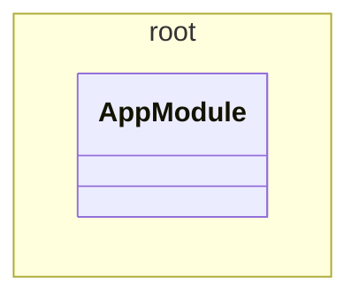

# Gateway service

A classical gateway proxy that sits between clients and services.

<!-- poe:classes:start -->
## Classes

### root

| Entity |
|--------|
| [AppModule](src/app.module.ts) |
<!-- poe:classes:end -->
