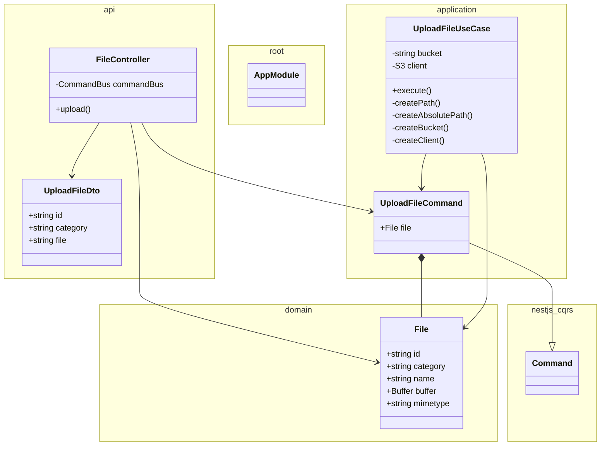

# Vault service

Manages files: upload, storage, etc

<!-- poe:classes:start -->
## Classes

| Entity | Notes |
|--------|-------|
| api/controllers/[FileController](src/api/controllers/file.controller.ts) |  |
| api/dto/[UploadFileDto](src/api/dto/upload-file.dto.ts) |  |
| application/commands/[UploadFileCommand](src/application/commands/upload-file.command.ts) | Extends `Command` |
| application/commands/[UploadFileUseCase](src/application/commands/upload-file.command.ts) | Implements `ICommandHandler` |
| domain/[File](src/domain/file.entity.ts) |  |
| [AppModule](src/app.module.ts) |  |
<!-- poe:classes:end -->
