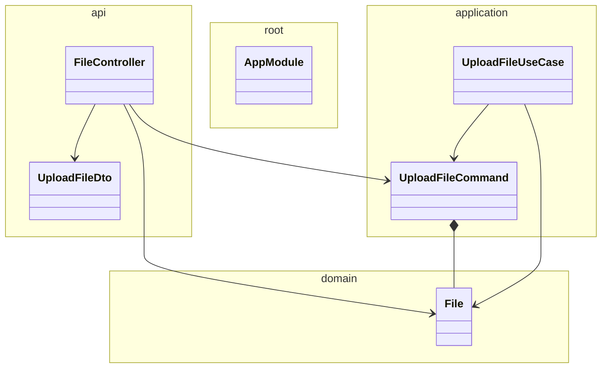

# Vault service

Manages files: upload, storage, etc

<!-- poe:class-table:start -->
## Classes

### api

| Entity |
|--------|
| controllers/[FileController](src/api/controllers/file.controller.ts) |
| dto/[UploadFileDto](src/api/dto/upload-file.dto.ts) |

### application

| Entity | Notes |
|--------|-------|
| commands/[UploadFileCommand](src/application/commands/upload-file.command.ts) | Extends `Command` |
| commands/[UploadFileUseCase](src/application/commands/upload-file.command.ts) | Implements `ICommandHandler` |

### domain

| Entity |
|--------|
| [File](src/domain/file.entity.ts) |

### root

| Entity |
|--------|
| [AppModule](src/app.module.ts) |
<!-- poe:class-table:end -->

<!-- poe:class-diagram:start -->
## Class Diagram

<!-- poe:class-diagram:end -->
