# @dod/poe

<!-- poe:header:start -->
The inspector — generates README documentation by scanning workspace sources
<!-- poe:header:end -->

<!-- poe:classes:start -->
## Classes

```mermaid
classDiagram
  namespace classes {
    class ClassRegistry {
      -Map classMap
      +InspectedClass items
      +Map externalSources
      +Endpoint endpoints
      +PrismaSchema schema
      +Map externalTypes
      +boolean isEmpty
      +Record layers
      +getExternalSource()
      +getLocation()
      +getLayer()
      +getLayerEndpoints()
    }
    class InspectedClass {
      +string link
      +string location
      +isEqual()
      +toString()
    }
    class InspectedClassMember {
      +string name
      +Visibility visibility
      +boolean isMethod
      +string type
      +string prefix
      +toString()
    }
    class InspectedClassRelation {
      +string from
      +string to
      +string arrow
      +toString()
    }
    class ClassParser {
      -ScannedFile file
      +classes()
      +imports()
    }
    class ClassRegistryParser {
      +parse()
      -mergeImports()
      -extractEndpoints()
    }
    class RelationBuilder {
      -ClassRegistry registry
      -Set knownNames
      +buildRelations()
      -toRelations()
      -hasUsageRelation()
      -isKnownRelation()
    }
    class ConfigLoader {
      +load()
      -assertExists()
    }
    class Endpoint {
      +string file
      +string layer
      +string className
      +string method
      +string path
      +string handler
      +readonly params
      +string returns
      +string description
    }
    class EndpointExtractor {
      +extract()
      -findControllers()
      -extractFromController()
      -findMethodSignature()
      -stripParams()
      -stripParamAnnotations()
      -extractReturnType()
      -unwrapPromise()
      -findPrecedingJsdoc()
      -parseJsdoc()
      -joinPath()
      -findMatchingParen()
      -extractBracedBlock()
      -splitTopLevel()
    }
    class ChildrenTable {
      +build()
      -collectChildren()
      -readPackage()
      -columnHeader()
      -titleCase()
    }
    class InspectorPoe {
      -string basePath
      -ConfigLoader configLoader
      -SchemaReader schemaReader
      -ReadmeWriter writers
      +inspect()
      +index()
      +staleReadmes()
      -createWriter()
      -readPackageDescription()
    }
    class ClassDiagram {
      -ClassRegistry classRegistry
      -Set knownNames
      -string lines
      +renderLayer()
      -addLayerDiagram()
      -collectForeignClasses()
      -collectExternalParents()
      -addNamespace()
      -addExternalNamespace()
      -getRelatedNames()
      -groupByLayer()
      -addRelations()
      -isKnownName()
      -clearLines()
      -addLine()
    }
    class ClassTable {
      -string root
      -InspectedClass classes
      -ClassRegistry classRegistry
      -boolean hasDescriptionColumn
      +renderContent()
      -buildHeader()
      -buildRow()
      -renderRow()
      -entityCell()
      -descriptionCell()
      -renderNotes()
    }
    class HeaderBuilder {
      +build()
      +hasContent()
      -buildToc()
      -collectHeadings()
      -slugify()
    }
    class PackageReport {
      -PoeConfig config
      -ClassRegistry classRegistry
      -RendererRegistry renderers
      +render()
      -renderLayerBody()
    }
    class ReadmeWriter {
      -string basePath
      -string readmePath
      -boolean checkMode
      -string originalContent
      -string currentContent
      +string path
      +read()
      +write()
      +isStale()
      +originalSnapshot()
      +currentSnapshot()
      -load()
      -readOriginal()
      -titleCase()
      -updateContent()
      -insertAfterTitle()
      -readPackageName()
    }
    class ApiRenderer {
      +render()
      -groupByController()
      -renderController()
      -row()
      -descriptionCell()
      -controllerTitle()
    }
    class ApplicationRenderer {
      +render()
      -groupByEntity()
      -entityName()
      -renderEntitySection()
      -renderEntryPointsSection()
      -isVisible()
      -useCaseRow()
      -descriptionCell()
      -params()
      -returnType()
      -splitTopLevel()
    }
    class DomainRenderer {
      +render()
    }
    class InfrastructureRenderer {
      +render()
      -renderDiagram()
      -renderModelBlock()
      -renderField()
      -renderRelation()
      -relationConnector()
    }
    class RendererRegistry {
      -Renderer domain
      -Renderer application
      -Renderer api
      -Renderer infrastructure
      +resolve()
    }
    class TypeLinker {
      -ClassRegistry registry
      +renderType()
      +renderParam()
      +renderSignature()
      -escape()
    }
    class ExternalTypeScanner {
      +scan()
      -groupByPackage()
      -toPackageSpec()
      -resolveWorkspace()
      -scanWorkspace()
      -walk()
      -lineOf()
    }
    class ScannedFile {
      +string path
      +string content
      +string layer
      +contains()
    }
    class Scanner {
      -string basePath
      -LayerConfig layers
      +scan()
      -scanLayer()
      -scanDir()
      -readItems()
      -scanItem()
      -scanFile()
      -isTsFile()
    }
    class PrismaModel {
      +string name
      +string tableName
      +PrismaField fields
      +PrismaRelation relations
    }
    class PrismaSchema {
      +PrismaModel models
      +boolean isEmpty
    }
    class SchemaParser {
      +parse()
    }
    class SchemaReader {
      +read()
    }
  }

  ClassRegistry *-- InspectedClass
  ClassRegistry *-- Endpoint
  ClassRegistry *-- PrismaSchema
  InspectedClass *-- InspectedClassMember
  InspectedClass *-- InspectedClassRelation
  ClassParser *-- ScannedFile
  ClassParser --> InspectedClass
  ClassRegistryParser --> ClassRegistry
  ClassRegistryParser --> ClassParser
  ClassRegistryParser --> RelationBuilder
  ClassRegistryParser --> Endpoint
  ClassRegistryParser --> EndpointExtractor
  ClassRegistryParser --> ScannedFile
  ClassRegistryParser --> PrismaSchema
  RelationBuilder *-- ClassRegistry
  RelationBuilder --> InspectedClass
  RelationBuilder --> InspectedClassRelation
  EndpointExtractor --> Endpoint
  EndpointExtractor --> ScannedFile
  InspectorPoe *-- ConfigLoader
  InspectorPoe *-- SchemaReader
  InspectorPoe *-- ReadmeWriter
  InspectorPoe --> ClassRegistry
  InspectorPoe --> ClassRegistryParser
  InspectorPoe --> ChildrenTable
  InspectorPoe --> HeaderBuilder
  InspectorPoe --> PackageReport
  InspectorPoe --> ExternalTypeScanner
  InspectorPoe --> Scanner
  ClassDiagram *-- ClassRegistry
  ClassDiagram --> InspectedClass
  ClassTable *-- InspectedClass
  ClassTable *-- ClassRegistry
  PackageReport *-- ClassRegistry
  PackageReport *-- RendererRegistry
  ApiRenderer --> ClassRegistry
  ApiRenderer --> InspectedClass
  ApiRenderer --> Endpoint
  ApiRenderer --> TypeLinker
  ApplicationRenderer --> ClassRegistry
  ApplicationRenderer --> InspectedClass
  ApplicationRenderer --> TypeLinker
  DomainRenderer --> ClassRegistry
  DomainRenderer --> InspectedClass
  DomainRenderer --> ClassDiagram
  DomainRenderer --> ClassTable
  InfrastructureRenderer --> ClassRegistry
  InfrastructureRenderer --> InspectedClass
  InfrastructureRenderer --> PrismaModel
  InfrastructureRenderer --> PrismaSchema
  RendererRegistry --> ApiRenderer
  RendererRegistry --> ApplicationRenderer
  RendererRegistry --> DomainRenderer
  RendererRegistry --> InfrastructureRenderer
  TypeLinker *-- ClassRegistry
  Scanner --> ScannedFile
  PrismaSchema *-- PrismaModel
  SchemaParser --> PrismaModel
  SchemaParser --> PrismaSchema
  SchemaReader --> PrismaSchema
  SchemaReader --> SchemaParser
```

| Entity | Description |
|--------|-------------|
| ClassRegistry/[ClassRegistry](src/ClassRegistry/ClassRegistry.ts#L10) | Collection of inspected classes plus any extracted endpoints and schema |
| ClassRegistry/[InspectedClass](src/ClassRegistry/InspectedClass.ts#L22) | Represents a single class discovered during inspection |
| ClassRegistry/[InspectedClassMember](src/ClassRegistry/InspectedClassMember.ts#L2) | Represents a single field, getter, or method of an inspected class |
| ClassRegistry/[InspectedClassRelation](src/ClassRegistry/InspectedClassRelation.ts#L1) | Represents a directed relation between two classes in a diagram |
| ClassRegistryParser/[ClassParser](src/ClassRegistryParser/ClassParser.ts#L25) | Parses a single scanned file and extracts class definitions and imports |
| ClassRegistryParser/[ClassRegistryParser](src/ClassRegistryParser/ClassRegistryParser.ts#L8) | Parses a collection of scanned files into a ClassRegistry |
| ClassRegistryParser/[RelationBuilder](src/ClassRegistryParser/RelationBuilder.ts#L4) | Builds relations between inspected classes |
| Config/[ConfigLoader](src/Config/ConfigLoader.ts#L15) | Resolves and loads the Poe configuration for a target package |
| Endpoints/[Endpoint](src/Endpoints/Endpoint.ts#L1) | A single HTTP endpoint exposed by a controller |
| Endpoints/[EndpointExtractor](src/Endpoints/EndpointExtractor.ts#L12) | Parses controller source files and extracts HTTP endpoints |
| Index/[ChildrenTable](src/Index/ChildrenTable.ts#L9) | Scans a folder for child workspaces (subdirs with a package.json) and builds a markdown table that lists each child with its description |
| [InspectorPoe](src/InspectorPoe.ts#L18) | Inspector Poe himself. Coordinates the inspection process |
| ReadmeWriter/[ClassDiagram](src/ReadmeWriter/ClassDiagram.ts#L5) | Generates a Mermaid class diagram for a single layer |
| ReadmeWriter/[ClassTable](src/ReadmeWriter/ClassTable.ts#L3) | Renders a markdown table of inspected classes |
| ReadmeWriter/[HeaderBuilder](src/ReadmeWriter/HeaderBuilder.ts#L2) | Assembles the README header block: package description plus a table of contents that mirrors the document's top-level sections |
| ReadmeWriter/[PackageReport](src/ReadmeWriter/PackageReport.ts#L4) | Renders the full package report by dispatching each configured layer to its matching renderer |
| ReadmeWriter/[ReadmeWriter](src/ReadmeWriter/ReadmeWriter.ts#L5) | Updates README files with generated class tables. In check mode, writes accumulate in memory without touching disk so callers can compare against the original to detect drift |
| Renderers/[ApiRenderer](src/Renderers/ApiRenderer.ts#L7) | Renders a layer as per-controller endpoint tables  Implements `Renderer` |
| Renderers/[ApplicationRenderer](src/Renderers/ApplicationRenderer.ts#L10) | Renders a layer as a use-case table. Entry points (facades without a parent base) get a separate section. Handlers and abstract bases are hidden as implementation detail.  Implements `Renderer` |
| Renderers/[DomainRenderer](src/Renderers/DomainRenderer.ts#L7) | Renders a layer as a Mermaid class diagram plus a table of its classes  Implements `Renderer` |
| Renderers/[InfrastructureRenderer](src/Renderers/InfrastructureRenderer.ts#L11) | Renders a layer as an ER diagram derived from the Prisma schema  Implements `Renderer` |
| Renderers/[RendererRegistry](src/Renderers/RendererRegistry.ts#L7) | Resolves a renderer by kind |
| Renderers/[TypeLinker](src/Renderers/TypeLinker.ts#L4) | Renders a type-bearing signature fragment with markdown links for any referenced type the registry knows about |
| Scanner/[ExternalTypeScanner](src/Scanner/ExternalTypeScanner.ts#L11) | Resolves a workspace's peer packages via node_modules symlinks and scans their source files for exported type/class/interface/enum declarations |
| Scanner/[ScannedFile](src/Scanner/ScannedFile.ts#L1) | Holds the raw content of a scanned source file |
| Scanner/[Scanner](src/Scanner/Scanner.ts#L7) | Searches the project for classes worthy of inspection |
| Schema/[PrismaModel](src/Schema/PrismaSchema.ts#L19) |  |
| Schema/[PrismaSchema](src/Schema/PrismaSchema.ts#L28) |  |
| Schema/[SchemaParser](src/Schema/SchemaParser.ts#L25) | Parses a Prisma schema file into a PrismaSchema |
| Schema/[SchemaReader](src/Schema/SchemaReader.ts#L8) | Reads and parses the Prisma schema for a package, if present |
<!-- poe:classes:end -->
s:end -->

<!-- poe:footer:start -->
> This document was inspected and assembled by Inspector Poe.
<!-- poe:footer:end -->
