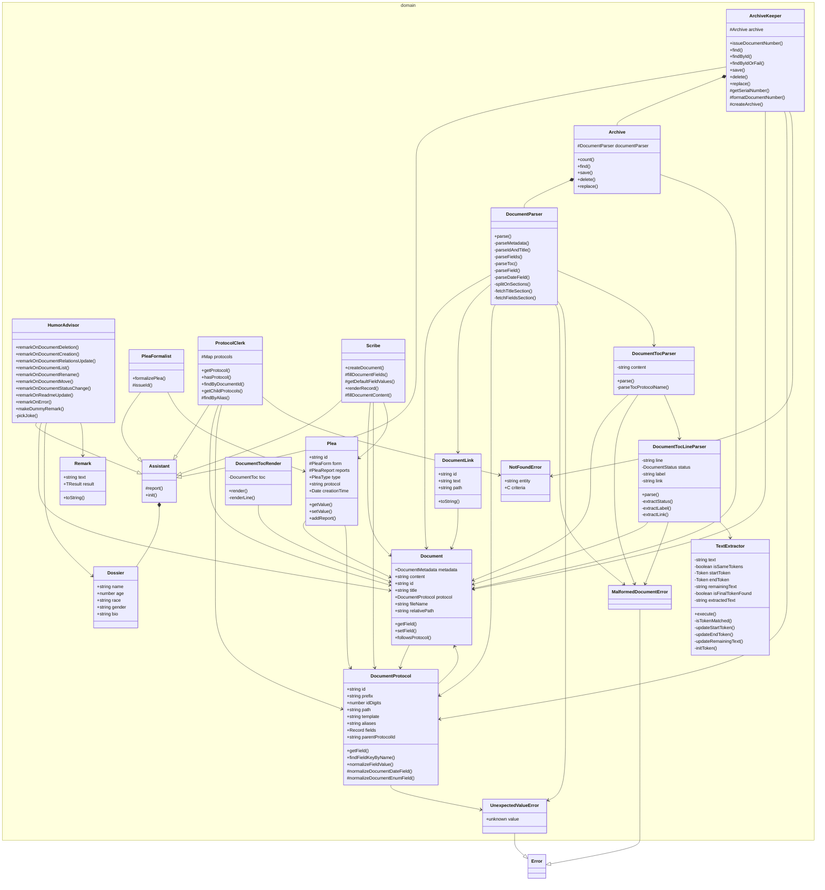

# zok

<!-- poe:header:start -->
The archivist — CLI for managing tasks, milestones, ADRs, and design docs

**On this page**

- [Application](#application)
- [Domain](#domain)
<!-- poe:header:end -->

<!-- poe:classes:start -->
## Application

### Entry points

- [Zok](src/application/Zok.ts#L55)

### Document

| Use case | Description |
|----------|-------------|
| [ChangeStatusDutyInstruction](src/application/instructions/ChangeStatusDutyInstruction.ts#L14) | Returns: [`Document`](src/domain/entities/Document.ts#L37) |
| [CreateDocumentDutyInstruction](src/application/instructions/CreateDocumentDutyInstruction.ts#L13) | Returns: [`Document`](src/domain/entities/Document.ts#L37) |
| [DeleteDocumentDutyInstruction](src/application/instructions/DeleteDocumentDutyInstruction.ts#L8) | Returns: [`Document`](src/domain/entities/Document.ts#L37) |
| [ListDocumentsDutyInstruction](src/application/instructions/ListDocumentsDutyInstruction.ts#L8) | Returns: [`Document`](src/domain/entities/Document.ts#L37)[] |
| [MoveDocumentDutyInstruction](src/application/instructions/MoveDocumentDutyInstruction.ts#L15) | Returns: [`Document`](src/domain/entities/Document.ts#L37) |
| [RenameDocumentDutyInstruction](src/application/instructions/RenameDocumentDutyInstruction.ts#L13) | Returns: [`Document`](src/domain/entities/Document.ts#L37) |
| [UpdateDocumentRelationsDutyInstruction](src/application/instructions/UpdateDocumentRelationsDutyInstruction.ts#L15) | Returns: [`Document`](src/domain/entities/Document.ts#L37) \| undefined |

### Other

| Use case | Description |
|----------|-------------|
| [UpdateReadmeDutyInstruction](src/application/instructions/UpdateReadmeDutyInstruction.ts#L16) |  |

## Domain

| Entity | Description |
|--------|-------------|
| assistants/[ArchiveKeeper](src/domain/assistants/ArchiveKeeper.ts#L5) | Abstract · Extends [Assistant](src/domain/assistants/Assistant.ts#L3) |
| assistants/[Assistant](src/domain/assistants/Assistant.ts#L3) | Abstract |
| assistants/[HumorAdvisor](src/domain/assistants/HumorAdvisor.ts#L5) | Extends [Assistant](src/domain/assistants/Assistant.ts#L3) |
| assistants/[PleaFormalist](src/domain/assistants/PleaFormalist.ts#L4) | Abstract · Extends [Assistant](src/domain/assistants/Assistant.ts#L3) |
| assistants/[ProtocolClerk](src/domain/assistants/ProtocolClerk.ts#L4) | Abstract · Extends [Assistant](src/domain/assistants/Assistant.ts#L3) |
| assistants/[Scribe](src/domain/assistants/Scribe.ts#L16) | Abstract · Extends [Assistant](src/domain/assistants/Assistant.ts#L3) |
| entities/[Document](src/domain/entities/Document.ts#L37) |  |
| entities/[DocumentLink](src/domain/entities/DocumentLink.ts#L2) |  |
| entities/[DocumentProtocol](src/domain/entities/DocumentProtocol.ts#L13) |  |
| entities/[Dossier](src/domain/entities/Dossier.ts#L8) |  |
| entities/[Plea](src/domain/entities/Plea.ts#L33) |  |
| entities/[Remark](src/domain/entities/Remark.ts#L1) |  |
| errors/[MalformedDocumentError](src/domain/errors/MalformedDocumentError.ts#L1) | Extends `Error` |
| errors/[NotFoundError](src/domain/errors/NotFoundError.ts#L1) |  |
| errors/[UnexpectedValueError](src/domain/errors/UnexpectedValueError.ts#L2) | Extends `Error` |
| tools/[Archive](src/domain/tools/Archive.ts#L9) | Abstract |
| tools/parser/[DocumentParser](src/domain/tools/parser/DocumentParser.ts#L13) |  |
| tools/parser/[DocumentTocLineParser](src/domain/tools/parser/DocumentTocLineParser.ts#L5) |  |
| tools/parser/[DocumentTocParser](src/domain/tools/parser/DocumentTocParser.ts#L5) |  |
| tools/parser/[TextExtractor](src/domain/tools/parser/TextExtractor.ts#L11) |  |
| tools/render/[DocumentTocRender](src/domain/tools/render/DocumentTocRender.ts#L6) |  |
<!-- poe:classes:end -->

<!-- poe:footer:start -->
> This document was inspected and assembled by Inspector Poe.
<!-- poe:footer:end -->
